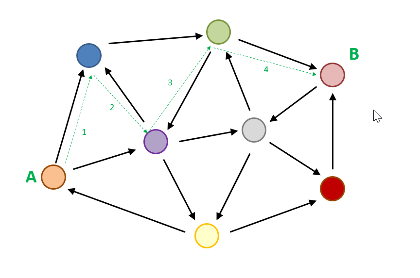

# Introduction to Graph Traversal #

----

**Go to:** &nbsp;&nbsp;&nbsp;&nbsp; [**Root TOC**](CM-Well.RootTOC.TOC.md) &nbsp;&nbsp;&nbsp;&nbsp; [**Topic TOC**](API.Traversal.TOC.md) &nbsp;&nbsp;&nbsp;&nbsp; [**Previous Topic**](API.Traversal.TOC.md)&nbsp;&nbsp;&nbsp;&nbsp; [**Next Topic**](API.Traversal.xg.md)  

----

## Outbound and Inbound Links ##

As you know, CM-Well is a linked data repository. This means that CM-Well entities (infotons) are stored in a graph structure, where infotons are graph nodes, and links between them are graph edges. But what are the links between infotons?

Infoton field values can be links to infotons, or in other words, URIs of other infotons. For example, if an infoton represents CompanyA, and in its **hasImmediateParent** field there's a URI pointing to CompanyB, then CompanyA is said to have an outbound link to CompanyB, and CompanyB has an inbound link from CompanyA.

If we have the CompanyA infoton and we want to find its parent company, we can retrieve it by following the outbound link in CompanyA's **hasImmediateParent** field. On the other hand, if we want to find CompanyA's child companies, we could follow inbound links from other infotons' **hasImmediateParent** fields that point to CompanyA.

## Traversing the CM-Well Graph ##

CM-Well's graph structure allows you to discover direct and indirect connections between entities, by exploring the links between infotons. To find those connections, you need to traverse the CM-Well graph from one infoton to the next. Two infotons might be connected indirectly by several links, and each time you traverse a link, you might be "traveling" in an outbound or inbound direction, relative to the infoton you started from.

For example, in the following graph, circles represent infotons and black arrows represent their inbound and outbound links with each other. The green arrows show a directed path from A (the orange infoton) to B (the pink infoton).

To arrive from A to B we traverse:

1. An outbound link to the blue node.
1. An inbound link to the purple node.
1. An inbound link to the green node.
1. An outbound link to the pink node.

The CM-Well API supports the graph traversal operators **xg**, **yg** and **gqp**. These operators allow you to perform the following actions on query results:

- [xg](API.Traversal.xg.md) - Add outbound links to query results.
- [yg](API.Traversal.yg.md) - Add both inbound and outbound links to query results.
- [qgp](API.Traversal.gqp.md) - Filter query results according to field values of inbound and outbound links.

Click on the **xg**, **yg** and **gqp** links above to read more about each operator.

>**Note:** You cannot use the graph traversal operators together with the **with-history** flag (an attempt to do this will result in an error). This is because the inbound and outbound links are not well-defined when including multiple historical versions of each infoton.

----

**Go to:** &nbsp;&nbsp;&nbsp;&nbsp; [**Root TOC**](CM-Well.RootTOC.TOC.md) &nbsp;&nbsp;&nbsp;&nbsp; [**Topic TOC**](API.Traversal.TOC.md) &nbsp;&nbsp;&nbsp;&nbsp; [**Previous Topic**](API.Traversal.TOC.md)&nbsp;&nbsp;&nbsp;&nbsp; [**Next Topic**](API.Traversal.xg.md)  

----
