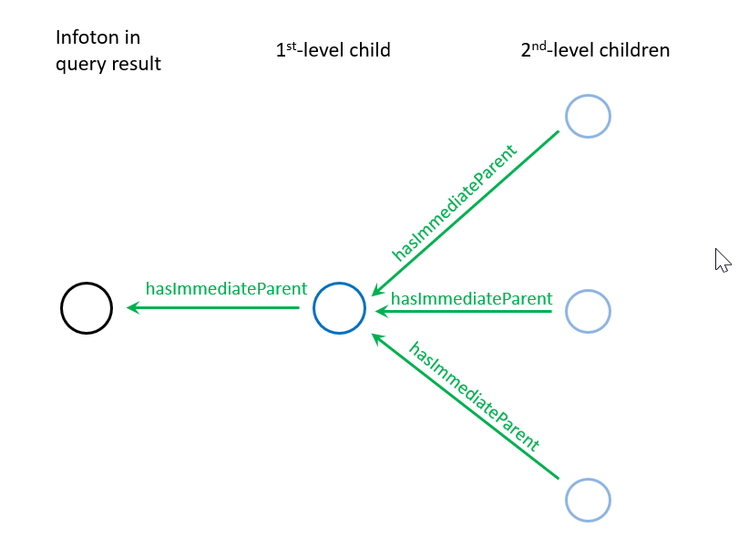
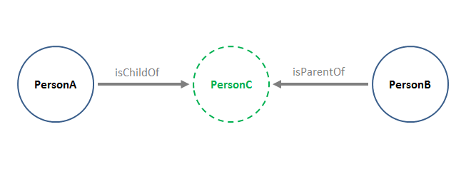

# *yg*: Traversing Inbound and Outbound Links #

----

**Go to:** &nbsp;&nbsp;&nbsp;&nbsp; [**Root TOC**](CM-Well.RootTOC.TOC.md) &nbsp;&nbsp;&nbsp;&nbsp; [**Topic TOC**](API.Traversal.TOC.md) &nbsp;&nbsp;&nbsp;&nbsp; [**Previous Topic**](API.Traversal.xg.md)&nbsp;&nbsp;&nbsp;&nbsp; [**Next Topic**](API.Traversal.gqp.md)  

----

## The *yg* Operator ##

The **yg** operator allows you to traverse both infotons' outbound links and their inbound links. When you add **yg** to a CM-Well query, for each infoton result of the query, CM-Well traverses the path defined by the **yg** value, and adds the infotons in that path to the query results.

In **yg** syntax, **>** indicates an outbound link and **<** indicates an inbound link.

>**Note**: The **yg** flag has several optional operands that allow you to define the path you want to traverse. See [Traversal Operands](API.Traversal.Operands.md) to learn more.

## Example: Inbound Links ##

Here is an example of a query that traverses inbound links:

    <cm-well-host>/permid.org?op=search&qp=CommonName.mdaas:Marriott%20Ownership,organizationCity.mdaas:Orlando&format=ttl&with-data&yg=<hasImmediateParent.mdaas<hasImmediateParent.mdaas

This query retrieves all infotons that point to the matched infotons through their **hasImmediateParent** field, and also all infotons that point to the level 1 inbound links through their **hasImmediateParent** field. In other words, it retrieves the child companies of the matched infotons, and also the child companies of those child companies. 

This is illustrated in the diagram below. The black circle represents the single infoton (Marriott in Orlando) returned by the **qp** query. The dark-blue circle is a 1st-level inbound link, and the 3 light-blue circles are 2nd-level inbound links. All 5 infotons would be returned by the query above.



## Example: Outbound and Inbound Links ##

Here is an example that traverses both outbound and inbound links.

Suppose we have a Quote, with a known RIC code of VAC. We want to find the corporate address of the company that issues it. We know the model in Open PermID includes Quotes, which link out to Instruments via the **IsQuoteOf** field. Organization infotons also link to Instruments, via the **primaryInstrument** field. The following diagram illustrates these relationships.


You can see that in order to retrieve the organization that issued the quote, we can follow the quote's outbound link to an instrument, and then follow the instrument's inbound link to the organization. To achieve this, we can run this query:

    <cm-well-host>/permid.org?op=search&qp=RIC.mdaas::VAC&with-data&yg=>IsQuoteOf.mdaas<primaryInstrument.mdaas
    
Note the use of the **>** operator to traverse an outbound link, and the **<** operator to traverse an inbound link.

Once we retrieve the desired organization's infoton using the query above, we can obtain its address value.

## Example: Using *xg* and *yg* Together ##

You can use the **xg** and **yg** flags together in the same search. In this case, first the **yg** traversal is processed and then the **xg** traversal.

This can be useful in cases where you want to collect a certain group of infotons using **yg**, and then expand them along a certain link using **xg**. This feature is often used in conjunction with SPARQL queries, the generate the input for the SPARQL query.

ADD EXAMPLE HERE.

## Using the *yg-chunk-size* Parameter ##

You can add the **yg-chunk-size** parameter to a  **yg** query.The **yg-chunk-size** value determines how many infoton paths (that resulted from the query preceding the **yg** query) will be processed at a time in a single **yg** query. This prevents heavy **yg** queries from "starving" other operations. 
The **yg** query is processed in chunks of **yg-chunk-size** until all input paths are processed.

The default value for **yg-chunk-size** is 10. For best results, you may need to adjust the value according to the specific query you're running.

<a name="hdrGhostSkips"></a>
## Ghost Skips ##

In some cases, when using **yg** to filter infotons according to their indirect relationships with other infotons, you may be interested in filtering by the relationship itself, while the intermediate infoton within the relationship is not important.

Here is an example:

 

Suppose we want to find PersonB, who is the grandparent of PersonA. We can determine this relationship by finding that the PersonA and PersonB infotons both point to PersonC, with the respective relationships of isChildOf and isParentOf. However, we can do this even if the PersonC infoton doesn't exist, that is, only its URI exists and appears in the fields of PersonA and PersonB.

CM-Well tolerates this situation when applying **yg** filters. That is, it skips over such "ghost" infotons as long as their URIs satisfy the relationship defined in the filter.

If, on the other hand, if you want to constrain your query to return only results for which the intermediate infoton *does* exist, you can do this by adding a filter on the intermediate infoton's fields. For example:

    \>aField[uuid.system:]<bField

This filter requires only that the intermediate infoton have a ```uuid.system``` field with any value, and it works because every infoton has a ```uuid.system``` field. Alternatively, for our example searching for Person infotons, we could add this filter:

    \>childOf[type.rdf:Person]<parentOf

----

**Go to:** &nbsp;&nbsp;&nbsp;&nbsp; [**Root TOC**](CM-Well.RootTOC.TOC.md) &nbsp;&nbsp;&nbsp;&nbsp; [**Topic TOC**](API.Traversal.TOC.md) &nbsp;&nbsp;&nbsp;&nbsp; [**Previous Topic**](API.Traversal.xg.md)&nbsp;&nbsp;&nbsp;&nbsp; [**Next Topic**](API.Traversal.gqp.md)  

----
