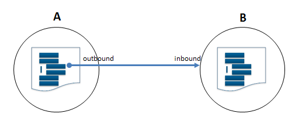
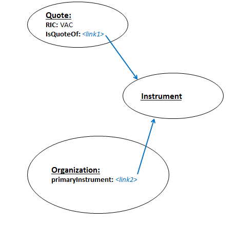

# Traversing Outbound and Inbound Links with xg and yg #

Infoton field values sometimes refer to other CM-Well entities, and are themselves links to infotons. Thus, infotons "point to" each other via their fields with infoton URI values. If infoton A has a field value that is the URI of infoton B, then A is said to have an outbound link to B, and B has an inbound link from A.

When you perform a CM-Well query, its results are a list of infotons that match the query parameters. Together with the query matches, you can also retrieve other infotons that point to the matched infotons, or are pointed to by them. In other words, you can retrieve the matched infotons' inbound and outbound links.

You do this by using the **xg** and **yg** parameters described below.

>**Note:** You cannot use the **xg** and **yg** parameters together with the **with-history** flag. This is because the inbound and outbound links are not well-defined when including multiple historical versions of each infoton. An attempt to combine graph traversal with historical version will result in an error. 

## Traversing Outbound Links with the xg Flag ##

To request outbound links in query results, add the **xg** flag to the query, as in the following example:

    <cm-well-host>/permid.org?op=search
    &qp=CommonName.mdaas:Marriott%20Ownership,organizationCity.mdaas:Orlando&with-data&format=ttl&xg

The xg flag can appear with or without other operands. The following sections describe these options.

### xg with No Operands ###

When the xg flag appears with no operands, the query results will contain (in addition to the infotons that match the query) all infotons that are outbound links of the matched infotons.

### Expansion Level ###
You can add a numeric expansion level operand to the xg flag, which is a value between 1 and 9.

    xg=<integer>

For example:

    <cm-well-host>/permid.org?op=search
    &qp=CommonName.mdaas:Marriott%20Ownership,organizationCity.mdaas:Orlando&with-data&format=ttl&xg=2

This query returns the matched infotons, their outbound links, and the outbound links of the "level 1" outbound links. In other words, **xg=2** retrieves both 1st and 2nd level outbound links, originating from the query matches.

(**xg=1** is equivalent to **xg** with no operands.)

> **Note:** The value of the **xg** parameter is limited to 9, but it is recommended to use smaller values (e.g. 1 or 2). The **xg** parameter should be used with caution, as larger numbers may result in very large data sets being returned. If you find you need a larger expansion level (e.g. 9 or above), this may indicate an inefficient data model or query.

### Expansion Field ###

Rather than requesting all outbound links, you can request only the outbound links that appear in a certain field or list of fields.  To do this, add **xg=** followed by a single field name or list of comma-separated field names.

    xg=<fieldName>
    xg=<fieldName>,<fieldName>,...,<fieldName>

For example, if you're querying for organizations and you're only interested in retrieving their immediate parent organizations, you could run the following query:

    <cm-well-host>/permid.org?op=search&qp=CommonName.mdaas:Marriott%20Ownership,organizationCity.mdaas:Orlando&format=ttl&with-data&xg=hasImmediateParent.mdaas

If you wanted to retrieve both immediate parents and ultimate parents, you could run the following query:

    <cm-well-host>/permid.org?op=search&qp=CommonName.mdaas:Marriott%20Ownership,organizationCity.mdaas:Orlando&format=ttl&with-data&xg=hasImmediateParent.mdaas,hasUltimateParent.mdaas

### The Outbound Link Operator ('>') ###

Suppose you have defined an xg value that returns a certain set of outbound links. You can then further expand this set to refer to higher levels of outbound links, using the '>' operator.

    xg=<outboundExpansion> > <fieldIdentifier>

For example:

    <cm-well-host>/permid.org?op=search&qp=CommonName.mdaas:Marriott%20Ownership,organizationCity.mdaas:Orlando&format=ttl&with-data&xg=hasImmediateParent.mdaas>hasUltimateParent.mdaas

This query retrieves the outbound links in the hasImmediateParent fields of the matched infotons, and in addition, the outbound links in the hasUltimateParent fields of the level 1 outbound links.

You can add a "chain" of several outbound link operators with field identifiers, to retrieve more and more remote links.

### The Field Wildcard ###

Instead of adding a specific field name after the '>' operator, you can use the wildcard character '_' to indicate all fields.

For example:

    <cm-well-host>/permid.org?op=search&qp=CommonName.mdaas:Marriott%20Ownership,organizationCity.mdaas:Orlando&format=ttl&with-data&xg=hasImmediateParent.mdaas>_

This query retrieves the outbound links in the hasImmediateParent fields of the matched infotons, and in addition, the outbound links *all* fields of the level 1 outbound links.

### Field Filters ###

You can add field filters to constrain the additional infotons retrieved by the **xg** flag. You do this by adding the field filters in [ ] brackets after the expansion definition.

    xg=<outboundExpansion>[field filter]

The syntax of the field filter is the same as for the [qp parameter](API.FieldConditionSyntax.md), except that only the partial match and exact match operators (: and ::) are supported for the **xg** flag..

For example:

    <cm-well-host>/permid.org?op=search&qp=CommonName.mdaas:Marriott%20Ownership,organizationCity.mdaas:Orlando&format=ttl&with-data&xg=hasImmediateParent.mdaas[organizationCity.mdaas:New%20York]

This query retrieves the outbound links in the hasImmediateParent fields of the matched infotons, but only those whose city field value is "New York".

## Traversing Outbound and Inbound Links with the yg Flag ##
You may want to define an expansion clause that refers to inbound links instead of (or as well as) outbound links. To do this, you use the **yg** flag.

Much of the syntax for the **yg** flag is the same as for the **xg** flag, so please read the sections above describing **xg** operands.

The main differences between the **xg** flag and the **yg** flag are:

* With the **yg** flag, you can also use the `<` operator to indicate inbound links.
* You cannot use the _ wildcard with **yg** (as this would create a prohibitively expensive query).
* On inbound expansions (indicated by the `<` operator), you can use all comparison operators in field filters (instead of just `:` and `::` for outbound expansions).

For example:

    <cm-well-host>/permid.org?op=search&qp=CommonName.mdaas:Marriott%20Ownership,organizationCity.mdaas:Orlando&format=ttl&with-data&yg=<hasImmediateParent.mdaas<hasImmediateParent.mdaas

This query retrieves all infotons that point to the matched infotons through their immediate parents field, and also all infotons that point to the level 1 inbound links through their immediate parents field. In other words, it retrieves the child companies of the child companies of the matched infotons. 

### Using the **yg-chunk-size** Parameter ###

You can add the **yg-chunk-size** parameter to a  **yg** query.The **yg-chunk-size** value determines how many infoton paths (that resulted from the query preceding the **yg** query) will be processed at a time in a single **yg** query. This prevents heavy **yg** queries from "starving" other operations. 
The **yg** query is processed in chunks of **yg-chunk-size** until all input paths are processed.

The default value for **yg-chunk-size** is 10. For best results, you may need to adjust the value according to the specific query you're running.

## Using xg and yg Together ##

You can use the xg and yg flags together in the same search. In this case, first the yg traversal is processed and then the xg traversal.

This can be useful in cases where you want to collect a certain group of infotons using yg, and then expand them along a certain link using xg. This feature is often used in conjunction with SPARQL queries, the generate the input for the SPARQL query.

## Usage Scenario Using Outbound and Inbound Links ##

Now that we understand how to work with outbound and inbound links, let's examine a scenario for which this feature is useful.

Suppose we have a Quote, with a known RIC code of “VAC”. We want to find the corporate address of the company that issues it. We know the model in Open PermID includes Quotes, which link out to Instruments via the IsQuoteOf field. Organization infotons also link to Instruments, via the primaryInstrument field. The following diagram illustrates these relationships.

You can see that in order to retrieve the organization that issued the quote, we can follow the quote's outbound link to an instrument, and then follow the instrument's inbound link to the organization. To achieve this, we can run this query:

    <cm-well-host>/permid.org?op=search&qp=RIC.mdaas::VAC&with-data&yg=>IsQuoteOf.mdaas<primaryInstrument.mdaas
    
When we retrieve the desired organization's infoton, we can obtain its address value.
