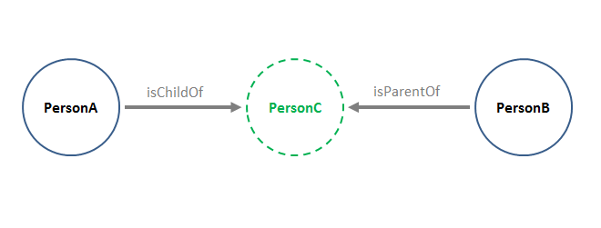

# Traversing Outbound and Inbound Links (*xg*, *yg* and *gqp*) #

----------

**Page contents:**

* [Traversing Outbound Links with the **xg** Flag](#hdr1)
	* [Example: Using **xg** to Retrieve Parent Organizations](#hdr2)
	* [Operands of the **xg** Flag](#hdr3)
		* [**xg** with No Operands](#hdr4)
		* [Expansion Level](#hdr5)
		* [Expansion Field](#hdr6)
		* [The Outbound Link Operator '>'](#hdr7)
		* [The Field Wildcard](#hdr8)
		* [Field Filters](#hdr9)
* [Traversing Outbound and Inbound Links with the **yg** Flag](#hdr10)
    * [Implementing Multiple Expansion Paths with the Pipe Operator](hdrYgPipe)
    * [Using the **yg-chunk-size** Parameter](#hdr11)
* [Using **xg** and **yg** Together](#hdr12)
	* [Ghost Skips](#hdr13)
* [Usage Scenario with Outbound and Inbound Links](#hdr14)
* [Using **gqp** to Filter by Inbound/Outbound Relationships](#hdr15)
    * [Implementing Multiple Filter Expressions with the Pipe Operator](#hdr16)

----------

Infoton field values sometimes refer to other CM-Well entities, and are themselves links to infotons. Thus, infotons "point to" each other via fields with infoton URI values. If infoton A has a field value that is the URI of infoton B, then A is said to have an outbound link to B, and B has an inbound link from A.


When you perform a CM-Well query, its results are a list of infotons that match the query parameters. Together with the query matches, you can also retrieve other infotons that point to the matched infotons, or are pointed to by them. In other words, you can retrieve the matched infotons' inbound and outbound links.

You do this by using the **xg** and **yg** parameters described in the following sections.

>**Note:** You cannot use the **xg** and **yg** parameters together with the **with-history** flag. This is because the inbound and outbound links are not well-defined when including multiple historical versions of each infoton. An attempt to combine graph traversal (use of **xg** and **yg**) with historical versions will result in an error. 

<a name="hdr1"></a>
## Traversing Outbound Links with the *xg* Flag ##

<a name="hdr2"></a>
### Example: Using *xg* to Retrieve Parent Organizations ###

The following query searches for Organization infotons whose name contains "Marriott Ownership" and whose city contains "Orlando":

    <cm-well-host>/permid.org?op=search&qp=CommonName.mdaas:Marriott%20Ownership,organizationCity.mdaas:Orlando&with-data&format=ttl&length=1

Running the query produces the following single infoton result (truncated for readability):

    <http://permid.org/1-4294969614>
        a                               mdaas:Organization , organization:Organization ;
        mdaas:CIK                       "0001541356" ;
        mdaas:CommonName                "Marriott Ownership Resorts Inc"@en ;
        mdaas:LEI                       "BW4532OH033VURR0IT68" ;
        mdaas:MXID                      "108194567" ;
        mdaas:OrganizationProviderTypeCode        "1" ;
        mdaas:RCPID                     "600073966" ;
        mdaas:TaxID                     "521320904" ;
        mdaas:akaName                   "Marriott Ownership Resorts" ;
        mdaas:entityLastReviewedDate    "2010-02-26 05:00:00" ;
        mdaas:equityInstrumentCount     "0" ;
        mdaas:hasImmediateParent        <http://permid.org/1-5035948006> ;
        mdaas:hasRegistrationAuthority  <http://permid.org/1-5000008957> ;
        mdaas:hasUltimateParent         <http://permid.org/1-5035948006> ;
        mdaas:headquartersAddress       "ORLANDO\nFLORIDA\n32821-6066\nUnited States\n"@en , "6649 Westwood Blvd Ste 300\nORLANDO\nFLORIDA\n32821-6066\nUnited States\n" ;
        ...

In the infoton retrieved by the query, we can see 3 fields that contain links to other infotons: ```hasImmediateParent```, ```hasRegistrationAuthority``` and ```hasUltimateParent```.


If we wanted to retrieve these infotons as well, we could use the **xg** flag, as in the following modified query:

    <cm-well-host>/permid.org?op=search&qp=CommonName.mdaas:Marriott%20Ownership,organizationCity.mdaas:Orlando&with-data&format=ttl&xg

This produces the following (truncated) results:

    <http://permid.org/1-4294969614>
        a                               mdaas:Organization , organization:Organization ;
        mdaas:CIK                       "0001541356" ;
        mdaas:CommonName                "Marriott Ownership Resorts Inc"@en ;
        mdaas:LEI                       "BW4532OH033VURR0IT68" ;
        mdaas:MXID                      "108194567" ;
        mdaas:OrganizationProviderTypeCode      "1" ;
        mdaas:RCPID                     "600073966" ;
        mdaas:TaxID                     "521320904" ;
        mdaas:akaName                   "Marriott Ownership Resorts" ;
        mdaas:entityLastReviewedDate    "2010-02-26 05:00:00" ;
        mdaas:equityInstrumentCount     "0" ;
        mdaas:hasImmediateParent        <http://permid.org/1-5035948006> ;
        mdaas:hasRegistrationAuthority  <http://permid.org/1-5000008957> ;
        mdaas:hasUltimateParent         <http://permid.org/1-5035948006> ;
		...

    <http://permid.org/1-5035948006>
        a                               mdaas:Organization , organization:Organization ;
        mdaas:CIK                       "0001524358" ;
        mdaas:CommonName                "Marriott Vacations Worldwide Corp" ;
        mdaas:ExchangeTicker            "VAC" ;
        mdaas:InvestextID               "VAC" ;
        mdaas:LEI                       "549300WA6BT5H4F7IO94" ;
        mdaas:MXID                      "111800547" ;
        mdaas:RCPID                     "600304172" ;
        mdaas:RIC                       "VAC.N" ;
        mdaas:SDCID                     "1218547002          " ;
        mdaas:SDCusip                   "56655E" ;
        mdaas:TaxID                     "452598330" ;
        mdaas:entityLastReviewedDate    "2016-03-02 05:00:00" ;
        mdaas:equityInstrumentCount     "1" ;
        mdaas:hasImmediateParent        <http://permid.org/1-5035948006> ;
        mdaas:hasRegistrationAuthority  <http://permid.org/1-5000008957> ;
        mdaas:hasUltimateParent         <http://permid.org/1-5035948006> ;
		...

    <http://permid.org/1-5000008957>
        a                               mdaas:Organization , organization:Organization ;
        mdaas:officialLatinName         "Delaware Department of State"@en ;
        tr-common:hasPermId             "5000008957" ;
        organization:hasActivityStatus  organization:statusActive ;
        organization:hasHeadquartersAddress  <http://permid.org/2-c59eac8479e6106496cb322e1d4705657db9708018a2dec5b178fe193d549879> ;
        organization:hasImmediateParent      <http://permid.org/1-5000008957> ;
        organization:hasLegacyPI        "15894917" ;
        organization:hasMXID            "107548790" ;
        organization:hasNDAOrgID        "106227913" ;
        organization:hasOfficialName    "Delaware Department of State"@en ;
		...
		
    <http://data.thomsonreuters.com/1-4294969614>
        a                            oa:Organization ;
        Common:organizationFoundedDaysourceLink
                "https://icis.corp.delaware.gov/Ecorp/EntitySearch/NameSearch.aspx" ;
        Common:organizationFoundedDaysourceType
                <http://data.thomsonreuters.com/1-2010107> ;
        Common:organizationFoundedDaysourceUpdateDate
                "2015-12-28T17:22:50" ;
        Common:organizationFoundedMonthsourceLink
                "https://icis.corp.delaware.gov/Ecorp/EntitySearch/NameSearch.aspx" ;
        Common:organizationFoundedMonthsourceType
                <http://data.thomsonreuters.com/1-2010107> ;
        Common:organizationFoundedMonthsourceUpdateDate
                "2015-12-28T17:22:50" ;
        Common:organizationFoundedYearsourceLink
                "https://icis.corp.delaware.gov/Ecorp/EntitySearch/NameSearch.aspx" ;
        Common:organizationFoundedYearsourceType
                <http://data.thomsonreuters.com/1-2010107> ;
        Common:organizationFoundedYearsourceUpdateDate
                "2015-12-28T17:22:50" ;
		...
	
    <http://permid.org/2-29ea9a58f0cf50bd968c58b8b301903bec0a3d793d3c9cc562a80d130a61555c>
        a                     vcard:Address ;
        vcard:country-name    "US" ;
        vcard:locality        "WILMINGTON" ;
        vcard:postal-code     "19808" ;
        vcard:region          "DELAWARE" ;
        vcard:street-address  "Suite 400\n2711 Centerville Road\nNew Castle"@en .	
		...
		
    <http://permid.org/2-0ea63bd5da91dc26c362f09a984b27eb4ada52b0bd494e3e0b8ec54e8fb6ac3d>
        a                     vcard:Address ;
        vcard:country-name    "US" ;
        vcard:locality        "ORLANDO" ;
        vcard:postal-code     "32821-6066" ;
        vcard:region          "FLORIDA" ;
        vcard:street-address  "6649 Westwood Blvd Ste 300"@en .	
		...


Note that these results contain the original infoton result, the 3 Organization infotons that are contained in its fields, and also 2 Address infotons that are contained in its fields. The last 5 infotons were retrieved because we used the **xg** flag.

Suppose we're only interested in Marriott Ownership Resorts' immediate parent. We can run the following query:

    <cm-well-host>/permid.org?op=search&qp=CommonName.mdaas:Marriott%20Ownership,organizationCity.mdaas:Orlando&with-data&format=ttl&xg=hasImmediateParent.mdaas
    
By specifying the field name ```hasImmediateParent``` as the **xg** value, we now constrain the query to return only outbound links contained in the original infoton's ```hasImmediateParent``` field.

If we're interested both in Marriott Ownership Resorts' immediate parent and its ultimate parent, we can specify two field names in the **xg** flag, as follows:

    <cm-well-host>/permid.org?op=search&qp=CommonName.mdaas:Marriott%20Ownership,organizationCity.mdaas:Orlando&with-data&format=ttl&xg=hasImmediateParent.mdaas,hasUltimateParent.mdaas

Now that you've seen an example of what you can achieve with the **xg** flag, read on to learn about more **xg** options and about the **yg** flag.

<a name="hdr3"></a>
### Operands of the *xg* Flag ###

The **xg** flag can appear with or without other operands. The following sections describe these options.

<a name="hdr4"></a>
#### *xg* with No Operands ####

When the **xg** flag appears with no operands, the query results will contain (in addition to the infotons that match the query) all infotons that are outbound links of the matched infotons. These outbound links may be infotons of any type.

<a name="hdr5"></a>
#### Expansion Level ####
You can add a numeric expansion level operand to the xg flag, which is a value between 1 and 9.

    xg=<integer>

For example:

    <cm-well-host>/permid.org?op=search
    &qp=CommonName.mdaas:Marriott%20Ownership,organizationCity.mdaas:Orlando&with-data&format=ttl&xg=2

The query above returns the matched infotons, their outbound links, and the outbound links of the "level 1" outbound links. In other words, **xg=2** retrieves both 1st and 2nd level outbound links, originating from the query matches.


> **Notes:** 
> * **xg=1** is equivalent to **xg** with no operands.
> * The value of the **xg** parameter is limited to 9, but it is recommended to use smaller values (e.g. 1 or 2). The **xg** parameter should be used with caution, as larger numbers may result in very large data sets being returned. If you find you need a larger expansion level (e.g. 9 or above), this may indicate an inefficient data model or query.

<a name="hdr6"></a>
#### Expansion Field ####

Rather than requesting all outbound links, you can request only the outbound links that appear in a certain field or list of fields.  To do this, add **xg=** followed by a single field name or list of comma-separated field names.

    xg=<fieldName>
    xg=<fieldName>,<fieldName>,...,<fieldName>

For example, if you're querying for organizations and you're only interested in retrieving their immediate parent organizations, you could run the following query:

    <cm-well-host>/permid.org?op=search&qp=CommonName.mdaas:Marriott%20Ownership,organizationCity.mdaas:Orlando&format=ttl&with-data&xg=hasImmediateParent.mdaas

If you wanted to retrieve both immediate parents and ultimate parents, you could run the following query:

    <cm-well-host>/permid.org?op=search&qp=CommonName.mdaas:Marriott%20Ownership,organizationCity.mdaas:Orlando&format=ttl&with-data&xg=hasImmediateParent.mdaas,hasUltimateParent.mdaas

<a name="hdr7"></a>
#### The Outbound Link Operator ('>') ####

Suppose you have defined an **xg** value that returns a certain set of outbound links. You can then further expand this set to refer to higher levels of outbound links, using the '>' operator.

    xg=<outboundExpansion> > <fieldIdentifier>

For example:

    <cm-well-host>/permid.org?op=search&qp=CommonName.mdaas:Marriott%20Ownership,organizationCity.mdaas:Orlando&format=ttl&with-data&xg=hasImmediateParent.mdaas>hasUltimateParent.mdaas

This query retrieves the outbound links in the **hasImmediateParent** fields of the matched infotons, and in addition, the outbound links in the **hasUltimateParent** fields of the level 1 outbound links.

You can add a "chain" of several outbound link operators with field identifiers, to retrieve more and more remote links.

<a name="hdr8"></a>
#### The Field Wildcard ####

Instead of adding a specific field name after the '>' operator, you can use the wildcard character '_' to indicate all fields.

For example:

    <cm-well-host>/permid.org?op=search&qp=CommonName.mdaas:Marriott%20Ownership,organizationCity.mdaas:Orlando&format=ttl&with-data&xg=hasImmediateParent.mdaas>_

This query retrieves the outbound links in the **hasImmediateParent** fields of the matched infotons, and in addition, the outbound links *all* fields of the level 1 outbound links.

<a name="hdr9"></a>
#### Field Filters ####

You can add field filters to constrain the additional infotons retrieved by the **xg** flag. You do this by adding the field filters in [ ] brackets after the expansion definition.

    xg=<outboundExpansion>[field filter]

>**Note:** The syntax of the field filter is the same as for the [qp parameter](API.FieldConditionSyntax.md), except that the fuzzy match operator ~ is not supported for **xg** queries.

For example:

    <cm-well-host>/permid.org?op=search&qp=CommonName.mdaas:Marriott%20Ownership,organizationCity.mdaas:Orlando&format=ttl&with-data&xg=hasImmediateParent.mdaas[organizationCity.mdaas:New%20York]

This query retrieves the outbound links in the **hasImmediateParent** fields of the matched infotons, but only those whose city field value is "New York".

<a name="hdr10"></a>
## Traversing Outbound and Inbound Links with the *yg* Flag ##
You may want to define an expansion clause that refers to inbound links instead of (or as well as) outbound links. To do this, you use the **yg** flag.

Much of the syntax for the **yg** flag is the same as for the **xg** flag, so please read the sections above describing **xg** operands.

The main differences between the **xg** flag and the **yg** flag are:

* With the **yg** flag, you can also use the `<` operator to indicate inbound links.
* You cannot use the '_' wildcard with **yg** (as this would create a prohibitively expensive query).

For example:

    <cm-well-host>/permid.org?op=search&qp=CommonName.mdaas:Marriott%20Ownership,organizationCity.mdaas:Orlando&format=ttl&with-data&yg=<hasImmediateParent.mdaas<hasImmediateParent.mdaas

This query retrieves all infotons that point to the matched infotons through their immediate parents field, and also all infotons that point to the level 1 inbound links through their immediate parents field. In other words, it retrieves the child companies of the child companies of the matched infotons. 

<a name="hdrYgPipe"></a>
### Implementing Multiple Expansion Paths with the Pipe Operator ###

If you want to expand along several paths using a single query, you can add several expansion expressions separated by the pipe ('|') operator.

For example, supposed we've uploaded the following information to CM-Well, which refers to the individual ```MrPresident```:

    @prefix foaf: <http://xmlns.com/foaf/0.1/> .
    @prefix dc:   <http://purl.org/dc/terms/> .
    @prefix locn: <http://www.w3.org/ns/locn#> .
    @prefix madsrdf:  <http://www.loc.gov/mads/rdf/v1#> .
    @prefix geonames: <http://www.geonames.org/ontology#> .
    @prefix geo:  <http://www.w3.org/2003/01/geo/wgs84_pos#> .
    @prefix xmpl: <http://ont.example.org/2017/v1.0#> .
    @prefix time: <http://www.w3.org/2006/time#> .
    @prefix xsd:  <http://www.w3.org/2001/XMLSchema#> .
    @prefix rdfs: <http://www.w3.org/2000/01/rdf-schema#> .
    @prefix cc:   <http://creativecommons.org/ns#> .
    
    <http://example.org/Individuals/MrPresident> a foaf:Person ;
      madsrdf:birthPlace <http://sws.geonames.org/5122525/> .
    
    <http://example.org/Residence/fedcba98-7654-3210-1234-56789abcdef0> a xmpl:Residence ;
      locn:location <http://sws.geonames.org/5122525/> ;
      xmpl:hasTenant <http://example.org/Individuals/MrPresident> ;
      time:hasBeginning "2017-01-20"^^xsd:date ;
      time:hasEnd "TBD" .
    
    <http://sws.geonames.org/5122525/> a geonames:Feature ;
      rdfs:isDefinedBy <http://sws.geonames.org/5122525/about.rdf> ;
      geonames:name "Jamaica Hospital Medical Center" ;
      geonames:alternateName "Jamaica Hospital" ;
      geonames:officialName "Jamaica Hospital Medical Center"@en ;
      geonames:featureClass geonames:S ;
      geonames:featureCode geonames:S\.HSP ;
      geonames:countryCode "US" ;
      geo:lat "40.70078"^^xsd:decimal ;
      geo:long "-73.81635"^^xsd:decimal ;
      geo:alt "18"^^xsd:decimal ;
      geonames:parentFeature <http://sws.geonames.org/5133268/> ;
      geonames:parentCountry <http://sws.geonames.org/6252001/> ;
      geonames:parentADM1 <http://sws.geonames.org/5128638/> ;
      geonames:parentADM2 <http://sws.geonames.org/5133268/> ;
      geonames:nearbyFeatures <http://sws.geonames.org/5122525/nearby.rdf> ;
      geonames:locationMap <http://www.geonames.org/5122525/jamaica-hospital-medical-center.html> .
    
    <http://sws.geonames.org/5122525/about.rdf> a foaf:Document ;
      foaf:primaryTopic <http://sws.geonames.org/5122525/> ;
      cc:license <http://creativecommons.org/licenses/by/3.0/> ;
      cc:attributionURL <http://sws.geonames.org/5122525/> ;
      cc:attributionName "GeoNames"^^xsd:string ;
      dc:created "2006-01-15"^^xsd:date ;
      dc:modified "2016-12-06"^^xsd:date .
    
    <http://sws.geonames.org/4140704/> a <http://www.geonames.org/ontology#Feature> ;
      rdfs:isDefinedBy <http://sws.geonames.org/4140704/about.rdf> ;
      geonames:name "The White House" ;
      geonames:alternateName "Executive Mansion", "Presidents House", "Presidents Palace", "White House"@en ;
      geonames:officialName "Maison Blanche"@fr, "The White House"@en, "Weißes Haus"@de ;
      geonames:featureClass geonames:S ;
      geonames:featureCode geonames:S\.BLDG ;
      geonames:countryCode "US" ;
      geo:lat "38.89761"^^xsd:decimal ;
      geo:long "-77.03637"^^xsd:decimal ;
      geo:alt "17"^^xsd:decimal ;
      geonames:parentFeature <http://sws.geonames.org/4140987/> ;
      geonames:parentCountry <http://sws.geonames.org/6252001/> ;
      geonames:parentADM1 <http://sws.geonames.org/4138106/> ;
      geonames:parentADM2 <http://sws.geonames.org/4140987/> ;
      geonames:nearbyFeatures <http://sws.geonames.org/4140704/nearby.rdf> ;
      geonames:locationMap <http://www.geonames.org/4140704/the-white-house.html> .
    
    <http://sws.geonames.org/4140704/about.rdf> a foaf:Document ;
      foaf:primaryTopic <http://sws.geonames.org/4140704/> ;
      cc:license <http://creativecommons.org/licenses/by/3.0/> ;
      cc:attributionURL <http://sws.geonames.org/4140704/> ;
      cc:attributionName "GeoNames"^^xsd:string ;
      dc:created "2006-01-15"^^xsd:date ;
      dc:modified "2014-08-04"^^xsd:date .
    
In a single query, the following call retrieves both the place that ```MrPresident``` was born (via an outbound link), and all the places where ```MrPresident``` lived (via a combination of inbound and outbound links):

    <cm-well-host>/example.org/Individuals/MrPresident?yg=<hasTenant.xmpl>location.locn|>birthPlace.madsrdf

You can add as many pipe-separated expansion expressions to one query as you want. The results are the equivalent of running each expansion query separately and pooling all their results.

<a name="hdr11"></a>
### Using the *yg-chunk-size* Parameter ###

You can add the **yg-chunk-size** parameter to a  **yg** query.The **yg-chunk-size** value determines how many infoton paths (that resulted from the query preceding the **yg** query) will be processed at a time in a single **yg** query. This prevents heavy **yg** queries from "starving" other operations. 
The **yg** query is processed in chunks of **yg-chunk-size** until all input paths are processed.

The default value for **yg-chunk-size** is 10. For best results, you may need to adjust the value according to the specific query you're running.

<a name="hdr12"></a>
## Using xg and yg Together ##

You can use the **xg** and **yg** flags together in the same search. In this case, first the **yg** traversal is processed and then the **xg** traversal.

This can be useful in cases where you want to collect a certain group of infotons using **yg**, and then expand them along a certain link using **xg**. This feature is often used in conjunction with SPARQL queries, the generate the input for the SPARQL query.

<a name="hdr13"></a>
### Ghost Skips ###

In some cases, when using **yg** to filter infotons according to their indirect relationships with other infotons, you may be interested in filtering by the relationship itself, while the intermediate infoton within the relationship is not important.

Here is an example:

 

Suppose we want to find PersonB, who is the grandparent of PersonA. We can determine this relationship by finding that the PersonA and PersonB infotons both point to PersonC, with the respective relationships of isChildOf and isParentOf. However, we can do this even if the PersonC infoton doesn't exist, that is, only its URI exists and appears in the fields of PersonA and PersonB.

CM-Well tolerates this situation when applying **yg** filters. That is, it skips over such "ghost" infotons as long as their URIs satisfy the relationship defined in the filter.

If, on the other hand, if you want to constrain your query to return only results for which the intermediate infoton *does* exist, you can do this by adding a filter on the intermediate infoton's fields. For example:

    \>aField[system.uuid:]<bField

This filter requires only that the intermediate infoton have a ```system.uuid``` field with any value, and it works because every infoton has a ```system.uuid``` field. Alternatively, for our example searching for Person infotons, we could add this filter:

    \>childOf[type.rdf:Person]<parentOf

<a name="hdr14"></a>
## Usage Scenario with Outbound and Inbound Links ##

Now that we understand how to work with outbound and inbound links, let's examine a scenario for which this feature is useful.

Suppose we have a Quote, with a known RIC code of “VAC”. We want to find the corporate address of the company that issues it. We know the model in Open PermID includes Quotes, which link out to Instruments via the **IsQuoteOf** field. Organization infotons also link to Instruments, via the **primaryInstrument** field. The following diagram illustrates these relationships.


You can see that in order to retrieve the organization that issued the quote, we can follow the quote's outbound link to an instrument, and then follow the instrument's inbound link to the organization. To achieve this, we can run this query:

    <cm-well-host>/permid.org?op=search&qp=RIC.mdaas::VAC&with-data&yg=>IsQuoteOf.mdaas<primaryInstrument.mdaas
    
When we retrieve the desired organization's infoton, we can obtain its address value.

<a name="hdr15"></a>
# Using *gqp* to Filter by Inbound/Outbound Relationships #

In some cases you may want to filter a group of infotons according to their inbound/outbound links, without actually retrieving those links.

For example, suppose you want to retrieve all persons of an age greater than 32, who live in New York. This condition must be applied to the following linked infotons:


We would like to retrieve only the Person infotons, while applying filters on the linked AddressRelation and Address infotons, but without retrieving those linked infotons.

There are ways to address this using **yg** and SPARQL queries, but they have limitations. For instance, a SPARQL query might terminate before finding results, due to the limit on the number of interim results that it can examine (10,000). Alternatively you could create a materialized view to address this scenario, but you'd have to update it every time a person changes their address.

The **gqp** flag is intended to handle this requirement. Here is an example of a search clause that uses **gqp** for the scenario described above:

    <cm-well-host>/?op=search&qp=type.rdf:Person,age>32&gqp=<addressOfPerson>physicalAddress[city::New%20York]

The **gqp** flag's syntax is identical to the **yg** flag's syntax, but it operates differently. As **yg** traverses the links defined in its value expression, it adds all the infotons in the link paths to its results. **gqp** does not add infotons to the results in the set returned by the search query. Rather it attempts to evaluate its expression for each "root" infoton, and if it fails at some stage in the evaluation or the expression evaluates as **false**, then the root infoton from which the path originated is *removed* from the result set.

The **gqp** flag can be used together with **xg** and **yg**. In this case, **gqp** takes precedence, meaning that first results are filtered by the **gqp** expression, and then expanded by **xg** and **yg**.

>**Notes:** 
>* The **gqp** flag can be applied to both **consume** and **search** operations. Note that when using **gqp** with consume, it is possible to filter out the entire chunk and therefore to receive no results for some iterations. If in this case you receive a 204 error, but the position token in the header is different than the one sent, you still need to keep consuming.
>* The [ghost skips](#hdr13) behavior applies to **qgp** as well as **yg**.

<a name="hdr16"></a>
## Implementing Multiple Filter Expressions with the Pipe Operator ##

As for the **yg** query, you can add several filter expressions to a single **gqp** query, separated by the pipe ('|') operator. However, the behavior of the complex expression is different than for **yg**. When piped expressions are used with **gqp**, CM-Well applies "or" logic among them. This means that in order to match the filter, an infoton only needs to match *one* of the piped expressions.

For example, the following query retrieves infotons of people who live *either* in New York *or* in Chicago.

    <cm-well-host>/?op=search&qp=type.rdf:Person&gqp=<addressOfPerson>physicalAddress[city::New%20York]|<addressOfPerson>physicalAddress[city::Chicago]