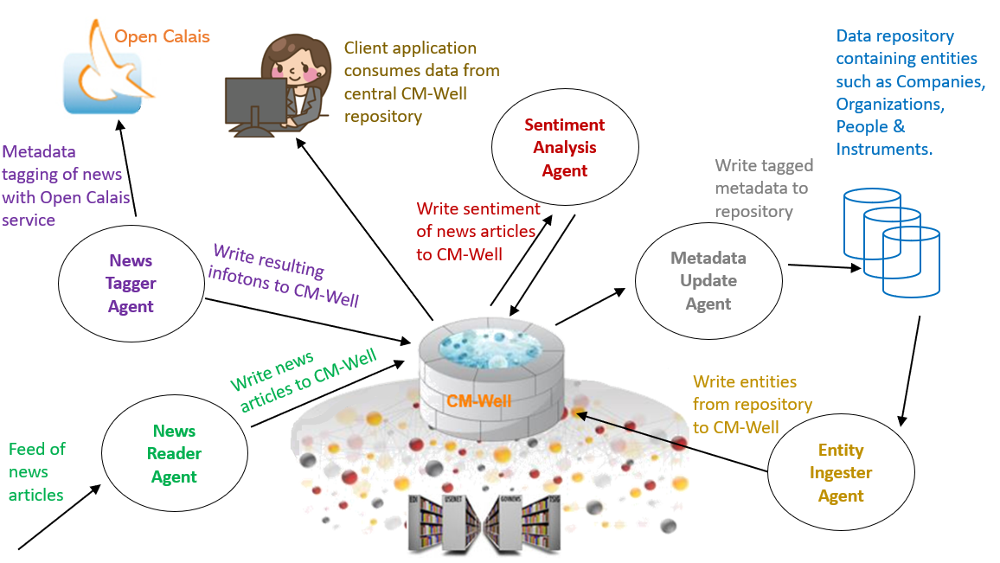

# CM-Well Collaboration Use Case: Information Ecosystem

The following diagram illustrates one possible use case for CM-Well as the hub of an information ecosystem. CM-Well is populated with infotons that are the result of automated metadata tagging applied to news articles, and also from additional data repositories. Various external agents read and write information from/to CM-Well.

  