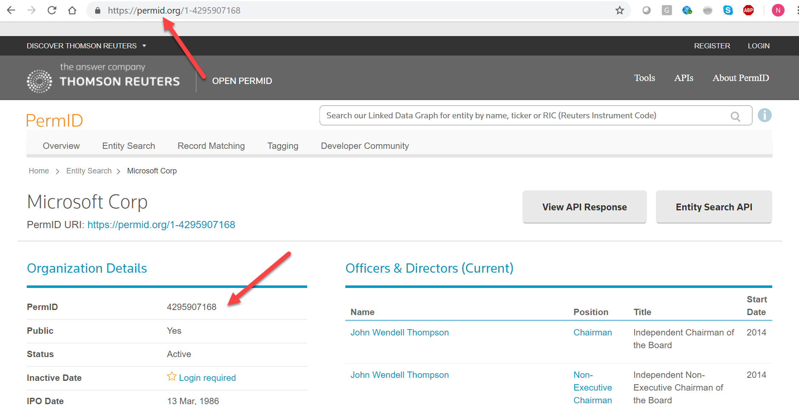

# Information Objects (“Infotons”)

CM-Well uses an information unit called an "infoton". An infoton is the set of all the triples associated with a single subject entity.

Each infoton:

- Represents a single entity or object.
- Has a URI, which serves as an ID of the object (which is the subject of the collection of triples the infoton contains), and which also serves as the infoton's reference address.
- Can have several attributes (the "objects" in the infoton's <subject-predicate-object> triples). Attributes can be either literal values or links to other infotons. Attribute types have namespaces, and can refer to external ontologies.
- Has one current version, pointed to by the URI, and optionally several "historical" versions, each with its own Universally Unique Identifier (UUID).

The data is still logically structured as a set of separate triples, but the infoton is physically stored together with the set of its predicate-subject relationships, as illustrated below:


By "flattening" the physical model in this way, CM-Well is able to more easily scale to very large numbers of triples, as it becomes easier to store the data horizontally across many more servers. This model is a combination of a traditional key-value database approach and a document-based approach (where the infoton is the "document").

Here is an example of a Turtle formatted infoton (truncated for brevity). Note the following:

- Prefixes are defined at the top, and then used in the infoton body for readability.
- The first triple ```:1-5035948006  a   mdaas:Organization ;``` indicates that this infoton is of type **Organization** , and its ID is 1-5035948006.
- The following triples describe additional attributes of the infoton.
- Some attributes have the "sys" namespace. This means that they are system attributes written internally by CM-Well, and not by the user who created or updated the infoton.

```
	@prefix mdaas: <http://ont.thomsonreuters.com/mdaas/> .
	
	@prefix sys:   <http://cm-well-host.com/meta/sys#> .
	
	@prefix nn:<http://cm-well-host.com/meta/nn#> .
	
	@prefix xsd:   <http://www.w3.org/2001/XMLSchema#> .
	
	@prefix rdf:   <http://www.w3.org/1999/02/22-rdf-syntax-ns#> .
	
	@prefix o: <http://permid.org/> .

    o:1-5035948006  a   mdaas:Organization ;

    sys:dataCenter  "na" ;

    sys:lastModified"2015-06-08T21:09:45.855Z"^^xsd:dateTime ;

    sys:parent  "/permid.org" ;

    sys:path"/permid.org/1-5035948006" ;

    sys:type"ObjectInfoton" ;

    sys:uuid"3205fef15f8bfda48bd1d44da2b6cb7a" ;

    mdaas:CIK   "0001524358" ;

    mdaas:CommonName"Marriott Vacations Worldwide Corp"@en ;

    mdaas:InvestextID   "VAC" ;

    mdaas:LEI   "549300WA6BT5H4F7IO94" ;

    mdaas:MXID  "111800547" ;

    ...

    mdaas:subsidiariesCount "109" .
```

## Infoton Types

Infotons can have the following types:

- **Object** – the most common type of infoton, described above; contains a collection of triples.
- **File** – an all-purpose text file.
- **Link** – points to another infoton (similar to a redirected URL).
- **Directory** – an infoton can be just a container for other infotons. Directory infotons may (but don't have to) have user-defined field values. Entity infotons and Directory infotons "look the same". The only difference is that Directory infotons can be created implicitly by creating another infoton with a path composed of '/'-separated parent directories.

!!! info
	The CM-Well web application is stored as a collection of file infotons.

## Infoton Formats

An infoton's data is a collection of triples associated with the infoton's subject.

Infotons can be retrieved in several common data formats, including JSON, RDF N3, RDF NQuads, RDF Ntriples, Atom, HTML, CSV, TSV, YAML and others.

See [Input and Output Formats](../../APIReference/UsageTopics/API.InputAndOutputFormats.md) to learn more.

## Readable URI

Infotons have readable URIs, that consist of their hierarchical path within CM-Well and their UUID.

Below you can see an example of a Company infoton within the Thomson Reuters PermID site (whose underlying data is provided by CM-Well). Note that the entity's PermID (permanent identifier) is an explicit part of the infoton's URL.



## Flexible Schema

Infotons have some "system fields" that are added automatically, such as their UUID, timestamp and path values. Other than system fields, there is no mandatory schema for an infoton. All well-formed fields are valid, no fields are mandatory, and the same field name may have several values.

## Directory Structure

CM-Well implements a directory paradigm, which is not a standard of Linked Data repositories. This is a convenient way to define a data hierarchy that provides informative grouping and facilitates search.

Each infoton has a path under its CM-Well platform, which is determined at the time of its creation. The path is composed of '/'-separated parent directories. If during the creation of an infoton a parent directory is referenced, which doesn't represent an existing infoton, then the parent directory infoton is created implicitly.

## Immutable Data and Infoton "History Trail"

CM-Well implements an "immutable data" principle. This means that infotons are never overwritten, but rather when an update occurs, the current version is saved as a historical version, and the new version becomes the current version. When an infoton's URI is dereferenced, the current version is retrieved. API users can add the special **with-history** flag to retrieve historical versions of infotons, enabling users to audit an infoton's entire change history.

Similarly, a delete operation on an infoton doesn't physically delete the version, but just marks it with a special **Deleted** status. API users can add the special **with-deleted** flag to retrieve deleted infoton versions. (There is also a **purge** operation which physically deletes the infoton.)

Thus, as infotons are updated over time, each infoton accumulates an array of historical versions in addition to the current version (which always points to the most recent version written).

!!! info
	To receive all changes to a certain object (for example, a company), use the **consume** API together with the **with-deleted** flag.

The image below illustrates how an infoton is stored with all of its previous versions.


## Named Sub-Graphs (Quads)

CM-Well supports "named sub-graphs" within the entire CM-Well Linked Data graph. This allows users to assign a label to infoton fields. The label is the name of the sub-graph, and the nodes in the sub-graph are the items in that have the specific label. In this case, relationships in the graph are represented not by triples but by quads, which include the subject, predicate, object and label (sub-graph name).

The named sub-graph feature allows you to manipulate data using the sub-graph name. For example, you can search for or delete fields by sub-graph name.

Here is a scenario where you might want to use named sub-graphs. Suppose you're maintaining a database of movies under CM-Well. A movie may receive several review scores from several different sources. You want to save all the scores as "Score" field values, but label each value according to the reviewing entity. You can do this using named sub-graphs, where the quad value is the name of the reviewer.