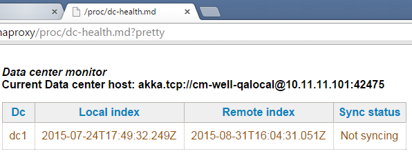
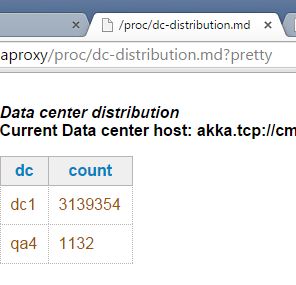

# Data Center Synchronization

## DC-Sync Overview

CM-Well scalability and resilience goes beyond a single Data Center (DC). It is based on a federation of CM-Wells in several interlinked DCs. Each DC pulls changes from the other DCs in its federation. Upon initial connection, the complete data set is replicated among the DCs, and from that point on, all new changes to data are replicated. This behavior complies with the "eventual consistency" nature of web content; it is neither transactional nor performed at real-time speed. The goal is that all information will eventually (in a reasonably short time period) be available in all DCs.

Each CM-Well grid in each DC is autonomous and self-contained. Machines in the grid are interlinked for updates (similar to the PuSH capabilities available to all clients); other than that they're loosely grouped.

This design is intentional and was chosen instead of relying on e.g. Cassandra's cross-DC "big circle", that would lock the design into a specific storage engine, and would also create a stronger dependency among the CM-Wells. The Cassandra model would also force a level of asymmetry on the storage layer and its management of various storage engines. The advantage of the chosen design paradigm is that it's implemented at the node level and uses an abstract storage layer that hides (and therefore enables replacing) the underlying storage engines.

The synchronization is also made simpler due to the fact that infotons are never overwritten but rather a new instance is created with its own internal UUID, leaving the previous version unchanged. The synchronization process effectively walks the timeline of the remote DC compared to the local DC replication, and imports objects in the order they're encountered on the timeline.

This enables a possible future feature, which is the ability to cope with a partial disconnect. E.g. Suppose there are 3 data centers: DC-1 , DC-2, and DC-3. Normally each DC pulls data from its peers directly (they are all interconnected). However if DC-3 for instance cannot reach DC-1 (due to a network issue), but DC-3 can reach DC-2 and DC-2 can reach DC-1, a contingency plan for DC-3 is to fetch DC-1's updates indirectly via DC-2 (despite not having direct connectivity).

## Rules and Assumptions

The following list describes some rules enforced and assumptions taken when planning the DC-Sync design:

- The most likely problem is a disconnection of DCs, not a CM-Well grid failing as a whole. Each grid is assumed to have enough machines to cope with its load (with spares). In addition, the replication factor, self-healing features and No-Single-Point-of-Failure design should cope with any local HW issue.
- There could be a DC catastrophe, which affects all (or a large portion) of DC machines.
- DC locality is assumed, i.e. we assume that each user writes to a single DC and does not implement cross-DC data replication independently from the automatic DC-Sync mechanism. Users should follow this best practice so as to avoid creating artificial race conditions between DCs.
- If a DC loses connection with other DCs, ingestion can continue locally as usual. Once the DC connects back, any changes will be propagated (in both directions).

## DC-Sync Models

Currently there are two types of synchronization models implemented among CM-Well grids:

- **Federation** – all grids within a defined group synchronize all data among themselves, such that eventually they are all copies of each other.
- **One-Directional** – synchronization is one-directional, such that the "slave" grid contains all data of the "master", but the opposite is not necessarily true. In this case, it's also possible to sync only a subset of the data rather than all the data.

## The DC-Sync Process

The DC-Sync process is based on a few simple principles that rely on the infoton's immutability. Each infoton has system fields indicating the originator DC and a timestamp of when it was ingested. These are fields searchable.

Each CM-Well grid contains a DC-Sync agent that is responsible for the synchronization process. This agent is hosted in its own JVM.

!!! note
	The DC-Sync JVM is spawned and initialized in each node, but only one DC-Sync agent is activated per grid. The DC-Sync agent roams among machines in case of node failure (similarly to the Health Control agent). A grid-level service determines which machine the DC-Sync will initially be run on.

The linkage of a CM-Well grid to remote DC grids is done via a special configuration infoton (stored under the meta/sys/dc path), containing the DC code name and URL (i.e. the DC's HTTP load balancer).

The DC-Sync agent creates a snapshot of the data that exists in each connected DC (based on the configuration infotons), then checks the last update from each DC. For each remote DC, it walks the timeline from the last update time and up to the present, and replicates the updated infotons. Infotons for update are pulled in small chunks and split into processing batches, in a way that avoids merge conflicts of updates to the same infoton. A precise reconstruction of the infoton updates is performed as per the ordered timeline.

## Monitoring DC-Sync

CM-Well provides a DC-Health dashboard for each DC, which reflects the state of synchronization vs. other DCs. The health view shows a table with a line per DC containing the local time cursor, the remote time cursor and the current state. Above the table, the specific node responsible for the replication is also displayed.

Below is an example of a sync process with the "Not syncing" status (in this case, due to no disk space).

In addition, the health view shows the distribution of objects per source DC (capturing where infotons were originated), as in the image below:

Health logs have a "yellow" status for a temporary inability to sync, and a "red" status for long-term failure to sync.
