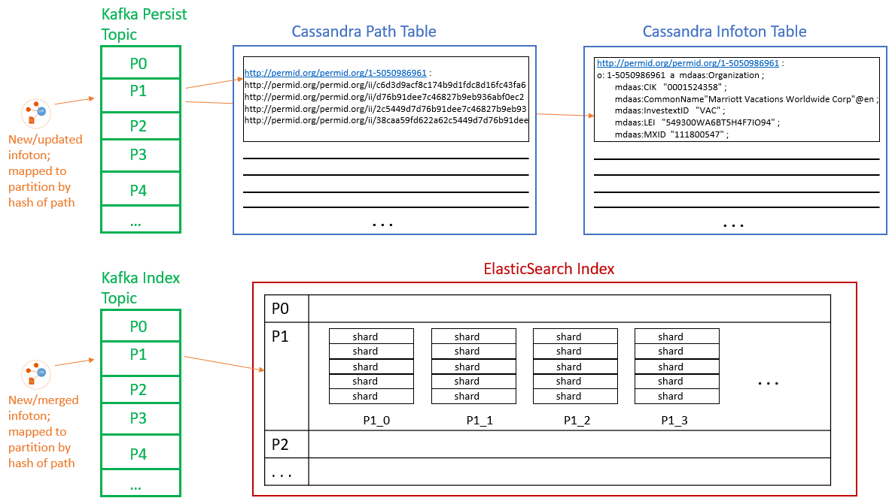

# Platform Overview & Design Principles

## Platform Architecture Overview

The CM-Well platform design is based on the concept of a grid providing a service, where all machines are equal. All machines are installed with an identical stack of components. There is no single point of failure. The system can tolerate a machine's failure and will realign to cope with the loss.

The system is designed to require zero manual maintenance. Any need for manual intervention (beyond physical repair) is considered a bug. This requires advanced health control and self-healing mechanisms.

## Data Redundancy

Inherent in the design of a fault-tolerant system is replication of data. The current replication factor is 3. This setup tolerates one machine outage at a time (so there is a quorum of 2 data replicas even if one copy is inaccessible). When a machine fails, the system recovers by replicating the data again to maintain the 3 copies for all data items.

Write requests are only considered complete after the new data has been written to a quorum of machines. Read requests also require a quorum, as data integrity is verified by reading one copy and checking it against the CRC value of a second copy.

## Grid Architecture

COMING SOON (diagram of grid services and how they spawn and interact with each other; Akka cluster singleton, master actor, etc.)

## Ingest Queues and Storage Architecture

CM-Well's management of infoton updates and storage is complex and involves several 3rd-party packages and distributed storage paradigms. The following diagram and table describe the architecture of these mechanisms.

 

| **Element** | **Contents** | **Logical Representation** | **Physical Representation** |
| --- | --- | --- | --- |
| Kafka Persist Topic | New or updated infotons, to be merged with existing if necessary and written to storage | One instance per CM-Well cluster | Each topic is divided into several partitions. Infotons are mapped to partitions according to a hash on their path value. Each partition resides on a single node and is processed by a single BG service. |
| Kafka Index Topic | New or updated (merged) infotons to be indexed by ES | One instance per CM-Well cluster | Each topic is divided into several partitions. Infotons are mapped to partitions according to a hash on their path value. Each partition resides on a single node and is processed by a single BG service. |
| CAS Path Table | Key is hash value of an infoton's path; maps to the list of point-in-time value UUIDs. | One instance per CM-Well cluster | Managed by Cassandra's "virtual circle" paradigm. Physically distributed among several machines. |
| CAS Infoton Table | Key is hash value of an infotons UUID; maps to the infoton's body (field name-value pairs) | One instance per CM-Well cluster | Managed by Cassandra's "virtual circle" paradigm. Physically distributed among several machines. |
| ES Index | Index of strings, mapping to infotons whose fields contains those strings | One instance per CM-Well cluster | The global instance is an alias encapsulating several "swim lanes", one per Kafka partition. This mechanism is a custom construct over ES, as ES does not efficiently manage big data sizes. |
| ES "swim lane" | A portion of the global ES index that maps to a single Kafka partition. Contains several "sub-indexes". | One instance per Kafka partition | CM-Well manages an ES "swim lane" (federation of smaller indexes) per Kafka partition. Each swim lane contains several "sub-indexes". |
| ES "sub-index" | Each "sub-index" contains a configurable number of Lucene "shards" (currently 5). | Several instances per ES "swim lane" | Each "sub-index" contains a configurable number of Lucene "shards" (currently 5). When the current sub-index reaches a certain size, a new one is created. ES manages physical shard distribution over several nodes. Each shard has a configurable number of replicas (currently 2). |

## Hardware Architecture and the Subdivision Concept

### Modules Using the Subdivision Concept

For certain modules that require large amounts of memory, we use a "subdivision concept" to assign different disks on the same machine to different JVMs. The subdivision concept was previously applied to both CAS modules and ES modules. Now, due to improvements to Cassandra and the use of the improved G1GC mode of JVM garbage collection, it is now applied only to ES and not to CAS.

The subdivision approach is not used for the WS and BG modules. These two processes use reactive patterns to drive best performance without requiring multiple JVMs (effective thread-pools, reactive & delegation to other components).

### Motivation for the Subdivision Concept

The initial CM-Well hardware design was based on commodity hardware, i.e. using many pizza-box machines, each with 2-3 drives, one 4-core CPU and 16GB to 32GB RAM.

The current setup uses bigger machines (Hadoop stereotype: 12 JBOD disks, 2 8-core CPUs -> 32-hyperthreaded core, 256GB RAM).

Most JVMs do not effectively use big heaps (with the exception of the expensive Azul Zing JVM), and are prone to critical error situations when they fail to do so. Therefore, for CM-Well we prefer to deploy multiple JVMs of moderate memory size (e.g. 8-16GB), while properly tuning the JVM memory parameters so as to minimize expensive garbage collection operations in "old generation" memory.

Given the conditions above, there is a gap between the hardware capabilities of the powerful machines and the limitations of the JVMs we run on them. To address this gap, we use "subdivisions" of the machines to maximally utilize their performance. Several JVM instances ("logical nodes") are spawned on each physical machine.  Each JVM is attached to its own set of 2 disks, thus minimizing resource contention and maximizing utilization.

Since faults may happen at the machine level, the storage layers (ES and CAS) are configured such that they treat the physical machine as a rack, so as not to have all data replicas stored onto the same machine, but rather to spread them across "virtual racks", i.e. physical machines.

## Resilience and Self-Healing

The HC module monitors JVM issues and can elect to kill a faulty JVM without damage due to the inherent redundancy. HC activities are logged, so there is full report of error situations for the admin personnel. HC repair activities are coordinated across the grid, and elective restarts of JVMs are managed such that they aren't done in parallel on several nodes.

If the WS and BG JVMs crash or if they're killed, the Health Control agent restarts them.

The ES and CAS JVMs use a different mechanism to assess faults and leverage the replication of data elements they store. Current replication factors allow tolerating a single machine's failure with no down-time or significant impact on performance. The assumption is that a 3-fold replication factor is enough to provide time to replace a machine when required (the replication factor can be configured to a larger number if this proves necessary).

If a machine fails and is non-responsive for 15 minutes, CM-Well starts replicating the failed machine's Cassandra segments on other machines. Before this can happen, the faulty node must be removed from the list of active nodes. This process is managed by the Health Control module.

ElasticSearch employs its own internal disaster recovery mechanisms. ES automatically compensates for failed nodes by replicating shards (and if necessary, by promoting secondary replicas to primary).

Both ElasticSearch and Kafka have a concept of primary and secondary partitions. If the machine with the primary partition fails, a new primary is elected from among the secondary partitions.

## Scalability

To scale up a CM-Well grid, simply add more CM-Well machines to the relevant data center. This enlarges both the grid's computing power and its storage capacity.

(Currently there is a configuration file that must be manually updated for new machines, but this is soon to be eliminated.)
