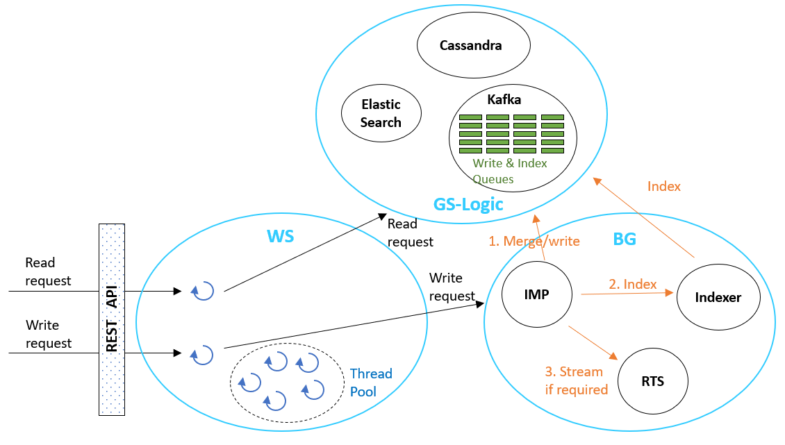
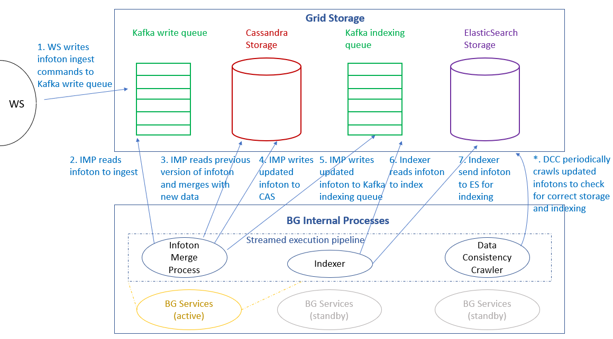

# Background (BG) Processing Module

The BG module (run in a separate JVM) performs batched processing of the ingest pipeline. BG takes requests from the update queue, processes them, and returns an asynchronous response to the requester (if tracking/blocking was activated on the ingest request). BG's internal modules (e.g. IMP, RTS, Indexer) are organized in a Disruptor-like pattern. BG maintains a pointer to its place in the queue, which is persisted periodically.

Almost all writes and calculations performed in this pipeline are idempotent, meaning that if for any reason BG processes a request more than once (e.g. due to a fault and restart) this will not change the state of the data. Stored information objects are immutable, and recalculating new instances results in the same exact outcome. (Note that if an attempt is made to write an infoton whose data is identical to that of an existing infoton, no write action occurs.)

## Infoton Merge Process (IMP)

The IMP module is responsible for writing new infotons and updating existing infotons. In the case of updating existing infotons, this includes retrieving the previous version of the infotons, merging them with the required changes, and writing the new current version. The resulting updated infotons are then queued for the RTS and Indexer modules to process.

The IMP has a "null elider" module. This means that if the IMP identifies that fulfilling a write request would result in a new infoton version whose user fields are identical to those of the existing current version, then it discards the write request (it skips over "null changes"). Note that only user fields are compared, while system fields are not. So, for example, if a null change is skipped, the relevant infoton's update time remains the existing update time, and is not changed.

## Real-Time Search (RTS)

The RTS is responsible for pushing changes to API clients who have subscribed for streamed updates. The clients have pre-defined CM-Well queries, and when new infotons are ingested, RTS checks to see whether they match the queries, and if so streams the new infotons to the subscribed clients.

## Indexer

After the IMP has written a new or updated infoton to CM-Well, the Indexer sends the infoton to be indexed by ES, while maintaining the abstraction of the directory structure. New versions are indexed and if necessary, the previous version is made "not current".

## Analytics Processing Module

The Analytics Processing Module is responsible for running heavy (and relatively long-running) queries in a controlled manner. For example, running a SPARQL or Gremlin query on a subgraph (or the full graph). This module is run in a separate JVM (also known by the nickname "Crashable Worker" or CW, because if it crashes or is killed, it doesn't harm mainstream CM-Well operation, and can be safely killed for using excess resources or becoming unresponsive). The processing pipeline of creating an in-memory subgraph, followed by execution of the SPARQL query itself is handled within this JVM. Creating a separate JVM process provides a quarantined environment where memory, CPU cycles and priority are controlled and isolated from other CM-Well components. Processes that are hung or are taking too many resources can be killed and restarted with no loss of data.

## Data Consistency Crawler Module

The Data Consistency Crawler (DCC) module tests proactively for inconsistent data in the infotons written to CM-Well, and fixes inconsistencies. The DCC's effect on performance is negligible.

The DCC runs within BG process, and is transparent to CM-Well users. It uses the  **\_kafka**  API to consume a copy of the Kafka  **persist\_topic**  queue (the queue filled with ingest messages by the Web Service process). Infotons are reviewed shortly after being processed (ingested) by BG. DCC tests each infoton in the queue for data inconsistencies.

A CM-Well cluster with N nodes has N Kafka Partitions, and N BgActors. Each BgActor, besides running Infoton Merge Process (IMP) and Indexer streams, also runs a DCC stream. If DCC operation is interrupted for any reason, the DCC resumes from its last known offset, which is persisted in  **zStore**. The assumption is that DCC can verify the same Kafka messages more than once with no harm done (its operation is idempotent).

## Process Diagrams

### Read and Write Processes – High Level

The following diagram illustrates the interactions that occur for read and write requests, among WS, BG and GS-Logic and their sub-modules (as described in the sections above).

### BG Process Internals

The following diagrams zooms in to examine the interactions that occur among internal BG processes when writing new or updated infotons.

Note that:

- Each BG instance processes ingest commands of a single partition of the Kafka queue (or "topic", as the queue is called in Kafka terminology). See [Storage Architecture](Arch.PlatformArch.Part1.md#ingest-queues-and-storage-architecture) to learn more about storage architecture in detail.
- On each CM-Well node, normally there is only one active BG service, with two more BG service instances in standby mode, for redundancy purposes. The two standby instances are allocated for processing the previous and next Kafka partitions, relative to the node's default partition. They only become active in case a BG service on another machine fails.

 