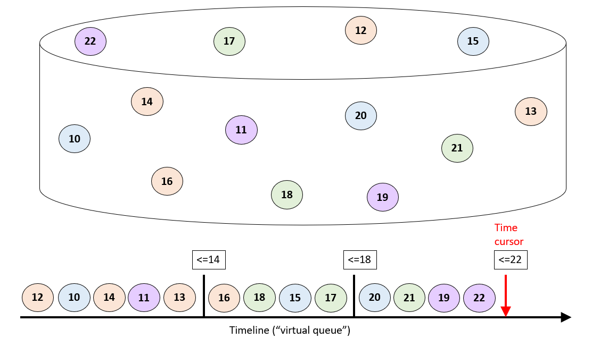

# Design Principles

## Dynamic Throughput Management

CM-Well is designed to manage its throughput dynamically, while performing to capacity on the one hand but not creating bottlenecks on the other. This is true of both read and write processing.

Processing is pipelined in such a way that each component can work at its own pace, while minimizing bottlenecks. Throughout the system, a "backpressure" mechanism is used to slow down insertion of new requests into processing queues, thus preventing congestion. This can result in users getting "Server Busy" errors and having to retry requests.

Under normal load, different processing activities are with a small distance on the time axis. Internal caching increases efficiency (flattening away the pipeline segregation). As an additional efficiency measure, the data of small infotons are put in the same queue as the ingest command message, so that the data is read by a sequential (efficient) process rather than a random-access fetch. (In practice, most infotons are small enough for this type of handling.)

Additional features of dynamic throughput management are:

- Each node runs multiple ES and CAS processes to handle ingestion.
- Write requests are performed asynchronously.
- A "backpressure" mechanism is used, whereby CM-Well may return "Server is Busy" errors if its queues are too full. It then becomes the caller's responsibility to manage retries.
- Several streaming requests can be handled in parallel, as they refer to chunks (lists of infotons) with no overlap in timestamp.

## Virtual Queues

Many CM-Well operations are applied to large groups of infotons, such as:

- Streaming
- Data center synchronization (replication)
- Any batch processing of data from CM-Well

CM-Well does not manage in-memory queues for infotons waiting to be processed. Instead, it can be said to manage such groups with a "virtual queue" paradigm. All infotons have a timestamp, indicating the time the infoton was written or updated. CM-Well retrieves groups of infotons to be processed by querying for them according to their timestamp (among other filters). Infotons are then processed roughly in order of their timestamp. CM-Well maintains a "time cursor" that indicates that timestamp of the last infoton processed. This allows an operation to be interrupted and resumed as the same place by querying according to the time cursor. Streaming operations are also managed with a time cursor (the token that the user receives for each chunk and supplies to retrieve the next chunk). (However, chunks obtained by a streaming request are not sorted internally.)

The image below illustrates how virtual queues work. Each circle represents an infoton, while its number represents its timestamp (simplified to an integer for the illustration). Infotons are stored and indexed by timestamp. Queries by timestamp (and optionally other filters) return "chunks" of infotons, whose timestamp is smaller than or equal to the requested timestamp. (Note that each chunk is not necessarily sorted internally by timestamp.) If a batch process (such as streaming) is interrupted, all the client has to do is to resume the request, starting from the last timestamp that was successfully processed.

## Efficient Directory Structure

Rather than each Directory infoton knowing which child infotons it contains, each child contains its path information ("knows who its parent is"). This prevents the need to maintain and update large and constantly-growing blocks of data containing directory contents.