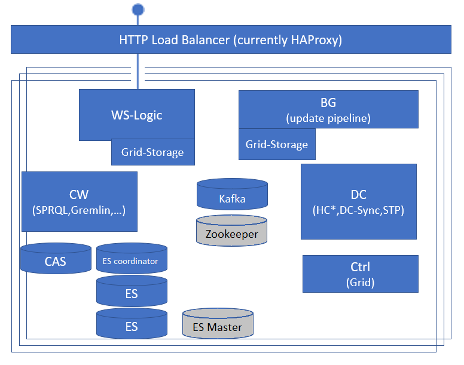

# SW Architecture Overview & Diagrams

## Software Architecture Overview

Here are some of the main tasks that the CM-Well platform performs:

- Manage API read(fetch)/write/query(search) requests from users
- Store infotons, including managing historical versions
- Perform asynchronous ingest processing (merging with previous data, storing & indexing infoton attribute values to enable search)
- Run a web interface application for searching and displaying infotons
- Monitor and report on the health of CM-Well modules; self-heal when possible
- Manage data synchronization among data centers (and followed CM-Well)

CM-Well as a platform is deployed over a set of machines (nodes). All CM-Well nodes are installed with an identical set of software components. The components work and interact with each other to perform the tasks described above and more.

!!! info
	There is also a "compact" version of CM-Well that contains all CM-Well components and can be installed on a single machine. This version is deployed within a Docker container, and can be used for development and testing.

## Software Modules at a Glance

The following table summarizes CM-Well's software components.

| **Module** | **Description** |
|:---|:---|
| Analytics JVMs | Separate processes for long computations e.g. SPARQL queries. |
| Background (BG) Processing | Processes ingest pipeline in the background, according to a work queue. |
| Cassandra | A 3rd-party storage package, used for table-based search and direct access to infotons. |
| Controller JVM | A grid-level service; used to manage Akka cluster and other core grid services. |
| Data Consistency Crawler (DCC) | A BG module that proactively tests for inconsistent data in the infoton stores, and fixes inconsistencies when found. |
| DC JVM | Distributed Container (runs various services with dedicated JVMs, e.g. HC, DC Sync, STP). |
| ElasticSearch | A 3rd-party search package, used for indexing & full-text search capabilities. |
| Grid Storage Logic (GS-Logic) | An abstraction layer above the storage modules, that encapsulates the storage layer (allowing lower storage and indexing layers to be switched). |
| HA-Proxy | A 3rd-party load balancing module that distributes API requests among CM-Well nodes |
| Health Control (HC) | Monitors the health of CM-Well nodes. |
| Inter-DC Sync Agent | Synchronizes data by pulling from other CM-Well grids. |
| Kafka (KF) | A 3rd-party package that manages internal queues for ingest processing in CM-Well. |
| SPARQL Trigger Processor (STP) Agent | An agent that monitors changes in CM-Well and runs SPARQL queries to construct new inferred triples, for the purpose of creating materialized views of infotons. |
| Web Service (WS) | The web service layer that handles read/write requests for users and external agents. |
| Zookeeper (ZK) | A 3rd-party package that manages leader-election, distributed consensus and configuration of Kafka. |

### Architecture Diagrams

#### Logical View

The following diagram shows a logical view of the CM-Well modules. (See the table above for a legend of module names and abbreviations.)

!!! note
	- There may be several Health Control (HC) modules.
	- The underlying packages in the Grid Storage subsystem can be modified and added to in the future, without changing the subsystem's interface.

#### Physical View

The following diagram shows a physical view of the CM-Well modules running on a single CM-Well node. (See the table above for a legend of module names and abbreviations.) The architecture adheres to the following principles:

- There is no master node.
- All nodes are installed with identical components.
- The actual activation of components may vary among nodes in a data center.
- The architecture has linear scalability through addition of more identical nodes.
- JVMs of different modules are isolated to enhance robustness.
- The nodes and the system as a whole are self-managed and self-healing, continually checking the health of all components and performing the required terminations, restarts and failovers in case of failures.

!!! note
    The ES Master and Zookeeper instances can potentially run on any node, but in practice are activated on one node per cluster.

 