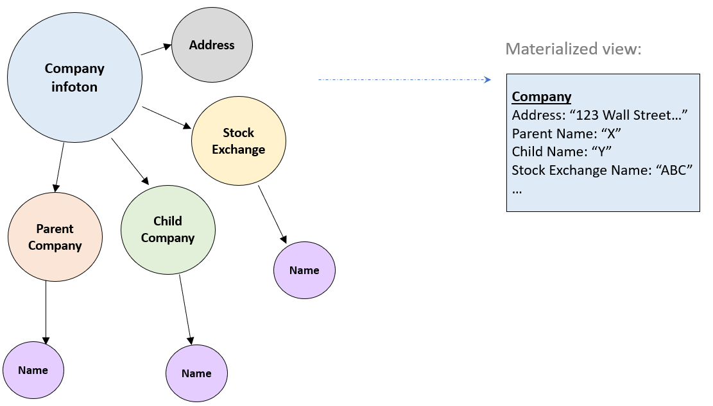
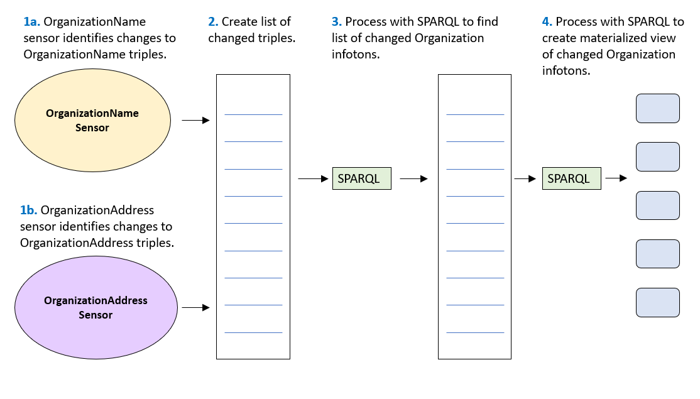

# SPARQL Trigger Processor (STP) Agent

The SPARQL Trigger Processor (STP) is a CM-Well agent that listens for changes to CM-Well's data, and when changes are detected, runs SPARQL commands in order to derive inferred data from the updated infotons.

A common usage of this feature is to create materialized views of CM-Well infotons. A materialized view is a "flattened" version of data whose original source included high levels of pointer redirection before arriving at data. (The materialized view may also be enriched with data from other infotons.) See [STP Use Case: Creating Materialized Views](#MaterializedViews) below.

The SPARQL Trigger Processor creates one or more  **sensors**. Each sensor periodically runs a query on a specified path in CM-Well, to detect changes to infotons under that path that have changed since the previous query. When changes are detected, the sensor reads the changed infotons and creates the resulting materialized views. Users can configure both the change path and query and the SPARQL query that creates the materialized view. Users define the SPARQL Trigger Processor's input and output by editing a YAML-formatted configuration file.

!!! note
	The STP's YAML configuration file is stored as a file infoton in a special admin path on CM-Well. See [SPARQL Trigger Processor](../Tools/Tools.UsingTheSPARQLTriggerProcessor.md) to learn more about how to configure the YAML file.

## STP Use Case: Creating Materialized Views

The image below illustrates how a materialized view of a Company infoton "flattens" out levels of indirection to create a more compact representation of the data.

The diagram below illustrates how the STP identifies updated infotons and creates their materialized views, using 2 sensors that "listen" to changes of specific object types.

 

## STP Implementation Description

COMING SOON.