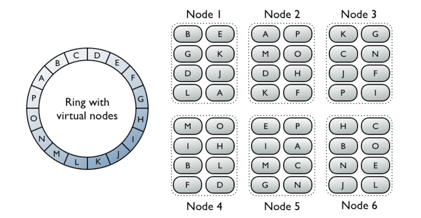

# Third-Party Packages

## Cassandra

The Cassandra package is used to store infotons with all the required linked data characteristics, including deep history and the "immutable data" concept.  It is mainly used for the "direct path", i.e. for fetching infotons by URI in a fast and scalable way. Cassandra also supports a convenient, higher level query language (CQL) compared to other column-family storage packages (e.g. HBase & Accumulo).

The design of the Cassandra storage management has no Single Point of Failure (SPoF). All nodes are equal and there is no "manager node". Cassandra's distribution model is built around the concept of a "virtual circle" that represents the entire range of storage locations.

Each CM-Well node hosts 256 virtual nodes, each of which is mapped to a location on the circle according to a hash value of the machine name. Each virtual node is responsible for a single segment on the circle. Infotons are mapped (via a hash value on the infoton's URI) to a location on the circle, and each virtual node must store the infotons that are mapped to its segment. If a CM-Well node is added, the data must be redistributed to include the new machine's virtual node locations, but this is only required for a fraction of the data rather than for all the data. This method is known as "consistent hashing".

For each segment on the virtual circle there is a primary machine responsible for storing the infotons mapped to that segment. However, since CM-Well maintains a replication factor of 3, each segment's storage is replicated on 2 additional machines. If the primary machine becomes inoperative, a new primary machine is elected.

(See [Datastax article](https://docs.datastax.com/en/cassandra/3.0/cassandra/architecture/archDataDistributeDistribute.html) to learn more).

 

Theoretically, Cassandra's virtual circle could encompass nodes in more than one data center. This design capability is _not_ used by CM-Well, so as not to rely this feature, thereby ruling out using alternative packages that don't support it. Cross-data-center coordination is done in the CM-Well logic layer, which manages the abstraction of uniform storage over identical nodes.

## ElasticSearch

The ElasticSearch (ES) package is used to index infotons by field values, to create higher level abstractions such as infoton directory paths and graph labels, and for statistical features. This also known as "inverted" search features, in Full Text Search terminology. Infotons are stored in a JSON format which is convenient for search, but which lacks all the Linked Data details stored in Cassandra. Each such JSON object (also called a "document") is a bag of <field,value> pairs which are indexed. Logically, two such indexes are maintained, one for the current infoton versions and one for the historical infoton versions.
ES requires more complex scalability considerations. The indexes are composed of "shards". Shards are Lucene indexes, whose size must be limited so as not to harm search performance. Upon creation of an index, the number of shards must be specified, and then cannot be changed (currently ES indexes are configured to have 5 shards each). Data is distributed amongst primary shards (based on a hash distribution function). Primary shards have replica shards based on a configured replication factor (currently set to 3, i.e. each primary shard has 2 replicas).

Since the number of primary shards can't be changed, a different approach is required in order to enable limitless linear scalability (both on the node number axis and infoton number axis). CM-Well uses multiple indexes and ES aliases to group the indexes logically. As information is added, new indexes are created. Two aliases are used: one is used by the front-end read/search and a second back-end alias is used for writing new data. When a size threshold is reached, a new index is created and the writing "cursor" is moved to point to the new index. (See [Ingest Queues and Storage Architecture](Arch.PlatformArch.Part1.md#StorageArchitecture) to learn more about storage architecture in detail.)

CM-Well's ES setup has a set of "master nodes" (a dedicated JVM with no data) and "data nodes". The master nodes manage the cluster, including distribution of data, replication and repair. The "data nodes" are responsible for storage and query processing. ElasticSearch has the concept of a "leader", which is one of the "master" nodes. The setup uses either 3 or 5 such nodes spread into different machines. It is also set up to require a majority (2,3 respectively) of followers to become a leader (to disallow "split brain" partitioning situation).  Data nodes are distributed amongst all the machines. This isolation setup (segregation of ES control JVMs) copes with split brains and fluctuations related to stress and JVM instability on data-nodes.

In addition, on each machine there is a data-less ES process called a "coordinator", which is the entry point for search queries, and which performs the merge-reduce stage (merges search results from the different ES shards).

## Kafka

The 3rd-party Kafka package is used to manage queues for infoton write requests.

CM-Well manages 4 such queues (known as "topics" in Kafka):

- **persist_topic** - each message represents an infoton to be written to Cassandra storage.
- **persist_topic.priority** - same as above, for a request sent with high priority.
- **index_topic** - each message represents an infoton to be indexed in Elastic Search.
- **index_topic.priority** - same as above, for a request sent with high priority.

## Zookeeper

The 3rd-party Zookeeper package is a dependency of the Kafka package. ZooKeeper is a centralized service for maintaining configuration information, leader election and providing distributed consensus resolution.