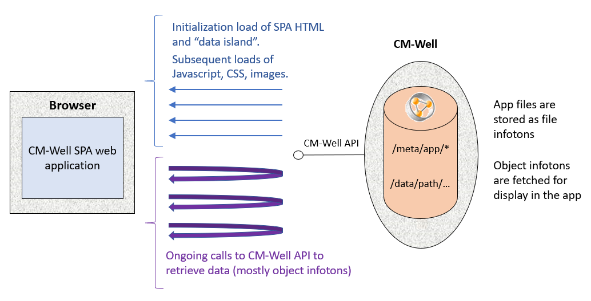

# Web Application

CM-Well supports a browser UI (via a web application), which it activates if it identifies a browser client. The UI displays infotons, their attributes and their paths in a user-friendly format, and supports searching for infotons by their types and values. The web application is implemented as a Single Page Application (SPA), meaning that it's loaded (mostly as a single-page) with all of the logic written in Javascript, it then issues calls to CM-Well to serve data as needed to repopulate areas in the UI without reload of the application. The application is stored as several file infotons containing Javascript code, CSS and images. It's stored in a protected directory (which can be changed using an admin token).

Additional web applications can be added in other directories in CM-Well's store. The above describes the default one (that is tied to web access from a browser).

 

### Health Monitoring Pages

Within the browser UI there are several "pages" that allow you to view the health and other reports of CM-Well nodes and software modules. These are implemented as "virtual infotons", whose corresponding page is built on-the-fly according to the infoton path. See [Health Dashboards](../../TestingAndMonitoring/Monitoring.HealthDashboards.md) to learn more.