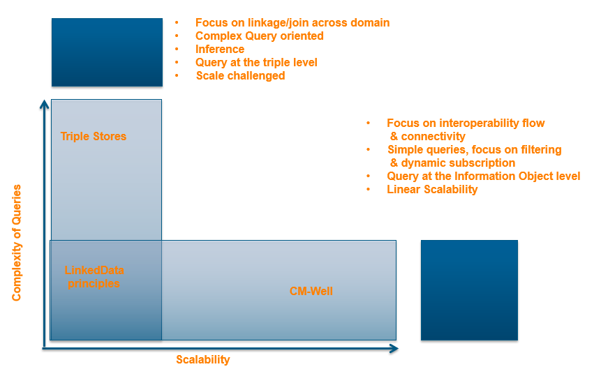

# Information Architecture Part 1: Overview and Principles

## Information Architecture Overview

The CM-Well architecture takes a synergistic approach to several data models and standards such as Linked Data, triple stores, Software as a Service, Web Oriented Architecture (WOA), big data analysis and more, merging them and adding to them to create a powerful, flexible and dynamic data platform.

Among the central characteristics of CM-Well's information architecture are:

- Data modeled both as <subject-predicate-object> triples and as information entities ("infotons"). Infotons represent real-world objects and their attributes.
- Data modeled as a graph, and APIs that enable graph traversal for relationship discovery.
- "Schema on read" – there is no mandatory schema per infoton subject type.
- No nested objects – an infoton field may contain a pointer to another infoton, but not the object itself.
- Information as a Service model; REST API allows both reading and writing data.
- "Information in motion" – goes beyond the mostly read-focused, mostly static-data approach of traditional Linked Data repositories, to handle frequent, dynamic updates from multiple sources.
- Ability to subscribe to and stream CM-Well information and its updates.
- URI as the web address of the current infoton version.
- Immutable data and deep history (infoton versions saved for each update; historical versions are accessible by API).

## Linked Data and CM-Well's Advanced Read/Write Features

These are the standard rules that a Linked Data repository should comply with:

- Use Uniform Resource Identifiers (URIs) to identify things.
- URIs should be accessible via HTTP, so that the objects they refer to can be looked up by people   and software agents.
- Provide useful information about the dereferenced entity, using standard formats such as RDF, XML and N3.
- In the dereferenced entity's information, include links to other related URIs to enable discovery of other relevant information on the Web.

CM-Well complies with all these rules, but is also built for global interoperability (as opposed to using a proprietary database schema). CM-Well entities can point to other Linked Data entities, hosted either on CM-Well or on any other global repository.

In addition to allowing you to read entities, CM-Well's API also allows you to:

- Update existing entities
- Create new entities
- Search for entities by attribute values or relationships with other entities
- Subscribe to and stream updates
- Perform complex queries using the SPARQL language
- Create materialized views of your data, using an automated SPARQL agent.

The following figure illustrates how CM-Well's architecture differs from traditional triple store architecture.

## Big Data

Traditional Linked Data repositories are often read-oriented, as they typically contain relatively static data. In contrast, CM-Well is intended to maintain a large, constantly growing and changing dataset – in other words, a Big Data repository.

Big Data sets are so large or complex that traditional data processing applications have a hard time handling them. They pose challenges related to many aspects of data processing, including capture, storage, transfer, sharing, curation, search, query, analysis, visualization and scaling.

CM-Well is designed to handle Big Data challenges. CM-Well's features include:

- Platform architecture that allows seamless addition of nodes as needed
- Big Data algorithms applied to storage and search features

- Big Data Analytics layer (Spark, Hadoop)

## Web Oriented Architecture (WOA)

Web Oriented Architecture (WOA) is a fundamental principle of CM-Well design. WOA is specific type of Service Oriented Architecture (SOA) that integrates systems and users via globally linked hypermedia, based on web architecture. WOA uses a core set of web protocols including HTTP, XML, RDF and the REST API.

However, in contrast with standard WOA that only consists of REST services with proprietary JSON-formatted messages, CM-Well principles dictate that the content "flowing" in and out of its services is Linked Data, in standard formats such as RDF, N3 and Turtle. In addition, CM-Well services use a shared information model consisting of ontologies that define different knowledge domains.

In addition, CM-Well supports:

- PuSH (PubSubHubbub) subscription
- Namespaces from external ontologies
- Linear scalability
- Representing Linked Data concepts and information objects using a RESTful API, with Web semantics

