# The CM-Well Web Interface #

* [Introduction](#hdr1)
* [CM-Well Paths](#hdr2)
* [CM-Well UI Controls](#hdr3)
	* [Address Bar](#hdr4)
	* [Results Page](#hdr5)
	* [Infoton View](#hdr21)   
	    * [Sub-Graph Icon](#hdrSubGraph)
	    * [Format Dropdown](#hdrFormat)
	    * [System Information Fields](#hdrSysInfo)
	    * [Favorite Field Controls](#hdrFF)
	* [Home Button](#hdr6)
	* [HELP Link](#hdr7)
	* [Use Old UI Link](#hdrOldUI)
	* [Results List Scrollbar](#hdr8)
	* [Search Controls](#hdr17)
* [Running CM-Well Queries in the UI](#hdr22)
* [Special CM-Well Folders and Files](#hdr23)
* [Configuring Infoton Link Display by Type](#hdr24)

## Introduction ##

The CM-Well web interface is a graphical user interface for accessing CM-Well through your browser. When you browse to the root URI of a CM-Well instance, you see this page:

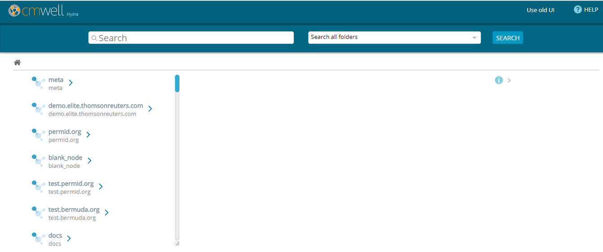

Using the CM-Well web interface, you can browse among the CM-Well folders and infotons, run queries and get results, and examine the query results. Anyone with network access to CM-Well can browse to its web UI; this requires no special permissions.

>**Note:** The CM-Well web UI is currently fully supported only in the Chrome browser.

This page describes the features of the CM-Well web interface and how to use them.

---------------------------------

## CM-Well Paths ##

CM-Well is a Linked Data repository with a hierarchical folder structure. Each folder can contain infotons and other folders. (See [CM-Well Data Paradigms](Intro.CM-WellDataParadigms.md) to learn more about infotons).

An infoton's URI is similar to an internet URI in that it refers to a specific internet resource. In this case the resource is an infoton rather than a web page. The infoton itself has no display information, but the CM-Well UI renders the infoton information as a visual web page.

A path to an infoton contains the CM-Well host, the sub-folders and the infoton's unique ID. For example: `<cm-well-host>/data.com/1-34415653093`

---------------------------------

## CM-Well UI Controls ##

### Address Bar ###

You can browse to an infoton by entering its path in a browser address bar.

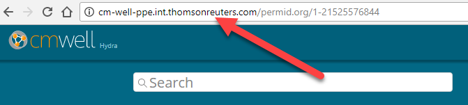

---------------------------------

### Search Results ###

The left-hand pane of the CM-Well web interface displays your query results, or in other words, the folders and/or infoton/s that reside under the CM-Well path in the address bar.

If the URI refers to a single infoton, the results page shows that infoton's fields and values (see [Infoton View](#hdr21)).

If there are sub-folders or infotons under the URI in the address bar, they are displayed as a list on the left of the results page.

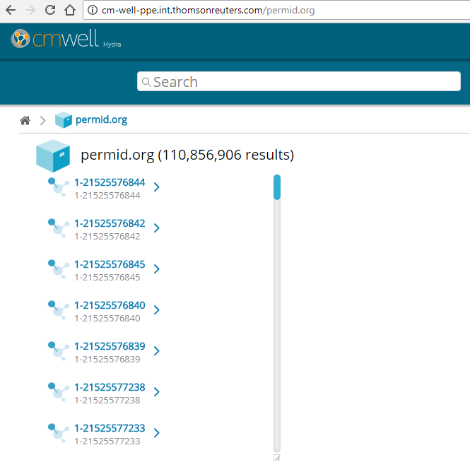

Clicking on the URI of a folder or infoton displays the page for the selected folder or infoton.

>**Note:** A CM-Well folder is also an infoton. It can potentially have data fields as well as child folders and infotons.

---------------------------------

### Infoton View ###

When a single infoton's URI appears in the browser address bar, the CM-Well web interface shows that infoton's page.

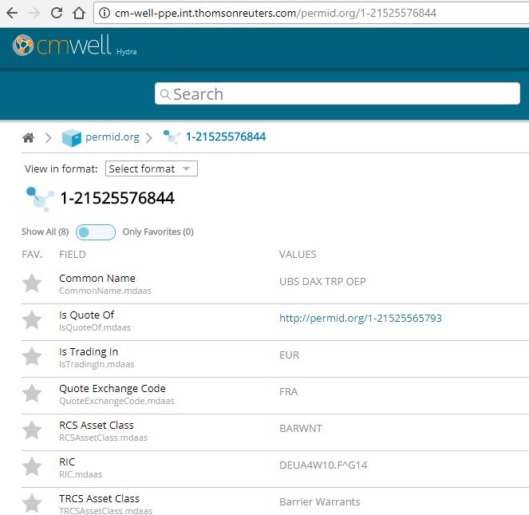

On this page, you can see the infoton's field names and values.

---------------------------------

#### Sub-Graph Icon ####

For some infotons, you may notice that some fields have a blue graph icon. This indicates that these fields are part of a sub-graph, or in other words, have been given a label.  (See [Working with Named Sub-Graphs](DevGuide.WorkingWithNamedSub-Graphs.md) to learn more.) You can see the label value by hovering over this icon.

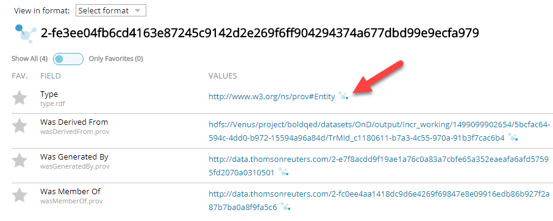

---------------------------------

#### Format Dropdown ####

At the top of the infoton view, you can see the **View in format** dropdown menu. This allows you to see the infoton fields in the triples format of your choice.

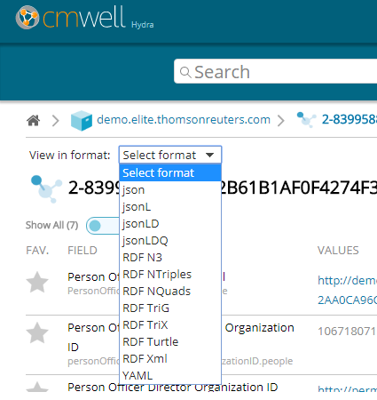

To view the infoton in one of the triples formats:

Select one of the values from the **View in format** dropdown menu. A new browser tab opens, displaying the infoton triples in the format you selected.

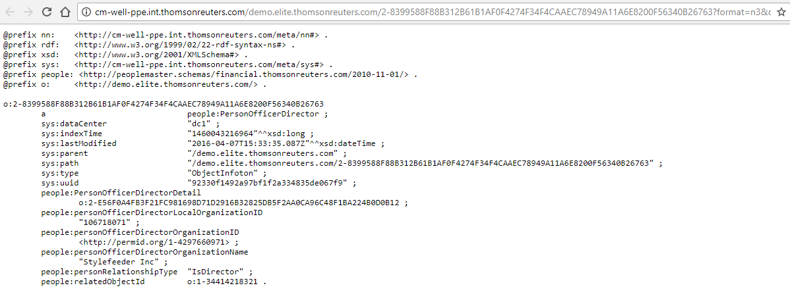

---------------------------------

#### System Information Fields ####

Infotons have two types of fields: user-defined data fields (also known as "object fields") which the user adds to the infoton, and system fields, which the CM-Well system creates. System fields include items such as the infoton's path, UUID and last modified time.

By default, system field are hidden in the infoton view. You can show or hide these fields by clicking on the (i) button on the left of the page.

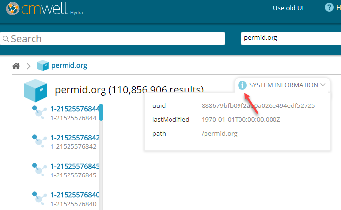

---------------------------------

#### Favorite Field Controls ####

Using the favorite field controls in the infoton view, you can choose to display only a subset of fields that interests you.

To display only your favorite fields:

1. Click the stars to the left of the fields you want to display. Selected stars are highlighted in yellow.
   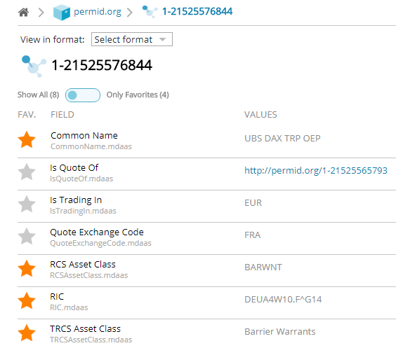
2. Move the slider over the fields to the **Only Favorites** position. Only the selected fields are displayed.
   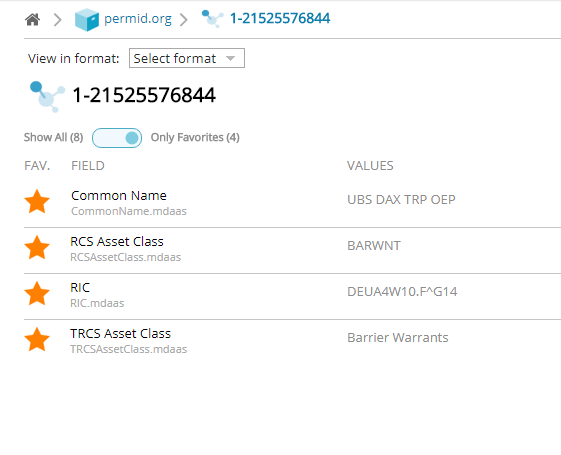

>**Note:** The favorite field settings apply to all infotons regardless of type, and are saved for your user and browser. They are retained for your user between browser sessions as long as you don't clear the browser data.

---------------------------------

### Home Button ###

Clicking on the Home button at the top left navigates to the CM-Well root URI.

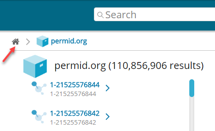

---------------------------------

### HELP Link ###

Clicking on the HELP link at the top right displays the Table of Contents page for the CM-Well help documentation.

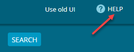

---------------------------------

### Use Old UI Link ###

If you prefer to use the previous version of the CM-Well web UI, you can click on the **Use old UI** link at the top right of the page.

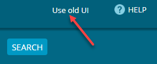

>**Note:** See [Old CM-Well Web Interface](CM-Well.OldWebInterface.md) to learn more about how to use the old UI.

---------------------------------

### Results List Scrollbar ###

When there is more than one sub-folder or infoton under the URI in the address bar, the results are displayed in a list on the left of the page. A message above the results list shows how many results are displayed on this page.

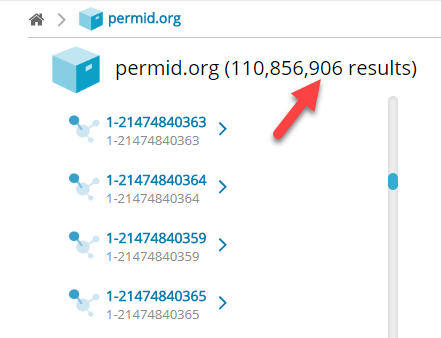

If there are many results, you can use the scrollbar to the right of the list to scroll down. The UI loads additional infotons for viewing as you scroll down the list.

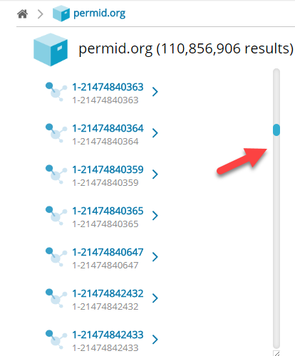

---------------------------------

### Search Controls ###

The CM-Well search controls appear at the top of the page.

To search for a value in all infoton fields:

1. Select a folder to search in from the dropdown menu. You can also choose **Search all folders**.
   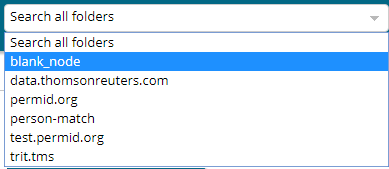
1. Type the value you want to search for in the edit box on the left.
2. Click the **Search** button. Search results are displayed in a list on the left.

---------------------------------

## Running CM-Well Queries in the UI ##

You can run simple CM-Well queries by entering them in your browser's address bar. These queries correspond to GET operations in CM-Well's REST API.

The simplest kind of query is one that retrieves a single infoton (which could also be a folder infoton). The infoton is retrieved by its URI.

You can also add query parameters to the address line, to retrieve several results while applying filters to their field values. For example, the following query searches for infotons under the permid.org folder (these are mainly Organization entities), which are located in New York state: 

`http://cm-well-host/permid.org?op=search&qp=organizationStateProvince.mdaas:New%20York`

When you enter this query in the address bar, CM-Well displays a list of links to infotons that match the query. You can click on these links to see those infotons' pages.

ADDIMAGE???

See the [Developer Guide and API Reference topics](CM-Well.RootTOC.md) to learn more about CM-Well queries.

---------------------------------

## Special CM-Well Folders and Files ##

In addition to folders and infotons that users create on CM-Well, there are several folders and files kept on CM-Well for various monitoring purposes and other functional purposes. (Files may be saved to CM-Well as a special kind of infoton.)

The following special folders, files and infotons may be of interest to users and operations personnel:

* **Health pages** - under the **proc** folder, there are several pages that reflect the health of CM-Well nodes and sub-systems. See [Health Dashboards](Monitoring.HealthDashboards.md) to learn more.
* **meta/lib** - you can copy your own Java library files (jar files) under this folder, and call their functions from within SPARQL queries. See [Calling Java Functions from SPARQL Queries](DevGuide.CallingJavaScalaFunctionsFromSPARQLQueries.md) to learn more.
* **proc/node** - in this infoton you can see version numbers of CM-Well components.
* **proc/fields** - in this infoton you can see a list of all field names from all infotons on the specific CM-Well platform.

---------------------------------

## Configuring Infoton Link Display by Type ##

Authorized users can configure the display of infoton links according to RDF type, instead of displaying the infoton link only as a path with a cryptic UUID. For example, for a Person infoton, you might want to display the person's first and last names in the link. For an organization, you might want to display the organization's name, CEO and country of origin.

### The Display Configuration Infoton ###

The Display Name configuration infoton must be placed in **/meta/dn/\<HASH\>**, where HASH is the md5 encoding of a type.rdf value. The configuration infoton must have a **forType** field, containing the RDF type for which you want to configure display.
In addition, it should have at least one field with the **displayName** prefix. The field values define the string that should be added to the displayed link for infotons of the given type. The values are either the name of a field that usually appears in the infoton, or a javascript snippet that defines a manipulation of such fields.

For example:

In this example, **displayName1** and **displayName2** refer to name fields that usually appear in Person infotons. **displayNameA** and **displayNameB** contain javascript snippets that define concatenations of such fields and string constants.

### Calculating Display Names ###

Multiple **displayName** values provide alternate display names. Display names are calculated until one of them produces a non-empty string, and then that string is used in the displayed link. (Note that an empty string  might be produced if the relevant field values are missing).

Display name values are calculated in the following order:
* First javascript value are calculated, in lexicographical order of all the displayNames whose value contains javascript.
* If none of the javascript displayNames produces a non-empty string (or there were none to begin with), the rest of the values are calculated in lexicographical order of  the displayNames.

In the example that appears above, **displayNameA** would be the first to be calculated, because it contains javascript, and **displayNameA** comes before **displayNameB** in lexicographical order. If the calculation produces a non-empty string, the result is added to the link's display.

This is what the configured Person links look like:

