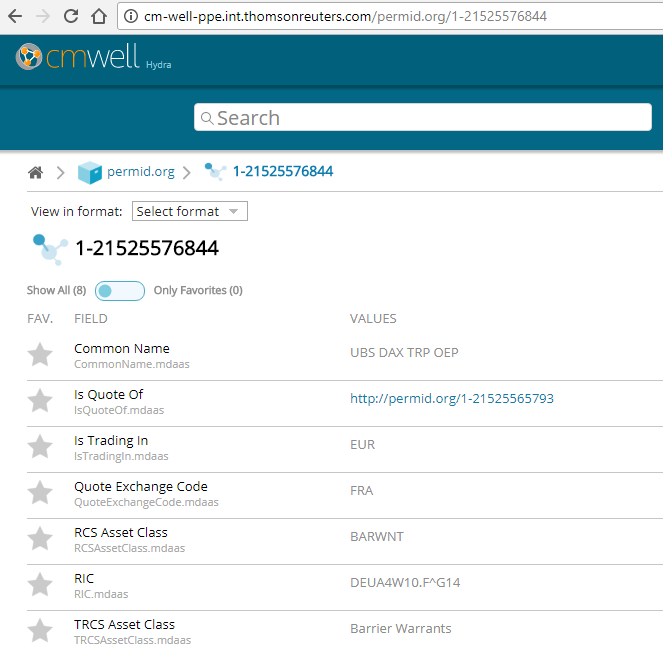
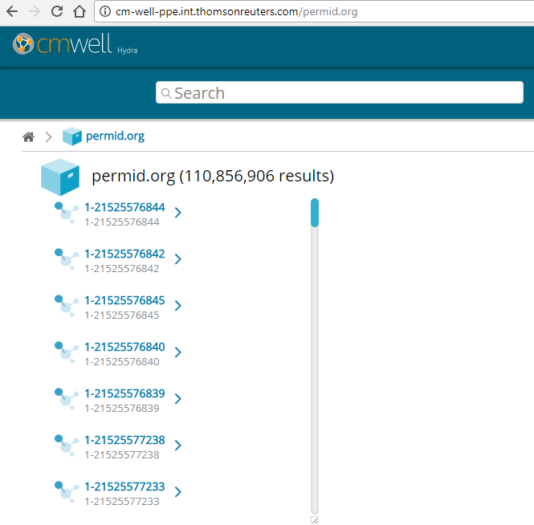
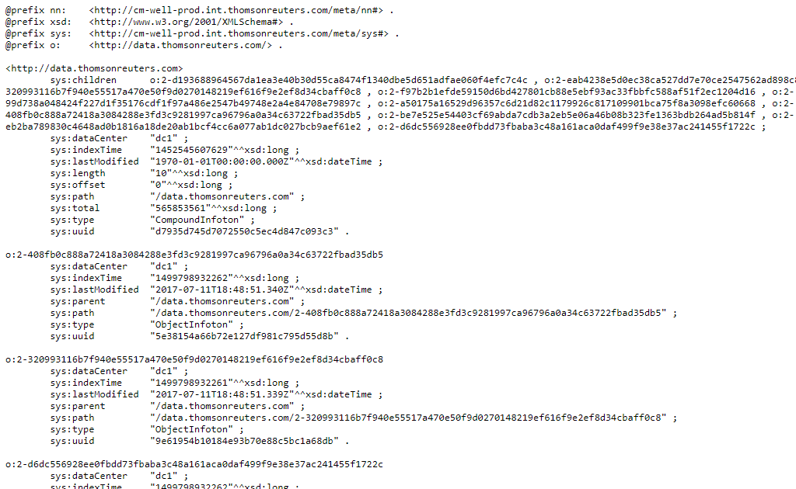

# Basic Queries #

[Getting an Infoton by Subject ID](#hdr1)

[Specifying the Output Format](#hdr2)

[Searching by a Single Field Value](#hdr3)

[Query Results: Links vs. Data](#hdr4)

[Paging through Results with Offset and Length Parameters](API.PagingThroughResultsWithOffsetAndLengthParameters.md)

<a name="hdr1"></a>
## Getting an Infoton by Subject ID ##
The simplest query you can make to CM-Well is to get all the basic predicates and objects that go with a single subject (entity). This is easy to retrieve, as all this information is stored as a single infoton.

Each CM-Well infoton has a unique URI that serves as an address for retrieving the infoton.

For example, in the case of Organization entities, the entity's TR Permanent Identifier (PermID) serves as the "key" for retrieving the corresponding infoton. So for example, to get the infoton for PermID 21525576844, the URI is:

http://cm-well-host/permid.org/1-21525576844

Let’s take a look at the URI's components:

-	**cm-well-host** – the CM-Well hostname.  
-	**permid.org** – The namespace for all the triples that belong to the Open PermID product. Namespaces are used to logically group types of infotons together. Infotons from different namespaces can still link to each other.
-	**1-** By convention, all PermIDs within CM-Well start with a 1- prefix to indicate that this identifier is a PermID.  There are other prefixes, such as **2-** to indicate a generated ID native to CM-Well, used to link dependent infotons to a main infoton.
	
-	**21525576844** – The PermID of the entity we're retrieving.  

Viewing the CM-Well URI shown above in a web browser displays this page:
   


<a name="hdr2"></a>
## Specifying the Output Format ##
If you're accessing the URI programatically, you will usually want to specify the output format in which you want to receive the results. You do this by adding the **format** parameter to the URI. See [CM-Well Input and Output Formats](API.InputAndOutputFormats.md) to learn more about the formats that CM-Well supports.

>**Note:** You can also specify the output format by adding an HTTP Accept header to the request. If both an Accept header and a **format** parameter appear in the request, the **format** parameter takes precedence.

Browse to ```http://cm-well-host/permid.org/1-5035948006?format=turtle```  to see the same results as above, but now rendered as a text file in RDF’s Turtle format.  The results will look like this (truncated for brevity): 

    @prefix mdaas: <http://ont.thomsonreuters.com/mdaas/> .
    @prefix sys:   <http://cm-well-host.com/meta/sys#> .
    @prefix nn:<http://cm-well-host.com/meta/nn#> .
    @prefix xsd:   <http://www.w3.org/2001/XMLSchema#> .
    @prefix rdf:   <http://www.w3.org/1999/02/22-rdf-syntax-ns#> .
    @prefix o: <http://permid.org/> .
    
    	o:1-5035948006  a   mdaas:Organization ;
    	sys:dataCenter  "na" ;
    	sys:lastModified"2015-06-08T21:09:45.855Z"^^xsd:dateTime ;
    	sys:parent  "/permid.org" ;
    	sys:path"/permid.org/1-5035948006" ;
    	sys:type"ObjectInfoton" ;
    	sys:uuid"3205fef15f8bfda48bd1d44da2b6cb7a" ;
    	mdaas:CIK   "0001524358" ;
    	mdaas:CommonName"Marriott Vacations Worldwide Corp"@en ;
    	mdaas:InvestextID   "VAC" ;
    	mdaas:LEI   "549300WA6BT5H4F7IO94" ;
    	mdaas:MXID  "111800547" ;
    
    	...
    
    	mdaas:subsidiariesCount "109" .


> Note that in this format you receive the infoton's system metadata, shown with the **sys** prefix in the example above.

<a name="hdr3"></a>
## Searching by a Single Field Value ##
If you don’t already know the infoton's PermID, you can perform a simple search for it, using a search operation as follows:

    <cm-well-host>/permid.org?op=search&qp=CommonName.mdaas:Marriott%20Ownership%20Resorts

These are the components of the search request:

-	**op=search** - indicates that this is a search operation.
-	**qp=** - the string following qp= contains field names and values that you want to match. In this example, we’re looking for infotons that have the field CommonName.mdaas, where the value is “Marriott Ownership Resorts”.

> **Notes:**
> 
> * Special characters must be escaped in the usual way for URIs. For example, spaces are escaped via %20, # characters are encoded using %23, and so on.
> * It is possible to search in all fields rather than in a specific field, as follows:  *qp=_all:Marriott%20Ownership%20Resorts*. However, this is discouraged, as it can result in prohibitively long processing time for the query.

See [Field Name Formats](API.FieldNameFormats.md) to learn about field name notation.

<a name="hdr4"></a>
## Query Results: Links vs. Data ##

Multiple query results are displayed as a list of links to the infotons that match the query, that looks like this:



Sometimes a list of links may be useful, but sometimes you want to see the actual contents of the results. You can get them by adding the parameter **with-data** to your request, as follows:

    http://cm-well-host.com/permid.org?op=search&qp=CommonName.mdaas:Marriott%20Ownership%20Resorts&with-data


> **Note:** The **with-data** flag can be added with no value, in which case the data is returned in N3 format. You can also add a format value to **with-data**, that can be any format that CM-Well supports, for instance: with-data=yaml, with-data=json, with-data=trig...

When you add the with-data flag to your query, in the results you receive the entire object for each infoton, rather than its link, as follows:



