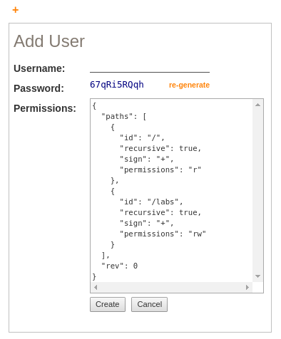

# Managing CM-Well Users #

----

**Go to:** &nbsp;&nbsp;&nbsp;&nbsp; [**Root TOC**](CM-Well.RootTOC.md) &nbsp;&nbsp;&nbsp;&nbsp; [**Topic TOC**](DevGuide.TOC.md) &nbsp;&nbsp;&nbsp;&nbsp; [**Previous Topic**](DevGuide.CM-WellSecurityFeatures.md)&nbsp;&nbsp;&nbsp;&nbsp; [**Next Topic**](DevGuide.DosAndDonts.md)  

----

In order to perform write operations on CM-Well, API clients need a user entity to be defined in CM-Well. Users have a unique username, a password, read and write permissions for accessing CM-Well folders, and optionally one or more roles that confer additional read and write permissions.

When a user logs into CM-Well successfully with valid username and password values, the user receives an access token that's valid for 24 hours after its creation. This token must be passed in the **X-CM-WELL-TOKEN** HTTP header for any API call that requires permissions (e.g. any call that updates CM-Well).

You can create users for your compiled instance of CM-Well with different permissions for accessing different subsets of folders.

The following sections describe how to manage users and passwords, and how to optionally define user role profiles.

>**Note**: After any change to user details, such as adding a new user or changing a password, remember to [refresh the authentication cache](API.Auth.InvalidateCache.md).

<a name="hdrCreateUsers"></a>
## Creating New Users ##

User details are encapsulated in a file infoton under the ```/meta/auth/users``` folder on CM-Well. To create a user, you will need to create this file infoton with the format described below. To do so you will need admin permissions. In your compiled version of CM-Well, there is a pre-defined admin user whose username and password are "root" and "root".

**To create a CM-Well user:**

1. Login to CM-Well with an admin user. A token with admin permissions is returned in the response.
1. Create the JSON body with the new user's details (see table and example below). 
1. Upload the JSON body you created to a FileInfoton named \<username\>, under the folder ```/meta/auth/users```. (For example, if the new user's username is jsmith, you create the FileInfoton at ```/meta/auth/users/jsmith```.) Here is an example of a Curl call for creating the user FileInfoton, assuming the JSON body is in the text file ```userDetails.json```:

    ```curl cmwell/meta/auth/users/jsmith -H "X-CM-Well-Type:File" -H "Content-Type:application/json" -H "X-CM-Well-Token:<AdminToken>" --data-binary @userDetails.json```

1. In order for the new user information to take effect, refresh the CM-Well authentication cache using the following command:

    ```<cm-well-host>/_auth?op=invalidate-cache -H "X-CM-Well-Token:<AdminToken>"```

   You should receive the response ```{"success":true}```; if you don't, retry the call.

The following table describes the fields in the JSON body that you write to the FileInfoton:

<a name="tableFields"></a>

Field | Type | Description
:-----|:-----|:------------
paths | Array of path objects. | Mandatory. The CM-Well paths whose access permissions you want to specify for this user.
paths.id | String | Mandatory. The path name (not including the CM-Well hostname).
paths.sign | String | Mandatory. "+" to allow access; "-" to deny access.
paths.recursive | Boolean | Mandatory. Whether to extend permissions to all sub-folders.
paths.permissions | String | Mandatory. "r" (read permission), "w" (write permission) or "rw" (both). 
rev | Integer | Optional. A revision number for the user details. This value is encoded in any token provided to this user. If you need to revoke user access, you can update the revision value. This invalidates any active tokens for this user, preventing user access.
digest | String | Optional. The user's password, encrypted using **bcrypt** and CM-Well's private key. This value is checked when a user logs in with HTTP Basic Authentication.
digest2 | String | Optional. The MD5 encryption of "\<username\>:cmwell:\<password\>". This value is checked when a user logs in with HTTP Digest Authentication. See [Generating User Passwords](#hdrGenPassword).
roles | Array of strings | Optional. An array of roles belonging to the user. See [Managing User Roles](#hdrRoles) for more details.
operations | Array of strings | Optional. Possible values are:<br/><br/>**PriorityWrite** - allows the user to use the **priority** flag to boost priority for **_in** actions.<br/>**Admin** - allows the user to perform administrator actions such as changing the log level and invalidating caches.<br/>**Overwrite** - allows the user to use the **_ow** endpoint to create infoton versions as specified (with no merge to existing versions).

>**Notes**: 
>* The JSON body does not include the username, as the username is "stored" as the FileInfoton's name.
>* To call the **_login** API, the user will need either a **digest** or a **digest2** value defined.

Here is an example of a user FileInfoton's JSON body:

    {
      "paths": [
	      {
		      "id": "/",
		      "sign": "+",
		      "recursive": true,
		      "permissions": "r"
	      },
	      {
		      "id": "/test.example.org",
		      "sign": "+",
		      "recursive": true,
		      "permissions": "rw"
	      }
      ],
	  "operations":["PriorityWrite"],
	  "rev":101,
      "digest": "$2a$10$7AnXsjks.IZXTbpRiAGN4OQItwiz4sgxM49lvTiCjWgOhbbOQkg2m",
      "digest2": "156a19430260e6b09497478441aea344"
    }

## Using the Old CM-Well UI to Create Users ##

You can use the old CM-Well UI to create a user with a convenient GUI.

**To create a user in the old CM-Well UI:**

1. Browse to \<cm-well-host\>/_login.
2. Enter your admin user and password.
1. Click on the **Use old UI** link at the top-right corner.
2. Enter Edit Mode by clicking on the pencil icon (under the well image to the right).
3. Navigate to ```/meta/auth/users```.
4. Click on the **+** sign at the end if the users list. The **Add User** dialog is displayed and a password is generated for the user.
   
1. From the **Password** field, copy and save the password value for your own information.
2. In the **Username** field, type the new username.
2. In the **Permissions** field, edit the **paths** field as required.
3. Click the **Create** button. The new user's FileInfoton is created.

>**Note**: The **digest** and **digest2** values are not visible in the dialog, but are added to the FileInfoton automatically. 

## Editing User Details ##

To edit user details, follow the same procedure as for creating a new user. This overrides the existing FileInfoton with your new user details content.

<a name="hdrGenPassword"></a>
## Generating User Passwords ##

You can use the [generate-password API](API.Auth.GeneratePassword.md) to generate a random password and its encoded digest value. 

## Changing User Passwords ##

You can use the [change-password API](API.Auth.ChangePassword.md) to change an existing password.

## Deleting Users ##

To delete a user, simply delete the FileInfoton with the user's details, then call the [invalidate-cache API](API.Auth.InvalidateCache.md) to make the deletion effective immediately.

<a name="hdrRoles"></a>
## Managing User Roles ##

You may want to define user roles that confer a particular set of access permissions on users with those roles, to be applied to several users. You can do this by creating FileInfotons with the same **paths** field as described in [Creating New Users](#hdrCreateUsers) (no other fields are required).

If a user's FileInfoton has the **roles** field, then the user takes on the permissions of those roles. For example, if user jsmith has "roles":["Editor"] in his FileInfoton, and there is a ```/meta/auth/roles/Editor``` FileInfoton which allows write permission on certain paths, then jsmith can write to those paths, even though they're not mentioned in his personal **paths** field.

>**Note**: If there's a contradiction between personal permissions and role-based permissions, the personal permissions take precedence.

**To create a role FileInfoton:**

1. Login to CM-Well with an admin user. A token with admin permissions is returned in the response.
1. Create the JSON body with role paths and permissions as required. See [paths field](#tableFields).
1. Upload the JSON body you created to a FileInfoton named <rolename>, under the folder ```/meta/auth/roles```. For example:

    ```curl cmwell/meta/auth/roles/Editor -H "X-CM-Well-Type:File" -H "Content-Type:application/json" -H "X-CM-Well-Token:<AdminToken>" --data-binary @roleDetails.json```

1. In order for the new role information to take effect, refresh the CM-Well authentication cache using the following command:

    ```<cm-well-host>/_auth?op=invalidate-cache -H "X-CM-Well-Token:<AdminToken>"```

## Related Topics ##
[CM-Well Security Features](DevGuide.CM-WellSecurityFeatures.md)
[Login API](API.Login.Login.md)
[Change Password API](API.Auth.ChangePassword.md)
[Generate Password API](API.Auth.GeneratePassword.md)
[Invalidate Cache API](API.Auth.InvalidateCache.md)

----

**Go to:** &nbsp;&nbsp;&nbsp;&nbsp; [**Root TOC**](CM-Well.RootTOC.md) &nbsp;&nbsp;&nbsp;&nbsp; [**Topic TOC**](DevGuide.TOC.md) &nbsp;&nbsp;&nbsp;&nbsp; [**Previous Topic**](DevGuide.CM-WellSecurityFeatures.md)&nbsp;&nbsp;&nbsp;&nbsp; [**Next Topic**](DevGuide.DosAndDonts.md)  

----
