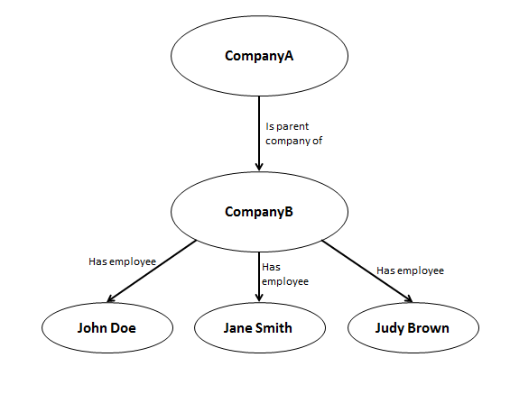

# CM-Well Data Paradigms #

----

**Go to:** &nbsp;&nbsp;&nbsp;&nbsp; [**Root TOC**](CM-Well.RootTOC.md) &nbsp;&nbsp;&nbsp;&nbsp; [**Topic TOC**](Intro.TOC.md) &nbsp;&nbsp;&nbsp;&nbsp; [**Previous Topic**](Intro.IntroductionToCM-Well.md
)&nbsp;&nbsp;&nbsp;&nbsp; [**Next Topic**](Intro.OverviewOfTheCM-WellAPI.md
)  

----

## Introduction ##
Since CM-Well is a sophisticated data repository, it stands to reason that many data structures and paradigms are involved. This section describes CM-Well's most central data paradigms, which should help you get a good conceptual understanding of the principles that guide CM-Well's design and functionality.

CM-Well is part of Thomson Reuters' Big Open Linked Data initiative. For a breakdown of what that means, read on!

## Big Data ##

Big data is just what it sounds like: very large data sets. These sets are so large or complex that traditional data processing applications have a hard time handling them. Big data sets pose challenges related to many aspects of data processing, including capture, storage, transfer, sharing, curation, search, query, analysis, visualization and privacy. 

But together with the challenges comes huge potential. The right tools (usually those involving statistical analysis) can mine insights from big data sets that would otherwise be undiscoverable. For example, mining Twitter feeds can uncover trending news topics. Analyzing people's travel patterns might help understand how diseases spread.

CM-Well is a repository for the financial information that TR excels at providing: information about people, companies and market data. Although the data grows continually, CM-Well is designed to be seamlessly scalable, so that storage issues are invisible to its users, and access time remains constant.

## Open Data ##
A piece of data is "open" if anyone is free to use, reuse, and redistribute it, without restrictions from copyright, patents or other mechanisms of control. Open data is a principle that is particularly applicable in the Internet age. The idea is that freely sharing data can exponentially boost progress in diverse fields such as art, science, education, economics and so on. 

Thomson Reuters is a staunch supporter of open data principles, as exemplified by its platforms [Open PermID](https://permid.org/), for open access to company information, and [Open Calais](http://www.opencalais.com/) for open access to metadata tagging services.

## Linked Data ##

Linked data is a method of publishing structured data so that it can be interlinked and become more useful through semantic queries. It utilizes standard Web technologies such as HTTP, RDF and URIs, but rather than using them to serve web pages for human readers, it extends them to share information in a way that can be read automatically by computers. 

Linked data is a data modeling standard, and as such it promotes interoperability, meaning that it enables data from different sources to be automatically connected and queried as extensions of each other.

## Graph Databases ##
Most of us are used to thinking of databases as tables with rows and columns, like a spreadsheet table. But this is just one possible structure for a database.

CM-Well data is represented as a graph database. A graph database is modeled as a directed graph, with nodes representing entities, and arrows between the nodes, representing a relationship between the two entities.

Here is an example of a simple graph that might be part of a larger graph database:

Some advantages of graph databases vs. relational databases are:

* Relationships between entities are explicitly and compactly stated.
* Convenient for data modeling.
* The same field can have multiple values.
* Fields do not have to have a strict type.

## Data Triples ##
When you examine the "arrows" or relationships in a graph database, you can see that there are 3 elements defining a relationship: a subject, and object, and the specific relationship between them. The arrow points from the subject to the object.

In the graph in the previous section, you can see the following "triple":

>**CompanyA** (subject)  --- **is parent company of** (relationship) ---> **CompanyB** (object)

You can think of a graph database as a collection of connected, overlapping triples of  *(subject, relationship, object)* elements. Note that an entity can be a subject in one triple, and an object in another. This is what enables the graph to be one continuous structure, in which indirect relationships can be inferred from direct ones.

## RDF and URIs ##
When you retrieve data from CM-Well, it is represented in Resource Description Framework (RDF) format.

RDF is a set of World Wide Web Consortium (W3C) specifications, used as a method for modeling web resources information. RDF is designed to represent data triples. An RDF triple contains a subject, object and predicate (which is the same as the "relationship" described in the previous section).

The subject of an RDF statement is a Uniform Resource Identifier (URI). A URI looks similar to a URL, but rather than pointing to a human-readable web page, it points to a machine-readable data resource.

Here is an example of a CM-Well URI: [http://cm-well-host.com/permid.org/1-5035948006](http://cm-well-host.com/permid.org/1-5035948006) 

Here is an example of an RDF \<subject, predicate, object\> triple:

    <http://example/superheroes/spiderman> <http://www.perceive.net/schemas/relationship/enemyOf> <http://example/superheroes/green-goblin>

RDF is a logical standard, which can be implemented by several different syntactical formats. 

CM-Well supports the following RDF encoding formats:

* RDF XML
* N-Triples
* Turtle
* N3

See [CM-Well Input and Output Formats](API.InputAndOutputFormats.md) to learn more about these formats.

## CM-Well Infotons ##
CM-Well uses a data structure nicknamed "infoton". An infoton is the set of all the triples associated with a single subject entity. The data is still logically structured as a set of separate triples, but the infoton is physically stored together with the set of its predicate-subject relationships, like this:

By “flattening” the physical model in this way, CM-Well is able to more easily scale to very large numbers of triples, as it becomes easier to store the data horizontally across many more servers.

The results of your queries to CM-Well will generally be one or more whole infotons.

----

**Go to:** &nbsp;&nbsp;&nbsp;&nbsp; [**Root TOC**](CM-Well.RootTOC.md) &nbsp;&nbsp;&nbsp;&nbsp; [**Topic TOC**](Intro.TOC.md) &nbsp;&nbsp;&nbsp;&nbsp; [**Previous Topic**](Intro.IntroductionToCM-Well.md
)&nbsp;&nbsp;&nbsp;&nbsp; [**Next Topic**](Intro.OverviewOfTheCM-WellAPI.md
)  

----