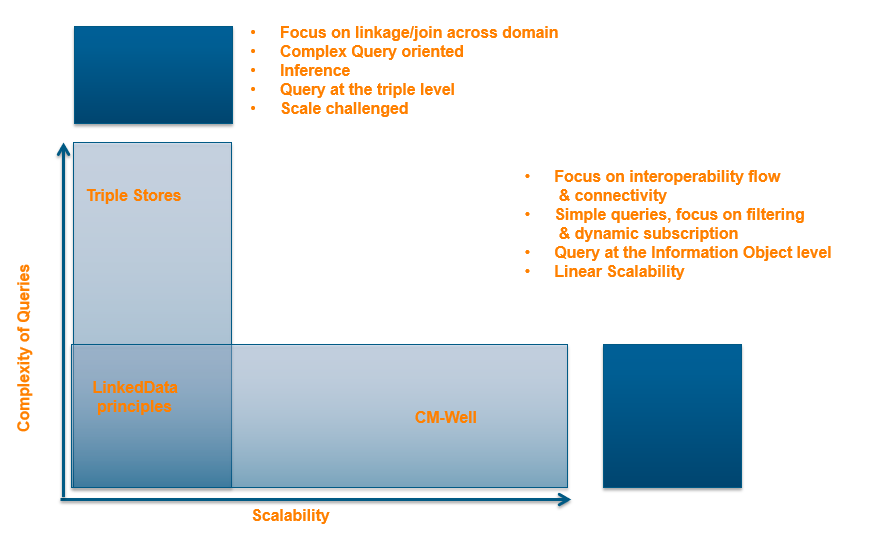

# CM-Well vs. Other Information Repositories

CM-Well combines many features that can be found in other types of information repositories, such as JSON document storage, RDF triple modeling, full-text search, information graph traversal, and so on. If you’re new to CM-Well, you may be wondering what the difference is between CM-Well and other types of repositories. This page describes some of those differences. We hope it helps you decide if CM-Well is right for your needs.

At a high level, CM-Well’s main theme is applying Linked Data core principles to a repository of changing data. This is done using a simple HTTP-based interface, not a proprietary database-centric API. CM-Well’s underlying infrastructure may change, but the Linked Data principles and change-friendly API will be preserved.

## CM-Well vs. Triple Stores

There is only a partial overlap between triple store features and CM-Well features.

The features supported by both CM-Well and a standard triple store are:

* Graph representation of RDF triples
* Modeling of relationships among entities
* Support of quads (named sub-graphs)
* Support of graph query languages such as SPARQL and Gremlin

The core differentiator of CM-Well is that in addition to the triples data paradigm, CM-Well supports the information object (or “infoton”) paradigm. An infoton represents an entity, and contains triples (or quads) that in effect are the entity’s attributes. Although an infoton is composed of triples or quads, it represents a higher-level entity concept and is managed and displayed as such. A standard triple store lacks this higher-level concept.

In addition, CM-Well’s design principles are based on the assumption that its infotons are updated over time, and it supports many features related to the management and monitoring of those changes. CM-Well calls this principle “information in motion”.

These are the principles and features that CM-Well supports, which cannot be found in an off-the-shelf triple store product:

* Information object (infoton) paradigm; retrieval of infotons by URI
* The data model includes a directory paradigm, whereby the ‘/’ character separates directories in infoton URIs. The subject-ID-as-URI principle imposes some restrictions on the URI format that don’t exist in a standard triple store.
* A simple RESTful API that combines Linked Data principles with Web Oriented Architecture
* Support of markup controls that allow defining replace/delete operations within the ingested content
* Concept of immutable objects/historical infoton versions
* Infoton streaming and subscription to updates
* Virtual queues to manage long-term operations on multiple infotons
* Graph traversal functions (transitive traversal of inbound/outbound links to infotons). This functionality can also be achieved through SPARQL queries, but in some cases it’s easier and more intuitive to traverse links using a simple RESTful API. (CM-Well does support SPARQL queries; however, when applying SPARQL queries on the entire graph as opposed to a sub-graph, it does not perform as well as some other triple stores.)
* Configurable creation of materialized views, derived data and projected data, based on the raw repository data
* Data center synchronization (live replication of entire repositories, or select subsets retrieved by search queries)
* Friendly UI for displaying and searching for infotons. This is an optional utility which is part of the CM-Well code base.
* Special infoton types. These include file infotons, which allow easy construction of SPA web applications as part of the data solution, and serve as the basis for software extensibility & customization. Another special infoton type is redirection infotons (serving as symbolic links).
* Additional APIs beyond just SPARQL.

 
## CM-Well vs. ElasticSearch as a NoSQL Document Store

Some usage scenarios utilize ElasticSearch as a flexible document store for JSON document, with direct access and full-text search features. If you don’t require object modeling, this may be sufficient for your needs. 
However, if you do require object modeling, such as for representing a knowledge graph, CM-Well may be a good alternative as a higher-level abstraction that is also Linked Data-friendly. Each JSON document can be transformed into an infoton that represents an object. Infotons can contain real, dereferenceable URI links to other infotons, in contrast to JSON’s “same-value” linkage.

CM-Well also adds:

* An extra layer of scaling management, which adds new ElasticSearch indexes as needed
* Health monitoring and data consistency corrections
* An underlying Cassandra storage layer - a more robust and reliable storage platform than ES.
