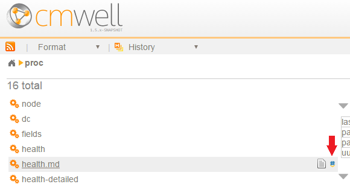
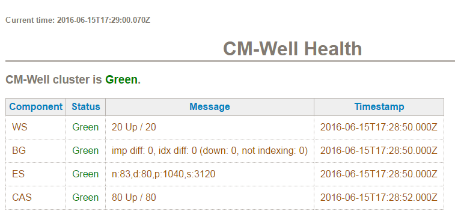
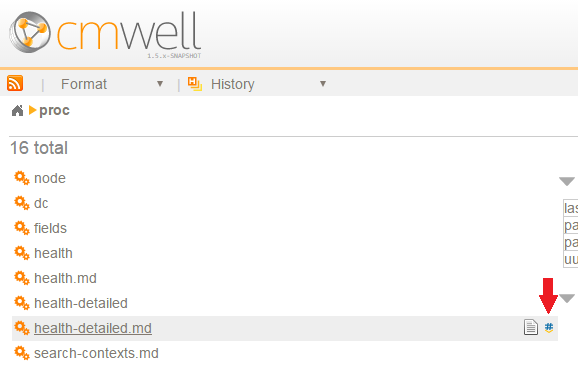
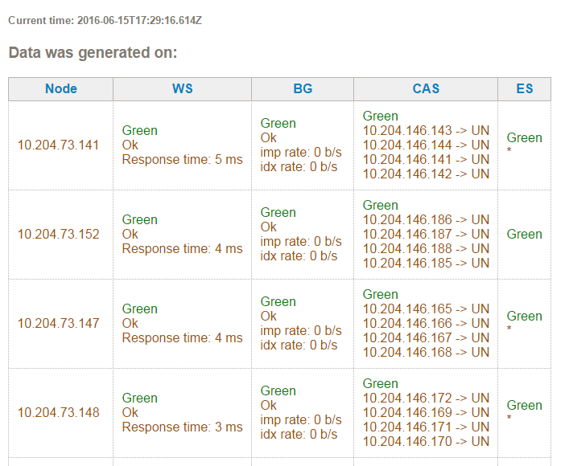

# CM-Well Health Dashboards #

CM-Well provides two views that display the health of its nodes (machines) and software components:

* **Component view** - shows the health of each type of component pool.
* **Node view** - shows the health of each machine in the environment.

>**Note:** There are also views that show the health of the [JVM processes](#hdr1) running on CM-Well nodes.

These are the software component acronyms you will see in the health views:

* **WS** - web service components, which serve API requests.
* **BG** - background processes, which perform lengthier tasks.
* **ES** - Elastic Search components, which perform full-text search operations.
* **CAS** - Cassandra components, which provide storage infrastructure.

The health of each node and component instance is polled about every 30 seconds.

These are the statuses you may see for components and nodes:

Status | Description
:-------|:------------
 | OK
 | Warning status but no operational impact
 | Error status with operational impact

 
>**Notes:** 
>
>* A red status does not necessarily mean complete failure; requests may still be processed.
>* The health views may show additional information about the components. These are internal status/error messages, which are not documented here. 

## Component View ##

Each CM-Well cluster runs multiple instances of each type of component, for purposes of parallel processing and redundancy. The component view shows the status of each of these "pools" of components.

To display the component view:
1. Open the CM-Well home page in a browser.
2. Click the **proc** item at the top of the left-hand menu.
3. Hover your cursor over the **health.md** item in the left-hand menu. The "plain text" and "markdown" icons are displayed.
4. Click the blue "markdown" icon. 

----------

The component view is displayed. It show the overall health status of the cluster, and a table showing each type of component, its health status, any additional status or error messages, and the date-time the status was last updated.

----------

## Node View ##

The node view shows the status of each machine running in the CM-Well cluster, and the software components running on it.

To display the node view:
1. Open the CM-Well home page in a browser.
2. Click the **proc** item at the top of the left-hand menu.
3. Hover your cursor over the **health-detailed.md** item in the left-hand menu. The "plain text" and "markdown" icons are displayed.
4. Click the blue "markdown" icon. 

----------
The node view is displayed. It contains a table showing each node's IP address, the health status of each type of software component on that node, and any additional status or error messages.

----------

## JVM Views (for internal TMS use) ##

The following views show the health of the JVM processes running on CM-Well nodes.

*  All JVM processes: `<cm-well-host>/proc/members-all.md?pretty`
*  Active JVM processes: `<cm-well-host>/proc/members-active.md?pretty`