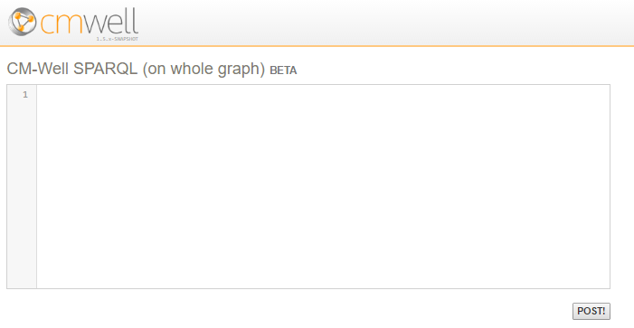
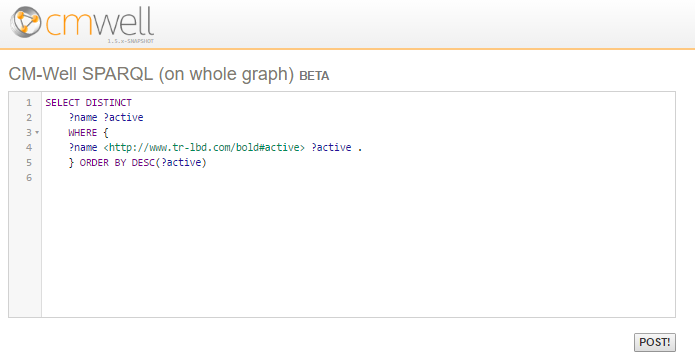
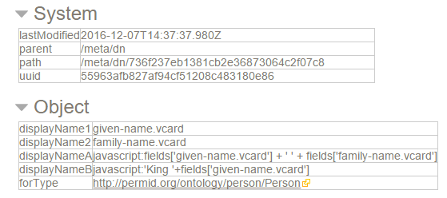
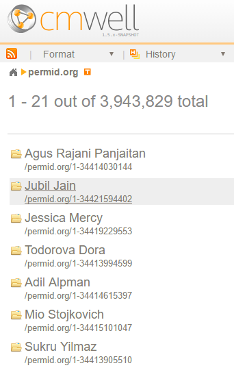

# CM-Well Version Release Notes - Dec. 7 2016 #

## Change Summary ##

### New Features ###

Feature/Link | Description
:-------------|:-----------
[UI for Submitting a SPARQL Query on the Whole Graph](#hdr1) | CM-Well UI includes a page for submitting queries to the _sparql endpoint (to be applied to the whole CM-Well graph).
[Enhanced SPARQL Editor Features in CM-Well UI](#hdr2) | The two SPARQL edit boxes are now enhanced with syntax highlighting, auto-completion, line numbering and so on.
[Configuring Infoton Link Display by Type](#hdr3) | POC of feature that allows you to configure the display format of infoton links by RDF type.
[markReplace and markDelete Take Quad Values](#hdr4) | markReplace and markDelete now take quad values that allow you to delete only field values from specified named graph.
[Sudo User instead of Root for CM-Well Machine Preparation](#hdr5) | For Ops personnel. Machine preparation now requires entering root password via sudo, rather than logging in as root.

### Notable Bug Fixes ###

* More bugs were fixed in the "SPARQL on whole graph" feature.
* Fixes were made to bugs in the CM-Well Console, which were encountered when upgrading to Oracle Linux 7.1.  

### Changes to API	 ###

markReplace and markDelete now take quad values that allow you to delete only field values from specified named graph

------------------------------

## Feature Descriptions ##

### UI for Submitting a SPARQL Query on the Whole Graph ###

**Description:**

This feature was added in a previous release, but was undocumented until now. In the CM-Well UI, in the SPARQL Query page, you can now click the **SPARQL on whole graph link**. This displays a page that allows you to submit a query to the _sparql endpoint, which runs the query on the entire CM-Well graph rather than on a specific set of paths.

**Documentation:** 
* [Apply SPARQL to the Entire Graph](API.Query.ApplySPARQLToEntireGraph.md)
* [The CM-Well Web Interface](CM-WellWebInterface.md)

----------

### Enhanced SPARQL Editor Features in CM-Well UI ###

**Description:**

The two SPARQL edit boxes in the CM-Well UI (SPARQL on paths and SPARQL on entire graph) are now enhanced with usability features such as syntax highlighting, auto-completion, line numbering and so on. 

**Documentation:** N/A.

----------

### Configuring Infoton Link Display by Type - POC ###

**Description:**

The new release contains a proof-of-concept for a feature that will allow authorized users to configure the display of infoton links according to RDF type, instead of displaying the infoton link only as a path with a cryptic UUID. For example, for a Person infoton, you might want to display the person's first and last names in the link. For an organization, you might want to display the organization's name, CEO and country of origin.

To configure the infoton link display for a specific type, you must upload a special configuration infoton to the **/meta/dn** path (dn = Display Name) in CM-Well. The infoton contains the RDF type for which you want to configure display, and additional fields that define the field values that you want to appear in the link.

Here is an example of a configuration infoton for the Person type:

And this is what the configured Person links look like:

**Documentation:** [The CM-Well Web Interface](CM-WellWebInterface.md).

----------

### markReplace and markDelete Take Quad Values ###

**Description:**

The markReplace and markDelete operators in the CM-Well API now take quad values that allow you to delete only field values from specified sub-graphs.

If you specify a quad format (e.g. format=nquads) but provide triples data, CM-Well infers <*> as the missing quad value, and therefore will delete all specified fields that have any quad value. This change was requested by the Legal Analytics team.

**Documentation:** 
[API: Delete Fields](API.Update.DeleteFields.md)
[API: Delete Specific Field Values](API.Update.DeleteOrReplaceValuesInNamedSubGraph.md)

### Sudo User instead of Root for CM-Well Machine Preparation ###

**Description:**

This feature is of interest only to Operations personnel. 

Previously, the preparation stage for a CM-Well machine required you to login with the root user, thus allowing access to all root privileges. A change was made to CM-Well Console such that you can perform this stage using sudo and entering the root password, thus assuming root privileges only for the preparation operation.

**Documentation:** N/A.

