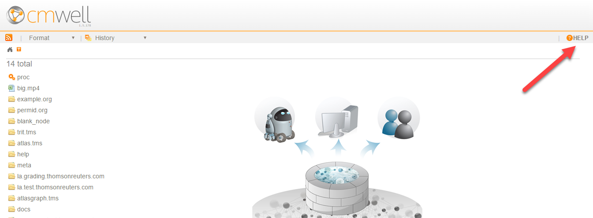

# CM-Well Version Release Notes - Oct. 6th 2016 #

## Change Summary ##

-----------------------
### HIGHLIGHTED FEATURES !!! ###

Feature/Link | Description
:-------------|:-----------
[CM-Well platform documentation published on CM-Well](#hdr1) | You can now access CM-Well documentation directly through the CM-Well web UI, by clicking on the HELP link in the top-right corner. Here you can find a Developer Guide, API Reference, introductory topics, tutorials and more.

-----------------------

### More Features ###

Feature/Link | Description
:-------------|:-----------
[Markdown displays in pretty mode by default](#hdr2) | Markdown content is displayed with HTML-like formatting rather than as plain text.
[Better handling of lengthy bulk-consume prep stage](#hdr3) | Enhancement to bulk-consume API when its warmup stage takes too long.
[Improved handling of large file infoton uploads](#hdr4) | Faster upload and more efficient storage model.

### Notable Bug Fixes ###

* Fixed: The bulk-consume token that encodes the read location in the queue would sometimes gets assigned a future point-in-time, when the consumer reached the present time.

### Changes to API	 ###

None.

------------------------------

## Feature Descriptions ##

### Documentation Published on CM-Well ###

**Description:**

Current CM-Well documentation is now published on CM-Well itself with every version. 

CM-Well documentation topics include:

* **Introductory Topics** - background about what CM-Well is and how it was developed.
* **Use Cases** - live use cases of TR products that incorporate CM-Well.
* **Developer Guide** - detailed descriptions of CM-Well workflows.
* **API Reference**	- a comprehensive reference for CM-Well API functions.
* **Tutorials**	- hands-on exercises for getting started with CM-Well, including example calls and the responses you can expect to receive.

To access the CM-Well documentation root table-of-contents, click the HELP link at the top-right of the CM-Well web page.

**Documentation:** N/A.

----------

### Markdown Displays in Pretty Mode by Default ###

**Description:**

Markdown content is now displayed with the addition of the "pretty" flag by default. This causes the display to have HTML-like formatting rather than plain text formatting. This behavior was added in order to create a friendlier user experience when reading CM-Well documentation.

**Documentation:** N/A.

----------

### Better Handling of Lengthy bulk-consume Preparation Stage ###

**Description:**

While the overall bulk-consume API provides very fast data streaming, bulk-consume has a preparation ("warm-up") stage that can be long. This could previously result in a long response time for returning the first chunk. Bulk-consume behavior was changed such that if the preparation stage takes more than 8 seconds, the API returns a shorter chunk (as for a call to the **consume** API) for that request, causing it to return faster.

**Documentation:** [Consume Next Bulk](API.Stream.ConsumeNextBulk.md)

----------

### Improved Handling of Large File Infoton Uploads ###

**Description:**

Some customers need to upload large files to CM-Well, for instance when packaging user-defined functions in large jar files, to be called within CM-Well SPARQL queries.

Previously, CM-Well could fail to upload large files, and its storage of such files was less efficient. Both these problems have been solved in this version.

**Documentation:** N/A.
