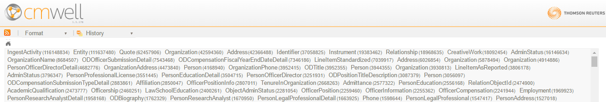

# CM-Well Version Release Notes - Sept. 11th 2016 #

## Change Summary ##

### Features ###
The following features have been added to CM-Well:

1. [With-deleted query flag](#hdr1) - The optional **with-deleted** flag allows you to retrieve the latest versions of the matched infotons, together with deleted infotons that match the query.
2. [Traffic shaping](#hdr2) - The CM-Well logic for managing traffic was modified to take into account the processing time that each user consumes, rather than just the rate of requests that the user sends.
3. [Automated Materialized View](#hdr3) - An external CM-Well utility processes all infotons defined in a configuration file, and creates "flattened" versions of them for more efficient search.
1. [Consume API](#hdr4) - An API for consuming infotons as a time-ordered "virtual queue".
1. [Bulk-consume API](#hdr5) - An additional consume API, optimized for high-capacity streaming.
1. [SPARQL on Entire Graph](#hdr6) - a new endpoint that enables performing a SPARQL query on the entire CM-Well graph.
1. [Calling Custom Java/Scala Functions from SPARQL Queries](#hdr7) - Allows uploading Scala files or Java/Scala jars and calling their functions from within a SPARQL query.
1. [SPARQL "Stored Procedures"](#hdr8) - Allows uploading SPARQL CONSTRUCT commands as files and calling them as "stored procedures" from within a SPARQL query.
1. [Navigation by RDF Type](#hdr9) - A new feature of the CM-Well web UI, which allows you to navigate infotons by their RDF type value.
1. [stats API](#hdr10) - Allows you to perform statistical queries on CM-Well data, to obtain metrics such as count, minimum, maximum, average and so on, on infoton field values.
1. [Sort by Matching Score](#hdr11) - Allows sorting query results by the system matching score, which indicates the relative frequency of the search terms.
1. [Improvements to Data Synchronization](#hdr12) - Improvements to data sync between the Eagan and Plano production environments.
1. [Storage Layer Enhancements](#hdr13) - Improvements to data consistency checks and behavior under load.
1. [Minimize Repair Time of Web Service](#hdr14) - Reduced auto-repair time for web service from 13 minutes to 30 seconds.
1. [Enhancements to Downloader and Ingester](#hdr15) - Bug fixes and stability improvements.
1. [New Storage Format for Data](#hdr16) - Enables upgrade of underlying Cassandra and Elastic Search components.
1. [Upgrade Time Reduced](#hdr17) - CM-Well upgrade time reduced from 30 minutes to 5 minutes.

### Changes to API	 ###

The following features were added to the CM-Well API:

* The **optional** **with-deleted** flag, which can be used with **op=search**.
* **consume** API.
* **bulk-consume** API.
* `_sparql` endpoint, allowing SPARQL queries on the entire graph.
* Call Java/Scala functions from SPARQL queries.
* Call SPARQL CONSTRUCT "stored procedures" from SPARQL queries.
* Obtain data statistics (produced by Elastic Search), via the **op=stats** flag. (The previous flag name **op=aggregate** is still supported.)
* Sort results by matching score (**sort-by=system.score**).

### Attention ###
Please note the following items regarding changes in CM-Well's behavior:

* Users who send unusually heavy queries may receive more **503 - Server unavailable** errors, due to the new traffic shaping feature.
* Any streaming/consume tokens created before the upgrade must be re-created.

### Known Issues ###
1. The bulk-consume token that encodes the read location in the queue sometimes gets assigned a future point-in-time, when the consumer reaches real-time.
1. Consume tokens created in previous versions are no longer valid. New tokens must be created.
1. SPARQL on the whole graph still has bugs. Among others, duplicate results sometimes appear in SELECT responses; to work around, use SELECT DISTINCT.

------------------------------

## New Features ##

### With-deleted Query Flag ###

**Description:**

By default, queries to CM-Well return only the most recent version of each matching infoton (although all versions are retained in the repository). If you add the **with-history** flag, the query returns all "historical" versions as well as the most recent versions. However, deleted infotons are returned neither for the default query nor for a **with-history** query.

The **with-deleted** flag was introduced to allow you to indicate that you wish to retrieve deleted infotons that match the query, as well as "live" infotons.

> **Notes:** The feature will become fully operational when the rewriting of CM-Well data in the new format is complete (see [New Storage Format for Data](#hdr16)). 

**Documentation:** [Using the with-deleted Flag](API.UsingTheWith-deletedFlag.md)

----------

### Traffic Shaping ###

**Description:**

Previously, CM-Well managed allocation of processing resources to users based on the number of requests the users sent per second. For certain heavy queries, the request rate is not a good indicator of the share of resources a user is consuming. A better indicator is the amount of time CM-Well spends actually processing the  users' requests. 

Therefore, CM-Well now tracks a processing-time metric per user, looking at a window of the past 20 seconds. CM-Well manages statuses per user according to this metric. Users that send unusually heavy requests over time are penalized with an extra wait period before their query results are returned (thus freeing up some resources for other users). In extreme situations, a user may be cut off entirely and receive no responses from CM-Well.

> **Notes:** Users who send unusually heavy queries may receive more **503 - Server unavailable** errors, due to traffic shaping.

**Documentation:** N/A.

----------

### Automated Materialized View ###

**Description:**

Certain complex queries require a great deal of graph traversal, making them inefficient and time-consuming. This problem was identified as being especially acute for certain matching scenarios required by the LBD client (e.g. matching people to the companies they work for), which were implemented using SPARQL constructs. The matching logic can be greatly simplified by "flattening" out multiple indirect relationships. A single "artificial" infoton can be created, which contains all required relationships directly as fields, rather than having to traverse several outbound links to retrieve the same information.

An external CM-Well utility has been developed, which processes infotons defined in a configuration file, and creates "flattened" versions (materialized views) of them for more efficient search. This utility will eventually be incorporated into the CM-Well engine, transparently to users, but greatly improving complex query times.

>**Notes:** This feature is also known internally as "SPARQL Trigger Processor".

**Documentation:** N/A.

----------

### consume API ###

**Description:**

The **consume** API allows you to iteratively read "chunks" of infotons streamed from CM-Well. The data stream acts a "virtual queue", where the infotons are sorted by time of modification. CM-Well supplies a token that indicates your location within the queue, which you pass to the **consume** API in order to retrieve the next chunk.

> **Notes:** 
> 
> * In case of a failure in the middle of a consume operation, you can resume reading from the same location by passing the latest token you received.
> * You can also use the bulk-consume API (described below) for faster processing.

**Documentation:** [Create Consumer](API.Stream.CreateConsumer.md)

----------

### bulk-consume API ###

**Description:**

The **bulk-consume** API is similar to the **consume** API, but more efficient for high-capacity streaming.

> **Notes:** The same location token is used for both the **consume** and the **bulk-consume** APIs. You can also switch between calls to **consume** and **bulk-consume**, using the same token instance. You may want to switch from **bulk-consume** to **consume** if network load is causing **bulk-consume** operations to fail.

**Documentation:** [Consume Next Bulk](API.Stream.ConsumeNextBulk.md)

----------

### SPARQL on Entire Graph ###

**Description:**

You can apply SPARQL queries to specific paths within the CM-Well graph, using the `_sp` endpoint (see [Apply SPARQL to Query Results](API.Query.ApplySPARQLToQueryResults.md)).

There is a new `_sparql` endpoint that initiates a query that is optimized to handle the **entire** CM-Well graph. Use this endpoint when you want to process the whole graph and not just specific paths within it.

>**Notes:** See [Known Issues](#known-issues).

**Documentation:** [Apply SPARQL to Entire Graph](API.Query.ApplySPARQLToEntireGraph.md)

----------

### Calling Custom Java/Scala Functions from SPARQL Queries ###

**Description:**

You can write a custom function in Java or Scala, upload a Scala source file or Java/Scala jar file, and call the function from within your SPARQL query code. This allows you unlimited flexibility to manipulate the data resulting from a SPARQL query. 

**Notes:** None.

**Documentation:** [Calling Custom Java/Scala Functions from SPARQL Queries](DevGuide.CallingJavaScalaFunctionsFromSPARQLQueries.md)

----------

### SPARQL "Stored Procedures" ###

**Description:**

CM-Well allows you to upload SPARQL CONSTRUCT commands, save them as file infotons and call them in SPARQL queries. This is conceptually similar to creating "stored procedures" for a database. This feature allows you to reuse long/complex CONSTRUCT commands rather than having to recreate them every time you use them.

**Notes:** None.

**Documentation:** [SPARQL: Uploading CONSTRUCTs as Stored Procedures](DevGuide.UsingSPARQLOnCM-WellInfotons.md#hdr).

----------

### Navigation by RDF Type ###

**Description:**

A new feature has been added to the CM-Well Web UI, which allows you to easily retrieve infotons by their RDF type value. For example, you can use this feature to retrieve only Organization infotons.

To activate the feature, click the **T** button to the right of the Home button.

This displays the RDF types that are found in the current CM-Well path, and their counts.

Clicking on a type name retrieves only infotons that have the chosen RDF type.

>**Notes:** The UI of this feature is temporary, and will be enhanced in upcoming versions.

**Documentation:** *Coming soon with CM-Well UI documentation.*

----------

### stats API ###

**Description:**

You can retrieve statistical information about CM-Well data by directing a special query to CM-Well. For example, you can discover how many distinct values there are for a certain field in a certain group of infotons.

The statistics feature is accessed by the **op=stats** operation.

The feature supports several output formats, including CSV.

> **Notes:** The previous keyword for the feature was **op=aggregate**, now changed to **op=stats**. Both keywords are supported.

**Documentation:** 

* [Developer Guide: Using Elastic Search Statistics](DevGuide.UsingElasticSearchStatistics.md) 
* [API Reference: Data Statistics](API.Query.DataStatistics.md)

----------

### Sort by Matching Score ###

**Description:**

Adding **sort-by=system.score** to a query causes the results to be sorted in descending order of the matching score. The matching score is produced by Elastic Search, as a TFIDF (Term Frequency Inverse Document Frequency) score on the search terms. This means that the score is higher if the search terms appear more frequently in a specific infoton than in other infotons on average.

>**Notes:** This feature does not work when the **with-data** flag is included in the query.

**Documentation:** [Sorting Results with the sort-by Flag](API.SortingResultsWithTheSort-byFlag.md)

----------

### Improvements to Data Synchronization ###

**Description:**

The data synchronization process has been significantly improved in the latest version. 

**Notes:** None.

**Documentation:** N/A.

----------

### Storage Layer Enhancements ###

**Description:**

Enhancements have been made to the CM-Well storage layer such that data consistency is checked more reliably and system load is handled better.

**Notes:** None.

**Documentation:** N/A.

----------

### Minimize Repair Time of Web Service ###

**Description:**

CM-Well automatically identifies unhealthy web service nodes and restarts them when necessary. The restart process could previously take 13 minutes and is now handled within 30 seconds.

**Notes:** None.

**Documentation:** N/A.

----------

### Enhancements to Downloader and Ingester ###

**Description:**

Many bug fixes and stabilization enhancements have been made to the CM-Well Downloader and Ingester utilities. Among others: the Ingester now pauses if it identifies a network connectivity problem, and resumes when it is resolved. 

**Notes:** None.

**Documentation:** N/A.

----------

### New Storage Format for Data ###

**Description:**

CM-Well is transitioning to a new data format that will allow upgrading to new versions of the Cassandra and Elastic Search database and search layers. (For example, the new version of Elastic Search does not accept a '.' character in field names).

>**Notes:** This change is transparent to CM-Well users and does not require any code changes.

**Documentation:** N/A.

----------

### Upgrade Time Reduced ###

**Description:**

The CM-Well upgrade time has been reduced from 30 minutes to under 5 minutes.

>**Notes:** Relevant only to Operations personnel.

**Documentation:** N/A.

