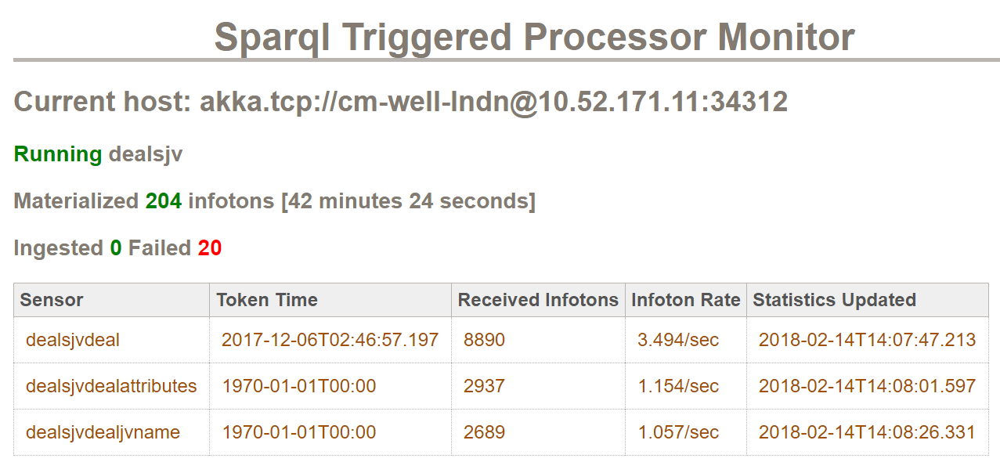

# Using the SPARQL Triggered Processor #

## What is the SPARQL Triggered Processor? ##

The SPARQL Triggered Processor is a CM-Well agent for running SPARQL queries and constructs periodically, for the purposes of creating materialized views of CM-Well infotons. A materialized view is a "flattened" version of data whose original source included high levels of pointer redirection before arriving at data. (The materialized view may also be enriched with data from other infotons.) 

The SPARQL Triggered Processor creates one or more **sensors**. Each sensor periodically runs a query on a specified path in CM-Well, to detect changes to infotons under that path that have changed since the previous query. When changes are detected, the sensor reads the changed infotons and creates the resulting materialized views. You configure both the change path and query and the SPARQL query that creates the materialized view.

You define the SPARQL Triggered Processor's input and output by editing a [YAML-formatted configuration file](#config). 

>**Note:** The SPARQL Triggered Processor also exists an external utility that you can run as a stand-alone executable. This page describes the SPARQL Triggered Processor integrated agent that runs within CM-Well. All you need to do in order to activate the agent for your materialized view is to define and upload the appropriate YAML configuration file.

See [Using SPARQL on CM-Well Infotons](DevGuide.UsingSPARQLOnCM-WellInfotons.md) to learn more about SPARQL queries.

<a name="config"></a>
## Creating the YAML Configuration File ##

The SPARQL Triggered Processor's configuration file is in YAML format. It contains:

* A query for detecting changes in specified infotons and collecting data to process. 
* A SPARQL query for processing the collected data and creating the materialized view.

The following table describes the parameters that you can configure in the YAML file:

Parameter | Description
:---------|:-----------
name | An informative name for this configuration. This should describe the materialized view you're creating. 
sensors | In the **sensors** parameter, you can define one or more "sensors", that detect changes in fields that you define. For example, you may want to test for changes to organizations' names, then process those organizations whose names have changed. Multiple sensors are defined in the YAML list syntax (prefixed with a '-' character).
sensors/name | An informative name for the sensor, used in SPARQL Triggered Processor logs.
sensors/path | The path in CM-Well under which the sensor checks for changes.
sensors/qp | The query that the sensor runs to detect changes.
sensors/fromIndexTime | *Optional*. The Triggered Processor only looks at updates that were made after **fromIndexTime**.
sensors/token | *Optional*. A state token that indicates the time from which the sensor should start searching. You can use **token** as an alternative to **fromIndexTime**.
sensors/sparqlToRoot | *Optional*. A SPARQL query that operates on the output of the **qp** query. You can use this query to travel upward from a changed node to the affected entity, for which you want to create a materialized view.
sparqlMaterializer | A SPARQL query that processes the input data and constructs the materialized view.
updateFreq | The SPARQL processor runs on data that's been updated since the time defined in **fromIndexTime**, and until the present time. Then it pauses for the amount of time defined in **updateFreq**, then it runs again until it processes all new updates, and so on. The **updateFreq** value is formatted like a Scala Duration object (\<timeUnit\> + '.' + \<unitNumber\>).

>**Note:** Make sure to indent the file correctly, according to YAML syntax rules.

Here is a (truncated) example of the YAML configuration file:

```yaml
    updateFreq: 1.minute
    name: MyMaterializedView
    active: true
    sensors:
    - name: organization
      path: /data.com
      qp: type.rdf:http://oa.schemas.tfn.thomson.com/Organization/2010-05-01/OrganizationName
      fromIndexTime: 0
      token: pAB6eJxVyzsOwjAQANHL0GY_hhApHQ1lOMP
      sparqlToRoot: |
       PATHS
        /data.com/2-%PID%?yg=<organizationName.oa&with-data&length=1000
    
       SPARQL
       PREFIX oa:  <http://oa.schemas.tfn.thomson.com/Organization/2010-05-01/>
    
       SELECT DISTINCT ?orgId
       WHERE {
         ?orgId  oa:organizationName ?orgName .
       }
    
    sparqlMaterializer: |
     PATHS
     /data.com/1-%PID%?xg&yg=<identifierEntityId.metadata&length=1000
     /data.com/1-%PID%?yg=<relatedFromEntityId.metadata|<relatedToEntityId.metadata
     /data.com/?op=search&qp=relatedFromEntityId.metadata:1-%PID%,relatedToEntityType.metadata:Geography&length=1000&with-data=true&yg=>relatedToEntityId.metadata<identifierEntityId.metadata
     /data.com/?op=search&qp=relationObjectId.metadata-new:1-%PID%,relationshipTypeId.metadata-new:310017&yg=>relatedObjectId.metadata-new<relationObjectId.metadata-new&with-data
     /data.com/1-%PID%?yg=<relatedObjectId.metadata-new[relationshipTypeId.metadata-new:310077]>relationObjectId.metadata-new<relatedFromEntityId.metadata[relationshipTypeCode.metadata:TRBCChildOf]>relatedToEntityId.metadata<relatedFromEntityId.metadata[relationshipTypeCode.metadata:TRBCChildOf]
    
     SPARQL
     prefix tr-org: <http://permid.org/ontology/organization/>
     prefix owl: <http://www.w3.org/2002/07/owl#>
     prefix rdf: <http://www.w3.org/1999/02/22-rdf-syntax-ns#>
     prefix oa: <http://oa.schemas.tfn.thomson.com/Organization/2010-05-01/>
     prefix data: <http://data.com/>
     prefix vcard: <http://www.w3.org/2006/vcard/ns#>
     prefix xsd: <http://www.w3.org/2001/XMLSchema#>
     prefix ont:   <http://ont.thomsonreuters.com/>
     prefix tr-common:	<http://permid.org/ontology/common/>
     prefix md:	<http://data.schemas.financial.thomsonreuters.com/metadata/2009-09-01/>
    
     CONSTRUCT {
     ?permId rdf:type tr-org:Organization .
     ?permId owl:sameAs ?cmpUri .
     ?permId vcard:hasURL ?url .
     ?permId tr-org:hasIPODate ?ipoDate .
     ?permId tr-org:hasOrganizationType ?optype .
     ?permId tr-org:hasActivityStatus ?statusOntologyTerm .
     ?permId ?foundedPredicate ?foundedDate .
     ?permId tr-org:hasHoldingClassification ?holding .
     ?permId tr-org:hasInactiveDate ?inactiveDate .
     ?permId tr-common:hasPermId ?permIdNumeric .
     ?permId tr-org:hasSubTypeCode ?subTypeCode .
     ?permId tr-org:isVerified ?verified .
     ?permId tr-org:isManaged ?isManaged .
     }
     WHERE {
       BIND(data:1-%PID% as ?cmpUri ) .
       ?cmpUri rdf:type oa:Organization .
       BIND(URI(REPLACE(STR(?cmpUri),"data.com","permid.org")) as ?permId) .
    
       ?cmpUri ont:permId ?permIdNumeric .
       ?cmpUri oa:isOrganizationManaged ?isManaged .
    
    ...
```

## Controlling the SPARQL Triggered Processor Job ##

### Activating and Deactivating the Job ###

When you have created the YAML configuration file and are ready to apply it, you upload it to CM-Well at `meta/sys/agents/sparql/<configName>/config`, where the containing folder name **\<configName\>** is a unique name that describes your configuration, and the configuration file name is always named **"config"**.

>**Note:** You will need special permissions to upload a file to the ```meta/sys``` folder.

Here is an example of a command that uploads a SPARQL configuration file:

    curl -X POST "<cm-well-host>/meta/sys/agents/sparql/MyCompanyMaterializedView/config" -H "X-CM-WELL-TYPE: FILE" -H "Content-Type: text/yaml" --data-binary @my-config.yaml -H X-CM-WELL-TOKEN2:<accessToken>

Uploading the configuration file causes CM-Well to read the file and run the SPARQL Triggered Processor agent on it. CM-Well polls periodically for changes to this file and applies the changes when they're detected.

If you want to stop the job and delete its configuration permanently, delete the configuration location, for example:

    curl -X DELETE <cm-well-host>/meta/sys/agents/sparql/MyCompanyMaterializedView

>**Note:** The job will end gracefully even without pausing it before deleting the configuration location.

### Pausing and Restarting the Job ###

When you create the the file infoton that contains the YAML configuration, CM-Well automatically creates a Boolean activation flag for the corresponding job, with a value of "true". The flag is created at the same location as the configuration file.

To temporarily pause and restart the SPARQL job, you can toggle the value of this flag as follows.

**Pause the job:**

    curl "<cm-well-host>/_in?format=ntriples&replace-mode" -H X-CM-WELL-TOKEN2:<accessToken> --data-binary "
    <cm-well-host/meta/sys/agents/sparql/MyCompanyMaterializedView> <http://localhost:9000/meta/nn#active> \"false\"^^<http://www.w3.org/2001/XMLSchema#boolean> .
    "

>**Note:** When you pause the SPARQL job, the last processed position is saved, and when you restart the job it resumes from the same position.

**Restart the job:**

    curl "<cm-well-host>/_in?format=ntriples&replace-mode" -H X-CM-WELL-TOKEN2:<accessToken> --data-binary "
    <cm-well-host/meta/sys/agents/sparql/MyCompanyMaterializedView> <http://localhost:9000/meta/nn#active> \"true\"^^<http://www.w3.org/2001/XMLSchema#boolean> .
    "

## The SPARQL Triggered Processor Monitoring Page ##

In the SPARQL Triggered Processor monitoring page, you can view the status and processing metrics of all SPARQL agent jobs. To see the monitoring page, browse to `proc/stp.md` on the CM-Well host machine.

Here is an example of how the monitoring page might look when running SPARQL agent jobs for two different configurations: **foo** and **bar**. 



The monitoring page displays the host on which the SPARQL jobs are running, and also the following details for each configuration:

Execution Module | Detail | Description
:----------------|:------|:-----------
Job | Status flag | Values: **Active**, **Non-active**. Indicates whether the job is running or paused
Job | Configuration location | The location of the YAML configuration infoton 
Job | Materialized infotons | The number of materialized infotons that the job has created
Job | Execution time | The execution time it took to create the materialized infotons
Sensor | sensor | Values: **oa-identifiers**, **oa-names**. The name of the sensor that polls for data changes.
Sensor | point-in-time | The point in time that the sensor is currently processing
Sensor | received-infotons | The number of changed infotons that the sensor detected
Sensor | infoton-rate | The number of infotons that the sensor is processing per second.
Sensor | last-update | The time that the sensor made its latest update.

## DEPRECATED: Downloading and Compiling CM-Well Data Tools ##

> **Notes:** 
> * To access the CM-Well Git site, you will need a GitHub user. See the [CM-Well GitHub Repository](https://github.com/thomsonreuters/CM-Well).
> * To compile and run CM-Well data tools, you will need Java version 8.

*To download and compile the CM-Well Data Tools source code:*

1. Go to [http://www.scala-sbt.org/download.html](http://www.scala-sbt.org/download.html) and install the Scala Build Tool (SBT) version appropriate for your OS.
2. Add the Scala sbt command to your PATH variable.
3. Perform a Git clone of the CM-Well Data Tools source code from [https://github.com/thomsonreuters/CM-Well](https://github.com/thomsonreuters/CM-Well).
4. Navigate to the `cm-well/cmwell-data-tools/tree/master` folder. It contains a file called **build.sbt**.
5. Run the following command: ```sbt app/pack```. The resulting script executables are created in the ```cmwell-data-tools-app/target/pack/bin``` folder.

> **Note:** To compile and run the CM-Well data tools, you will need Java version 8.

## DEPRECATED: Running the SPARQL Triggered Processor Utility ##

You can still run the SPARQL Triggered Processor as a stand-alone executable. 

To run the SPARQL Triggered Processor, run **cmwell-data-tools\cmwell-data-tools-app\target\pack\bin\sparql-processor-agent** on a Unix machine or **cmwell-data-tools\cmwell-data-tools-app\target\pack\bin\sparql-processor-agent.bat** on a Windows machine.

**Example:**

```
cmwell-data-tools-app/target/pack/bin/sparql-processor-agent --source-host cm-well-prod.int.thomsonreuters.com --config sensors.yaml --state state.dat --bulk
```
The following table describes the SPARQL Triggered Processor's input parameters:

Parameter | Description
:---------|:-------------
-b, --bulk | Use the bulk-consumer mode for download
-c, --config  <arg> | The path to the sensor configuration file
-s, --source-host <arg> | The source CM-Well host server, from which data is read
-i, --ingest | A flag that indicates whether to ingest the processed data to a CM-Well instance
-d, --dest-host <arg> | If **ingest** is indicated, the -d parameter defines the destination CM-Well instance, to which the processed data is written.
--state <arg> | A path to the token file that encodes the consume state for all sensors. To save the token file the first time you run the Triggered Processor, provide a path to the file. The Triggered Processor writes new state tokens to this file as chunks are consumed. To start the processing where you left off, you can use the state file saved from a previous run of the agent as input the next time you run it. 
-w, --write-token  <arg> | The CM-Well write permission token
--help | Show the help message
--version | Show the version of this application

>**Notes:** 
>* To display a description of the SPARQL Triggered Processor parameters, run `sparql-processor-agent --help`. 
>* There are 3 ways you can provide a start time for the sensor queries. In descending order of precendence, these are:
>     * The token file provided as the tool's **state** parameter.
>     * The **sensors/token parameter** in the YAML configuration file.
>     * The **sensors/fromIndexTime** parameter in the YAML configuration file.


