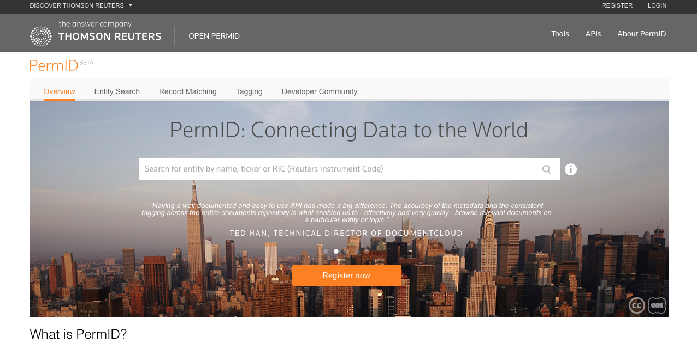

# CM-Well Use Case: Open PermID #

## Business Details ##

### Developed by: ###
TMS MDAAS team. 
**Contact:** Tamir Yatziv, tamir.yatziv@thomsonreuters.com.

### Product ###
Open PermID (also known internally within TMS as MDAAS = Metadata as a Service).

### Use Case ###

[Open PermID](https://permid.org) is an open TR platform, accessible by UI or API, which offers the following capabilities:

* Search for organizations, instruments and quotes and retrieve these entities and their attributes. Among other field values, the TR Permanent Identifier is returned for each entity.  
* Perform TR Intelligent Tagging (formerly "Open Calais") on any textual content.
* Automatically map the user's entire company database to TR PermID values. 

Open PermID provides the user with world-class financial content, metadata enrichment for the user's own content, and a convenient way to port the user's company database over to TR IDs. The hope is that once the user has a convenient way to utilize TR PermIDs, this makes other types of TR content that much more attractive and valuable to the user.

Open PermID uses CM-Well search capabilities to allow users to find organizations, instruments and quotes, and retrieves the located infotons from CM-Well.

## Developer Details ##

### CM-Well Usage Scenarios ###

Up until now, Open PermID created its own Elastic Search database from CM-Well data, adding an additional layer of search logic on top of Elastic Search. Starting from the release planned for September 2016, Open PermID will rely on CM-Well's Elastic Search feature.

Open PermID performs GET calls to retrieve CM-Well organization, instrument and quote infotons.

### Data Written to CM-Well ###
None.

### Data Read from CM-Well ###
Organizations, Instruments, Quotes. (People soon to be added.)

### Tips and Lessons Learned ###

* Before starting a POC against CM-Well, play with the CM-Well UI, get a feel for the data, and make sure you understand the principles of triple stores, infoton structure, and graph traversal. 
* The [CM-Well Docker](Tools.UsingCM-WellDocker.md) platform was used during development, among other things to write dummy data for testing, in cases where real data was not yet available.
* Be aware that CM-Well is a "community-driven database". The content written to CM-Well is highly dynamic, and only has to comply with a very few structural rules. Therefore, your code must always be ready for the possibility of missing or modified entities and fields. Always validate the data you read and be prepared to handle and log data errors.
