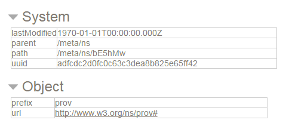

# Field Name Formats #

----

**Go to:** &nbsp;&nbsp;&nbsp;&nbsp; [**Root TOC**](CM-Well.RootTOC.md) &nbsp;&nbsp;&nbsp;&nbsp; [**Topic TOC**](API.TOC.md) &nbsp;&nbsp;&nbsp;&nbsp; [**Previous Topic**](API.FieldConditionSyntax.md)&nbsp;&nbsp;&nbsp;&nbsp; [**Next Topic**](API.FromAndToDatetimeFormatting.md)  

----

As we have learned, an RDF repository is a graph structure. RDF field names are also defined in a hierarchical graph structure, called an "ontology". This could be an internal Thomson Reuters/Refinitiv ontology or a 3rd-party ontology.

Thus, the "CommonName" field belonging to organizations is actually identified by its full path within the Thomson Reuters ontology:

    http://ont.com/mdaas/CommonName

The reason that you can't refer to fields only by their "terminal" name (e.g. "CommonName") is that this name may potentially appear in more than one ontology. Therefore using only the name without its path could result in ambiguity.

There are several different formats you can use to identify CM-Well fields, each with pros and cons. The following sections describe these formats.

## "Prefix" Format ##

The "prefix" format in CM-Well uses the immediate parent of the field name, from the field's full ontology path.
Thus, in the field "http://ont.com/mdaas/CommonName", CommonName is the field name, while "mdaas" is its prefix.

In spite of its name, in CM-Well you add the prefix *after* the field name itself, as follows: *fieldname.prefix*. For example "CommonName.mdaas".

>**Note**: For the special metadata fields of type **system**, **content** and **link**, the opposite order (e.g. "system.indexTime" or "length.content") is currently also supported. This is deprecated and will stop being supported in the future.

You may have noted that even adding the prefix to the field name does not guarantee uniqueness. If the same field name (with the same immediate parent name) is added to two different namespaces, the name becomes ambiguous and the query will fail.

Although the prefix is more readable than the alternatives, it is less reliable because of the potential for ambiguity (and it may even cease to be supported in the future).

>**Note:** The recommended best practice is to use the URI or hashed format (see below) for field identifiers, rather than the prefix format.

## URI Format ##

A field name's URI is its full URI in its hosting ontology.

For example, the URI of organizationFoundedYear.mdaas is:

    http://ont.com/mdaas/organizationFoundedYear

To use the full URI for a given field, surround the predicate with $ symbols. So for example, here is a query that uses the full URI for organizationFoundedYear.mdaas:

    <cm-well-host>/permid.org?op=search&qp=$http://ont.com/mdaas/organizationFoundedYear$>2014,type.rdf:Organization&with-data&format=ttl

## Hashed Format ##

Ontology namespaces are encoded by a hash function and stored in a special path in CM-Well: `<CMWellHost>/meta/ns`.
You can use the hash value instead of the unhashed (but potentially ambiguous) prefix value.

See for example the following entry from /meta/ns:

In this example, `http://www.w3.org/ns/prov` is the original namespace, and `bE5hMw` is its hashed value.

So, for example, we could refer to the Agent entity in this ontology as `$http://www.w3.org/ns/prov/Agent$` (the full URI format), but we could also refer to it using the hashed namespace value as a prefix, as follows: `Agent.$bE5hMw`. The $ character after the period indicates that what follows is a hashed value.

> **Note:** Using the hashed namespace value is faster than using any other field notation method; therefore if you want to improve query performance, use this format.

To find the hashed value for a certain namespace, you must search for it in CM-Well. So, for instance, to look up the namespace in the example above, you could run the following query:

    <cm-well-host>/meta/ns?op=search&qp=url:http://www.w3.org/ns/prov

The query returns the following namespace infoton:

    <cm-well-host>/meta/ns/bE5hMw

In your code, you can look up all the required hash values during initialization, and use them for querying at run-time.

----

**Go to:** &nbsp;&nbsp;&nbsp;&nbsp; [**Root TOC**](CM-Well.RootTOC.md) &nbsp;&nbsp;&nbsp;&nbsp; [**Topic TOC**](API.TOC.md) &nbsp;&nbsp;&nbsp;&nbsp; [**Previous Topic**](API.FieldConditionSyntax.md)&nbsp;&nbsp;&nbsp;&nbsp; [**Next Topic**](API.FromAndToDatetimeFormatting.md)  

----
