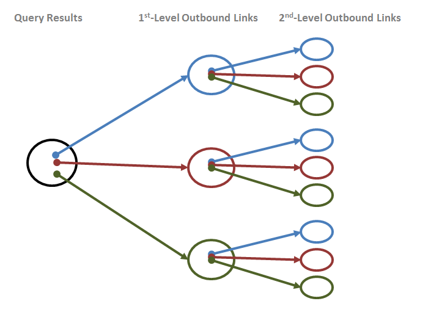

# Traversal Operands #

----

**Go to:** &nbsp;&nbsp;&nbsp;&nbsp; [**Root TOC**](CM-Well.RootTOC.md) &nbsp;&nbsp;&nbsp;&nbsp; [**Topic TOC**](API.Traversal.TOC.md) &nbsp;&nbsp;&nbsp;&nbsp; [**Previous Topic**](API.Traversal.gqp.md) 

----

## Traversal Operands Summary Table ##

The following table summarizes the operands that the **xg**, **yg** and **gqp** flags can take, and how they affect query results. See more details about the operands in the sections below the table (or by clicking the links in the table).

Operand&nbsp;&nbsp;&nbsp;&nbsp;&nbsp;&nbsp;&nbsp;&nbsp;&nbsp;&nbsp; | Description&nbsp;&nbsp;&nbsp;&nbsp;&nbsp;&nbsp;&nbsp;&nbsp;&nbsp;&nbsp;&nbsp;&nbsp;&nbsp;&nbsp;&nbsp;&nbsp;&nbsp;&nbsp;&nbsp;&nbsp;&nbsp;&nbsp;&nbsp;&nbsp;&nbsp;&nbsp;&nbsp;&nbsp;&nbsp;&nbsp;&nbsp;&nbsp;&nbsp;&nbsp; | Supported&nbsp;for | Example
:-------|:------------|:---------------|:--------
[xg with no operands](#hdrNoOperands) | Adds all level-1 outbound links in all fields | xg | ```<cm-well-host>/permid.org?op=search&qp=CommonName.mdaas:Marriott%20Ownership&with-data&xg```
[xg traversal level](#hdrLevel) | Adds all outbound links in all fields of query results, then all outbound links of the expanded set, and so on up to the traversal level specified. | xg | ```<cm-well-host>/permid.org?op=search&qp=CommonName.mdaas:Marriott%20Ownership&with-data&xg=3```
[xg traversal fields](#hdrXgField) | Adds all outbound links in the specified field or fields. As this option is only available for the **xg** flag, it refers implicitly to outbound links, even though the > operator is not used. | xg | ```<cm-well-host>/permid.org?op=search&qp=CommonName.mdaas:Marriott%20Ownership&with-data&xg=hasImmediateParent.mdaas```
[Multiple inbound or outbound traversal fields](#hdrFieldLists) | Comma-separated field lists can also appear after the > and < operators. | xg, yg, gqp | ```<cm-well-host>/permid.org?op=search&qp=CommonName.mdaas:Marriott%20Ownership&with-data&yg=<hasImmediateParent.mdaas,hasUltimateParent.mdaas```
[\>\[FieldName\]](#hdrOutbound) | Extends the traversal path with outbound links in the specified field. | xg, yg, gqp | ```<cm-well-host>/permid.org?op=search&qp=CommonName.mdaas:Marriott%20Ownership&with-data&xg=hasImmediateParent.mdaas>hasUltimateParent.mdaas```
[Field wildcard _](#hdrWildcard) | In field name clauses, refers to any field containing an infoton URI. | xg | ```<cm-well-host>/permid.org?op=search&qp=CommonName.mdaas:Marriott%20Ownership&with-data&xg=hasImmediateParent.mdaas>_```
[Field value filter](#hdrFieldValue) | Only continue along the traversal path if the infoton in the path meets the field value condition. | xg, yg, gqp | ```<cm-well-host>/permid.org?op=search&qp=CommonName.mdaas:Marriott%20Ownership&with-data&xg=hasImmediateParent.mdaas[organizationCity.mdaas:New%20York]```
[\<\[FieldName\]](hdrInbound) | Extend the traversal path with inbound links to the specified field. | yg, gqp | ```<cm-well-host>/permid.org?op=search&qp=CommonName.mdaas:Marriott%20Ownership&with-data&yg=<hasImmediateParent.mdaas```
[Multiple pipe-separated traversal paths](#hdrPipes) | For **yg**: traverse several paths in one query. For **gqp**: perform an "or" among the filters. | yg, gqp | **yg**: ```<cm-well-host>/example.org/Individuals/MrPresident?yg=<hasTenant.xmpl>location.locn\|>birthPlace.madsrdf```.<br/>**gqp**: ```<cm-well-host>/?op=search&qp=type.rdf:Person&gqp=<hasTenant.xmpl[hasBeginning.time<2000-01-01]>location.locn[name.geonames::The White House]\|>birthPlace.madsrdf[-countryCode::US]```


## Traversal Operands Details ##

<a name="hdrNoOperands"></a>
### *xg* with No Operands ###

When the **xg** flag appears with no operands, the query results will contain (in addition to the infotons that matched the query) all infotons that are outbound links of the matched infotons. These outbound links may be infotons of any type.

<a name="hdrLevel"></a>
### *xg* Traversal Level ###

You can add a numeric traversal level operand to the **xg** flag, which is a value between 1 and 9.

    xg=<integer>

For example:

    <cm-well-host>/permid.org?op=search
    &qp=CommonName.mdaas:Marriott%20Ownership,organizationCity.mdaas:Orlando&with-data&format=ttl&xg=2

The query above returns the matched infotons, their outbound links, and the outbound links of the "level 1" outbound links. In other words, **xg=2** retrieves both 1st and 2nd level outbound links, originating from the query matches.



> **Notes:** 
> * **xg=1** is equivalent to **xg** with no operands.
> * The value of the **xg** parameter is limited to 9, but it is recommended to use smaller values (e.g. 1 or 2). The **xg** parameter should be used with caution, as larger numbers may result in very large data sets being returned. If you find you need a larger expansion level (e.g. 9 or above), this may indicate an inefficient data model or query.

<a name="hdrXgField"></a>
### *xg* Traversal Fields ###

Rather than requesting all outbound links, you can request only the outbound links that appear in a certain field or list of fields.  To do this, add **xg=** followed by a single field name or list of comma-separated field names.

    xg=<fieldName>
    xg=<fieldName>,<fieldName>,...,<fieldName>

For example, if you're querying for organizations and you're only interested in retrieving their immediate parent organizations, you could run the following query:

    <cm-well-host>/permid.org?op=search&qp=CommonName.mdaas:Marriott%20Ownership,organizationCity.mdaas:Orlando&format=ttl&with-data&xg=hasImmediateParent.mdaas

If you wanted to retrieve both immediate parents and ultimate parents, you could run the following query:

    <cm-well-host>/permid.org?op=search&qp=CommonName.mdaas:Marriott%20Ownership,organizationCity.mdaas:Orlando&format=ttl&with-data&xg=hasImmediateParent.mdaas,hasUltimateParent.mdaas

<a name="hdrFieldLists"></a>
### Multiple Inbound or Outbound Traversal Fields ###

The previous section refers only to field lists in the **xg** value, with no other operands.
You can also use comma-separated field lists after the > and < operators.

For example, the following query retrieves all infotons that point to the initial query's result set through the **hasImmediateParent** and **hasUltimateParent** fields:

    <cm-well-host>/permid.org?op=search&qp=CommonName.mdaas:Marriott%20Ownership,organizationCity.mdaas:Orlando&format=ttl&with-data&yg=<hasImmediateParent.mdaas,hasUltimateParent.mdaas

<a name="hdrOutbound"></a>
### Outbound Link Operator ('>') ###

Suppose you have defined an **xg** value that returns a certain set of outbound links. You can then further expand this set to refer to higher levels of outbound links, using the '>' operator.

    xg=<outboundExpansion> > <fieldIdentifier>

For example:

    <cm-well-host>/permid.org?op=search&qp=CommonName.mdaas:Marriott%20Ownership,organizationCity.mdaas:Orlando&format=ttl&with-data&xg=hasImmediateParent.mdaas>hasUltimateParent.mdaas

This query retrieves the outbound links in the **hasImmediateParent** fields of the matched infotons, and in addition, the outbound links in the **hasUltimateParent** fields of the level 1 outbound links.

You can add a "chain" of several outbound link operators with field identifiers, to retrieve more and more remote links, as follows:

    <cm-well-host>/permid.org?op=search&qp=CommonName.mdaas:Marriott%20Ownership,organizationCity.mdaas:Orlando&format=ttl&with-data&xg=hasImmediateParent.mdaas>hasImmediateParent.mdaas>hasImmediateParent.mdaas

<a name="hdrWildcard"></a>
### Field Wildcard ###

Instead of adding a specific field name after the '>' operator, you can use the wildcard character '_' to indicate all fields.

For example:

    <cm-well-host>/permid.org?op=search&qp=CommonName.mdaas:Marriott%20Ownership,organizationCity.mdaas:Orlando&format=ttl&with-data&xg=hasImmediateParent.mdaas>_

This query retrieves the outbound links in the **hasImmediateParent** fields of the matched infotons, and in addition, the outbound links *all* fields of the level 1 outbound links.

<a name="hdrFieldValue"></a>
### Field Value Filter ###

You can add field filters to constrain the additional infotons retrieved by the traversal flag. You do this by adding the field filters in [ ] brackets after the expansion definition.

    xg=<traversalClause>[field filter]
    yg=<traversalClause>[field filter]
    gqp=<traversalClause>[field filter]

>**Notes:** 
>* The syntax of the field filter is the same as for the [qp parameter](API.FieldConditionSyntax.md).
>* The fuzzy match operator ~ is not supported for outbound links.

For example:

    <cm-well-host>/permid.org?op=search&qp=CommonName.mdaas:Marriott%20Ownership,organizationCity.mdaas:Orlando&format=ttl&with-data&xg=hasImmediateParent.mdaas[organizationCity.mdaas:New%20York]

This query retrieves the outbound links in the **hasImmediateParent** fields of the matched infotons, but only those whose city field value is "New York".

<a name="hdrInbound"></a>
### Inbound Link Operator ('<') ###

The **yg** flag allows you to traverse both infotons' outbound links and their inbound links. When you add **yg** to a CM-Well query, for each infoton result of the query, CM-Well traverses the path defined by the **yg** value, and adds the infotons in that path to the query results.

In **yg** syntax, **>** indicates an outbound link and **<** indicates an inbound link.

Here is an example of a query that traverses inbound links:

    <cm-well-host>/permid.org?op=search&qp=CommonName.mdaas:Marriott%20Ownership,organizationCity.mdaas:Orlando&format=ttl&with-data&yg=<hasImmediateParent.mdaas<hasImmediateParent.mdaas

This query retrieves all infotons that point to the matched infotons through their **hasImmediateParent** field, and also all infotons that point to the level 1 inbound links through their **hasImmediateParent** field. In other words, it retrieves the child companies of the matched infotons, and also the child companies of those child companies. 

<a name="hdrPipes"></a>
### Multiple Pipe-Separated Traversal Paths ###

#### Multiple Paths for *yg* ####

If you want to expand along several paths using a single query, you can add several expansion expressions separated by the pipe ('|') operator.

For example, supposed we've uploaded the following information to CM-Well, which refers to the individual ```MrPresident```:

<a name="hdrRdfData"></a>

    @prefix foaf: <http://xmlns.com/foaf/0.1/> .
    @prefix dc:   <http://purl.org/dc/terms/> .
    @prefix locn: <http://www.w3.org/ns/locn#> .
    @prefix madsrdf:  <http://www.loc.gov/mads/rdf/v1#> .
    @prefix geonames: <http://www.geonames.org/ontology#> .
    @prefix geo:  <http://www.w3.org/2003/01/geo/wgs84_pos#> .
    @prefix xmpl: <http://ont.example.org/2017/v1.0#> .
    @prefix time: <http://www.w3.org/2006/time#> .
    @prefix xsd:  <http://www.w3.org/2001/XMLSchema#> .
    @prefix rdfs: <http://www.w3.org/2000/01/rdf-schema#> .
    @prefix cc:   <http://creativecommons.org/ns#> .
    
    <http://example.org/Individuals/MrPresident> a foaf:Person ;
      madsrdf:birthPlace <http://sws.geonames.org/5122525/> .
    
    <http://example.org/Residence/fedcba98-7654-3210-1234-56789abcdef0> a xmpl:Residence ;
      locn:location <http://sws.geonames.org/5122525/> ;
      xmpl:hasTenant <http://example.org/Individuals/MrPresident> ;
      time:hasBeginning "2017-01-20"^^xsd:date ;
      time:hasEnd "TBD" .
    
    <http://sws.geonames.org/5122525/> a geonames:Feature ;
      rdfs:isDefinedBy <http://sws.geonames.org/5122525/about.rdf> ;
      geonames:name "Jamaica Hospital Medical Center" ;
      geonames:alternateName "Jamaica Hospital" ;
      geonames:officialName "Jamaica Hospital Medical Center"@en ;
      geonames:featureClass geonames:S ;
      geonames:featureCode geonames:S\.HSP ;
      geonames:countryCode "US" ;
      geo:lat "40.70078"^^xsd:decimal ;
      geo:long "-73.81635"^^xsd:decimal ;
      geo:alt "18"^^xsd:decimal ;
      geonames:parentFeature <http://sws.geonames.org/5133268/> ;
      geonames:parentCountry <http://sws.geonames.org/6252001/> ;
      geonames:parentADM1 <http://sws.geonames.org/5128638/> ;
      geonames:parentADM2 <http://sws.geonames.org/5133268/> ;
      geonames:nearbyFeatures <http://sws.geonames.org/5122525/nearby.rdf> ;
      geonames:locationMap <http://www.geonames.org/5122525/jamaica-hospital-medical-center.html> .
    
    <http://sws.geonames.org/5122525/about.rdf> a foaf:Document ;
      foaf:primaryTopic <http://sws.geonames.org/5122525/> ;
      cc:license <http://creativecommons.org/licenses/by/3.0/> ;
      cc:attributionURL <http://sws.geonames.org/5122525/> ;
      cc:attributionName "GeoNames"^^xsd:string ;
      dc:created "2006-01-15"^^xsd:date ;
      dc:modified "2016-12-06"^^xsd:date .
    
    <http://sws.geonames.org/4140704/> a <http://www.geonames.org/ontology#Feature> ;
      rdfs:isDefinedBy <http://sws.geonames.org/4140704/about.rdf> ;
      geonames:name "The White House" ;
      geonames:alternateName "Executive Mansion", "Presidents House", "Presidents Palace", "White House"@en ;
      geonames:officialName "Maison Blanche"@fr, "The White House"@en, "Weißes Haus"@de ;
      geonames:featureClass geonames:S ;
      geonames:featureCode geonames:S\.BLDG ;
      geonames:countryCode "US" ;
      geo:lat "38.89761"^^xsd:decimal ;
      geo:long "-77.03637"^^xsd:decimal ;
      geo:alt "17"^^xsd:decimal ;
      geonames:parentFeature <http://sws.geonames.org/4140987/> ;
      geonames:parentCountry <http://sws.geonames.org/6252001/> ;
      geonames:parentADM1 <http://sws.geonames.org/4138106/> ;
      geonames:parentADM2 <http://sws.geonames.org/4140987/> ;
      geonames:nearbyFeatures <http://sws.geonames.org/4140704/nearby.rdf> ;
      geonames:locationMap <http://www.geonames.org/4140704/the-white-house.html> .
    
    <http://sws.geonames.org/4140704/about.rdf> a foaf:Document ;
      foaf:primaryTopic <http://sws.geonames.org/4140704/> ;
      cc:license <http://creativecommons.org/licenses/by/3.0/> ;
      cc:attributionURL <http://sws.geonames.org/4140704/> ;
      cc:attributionName "GeoNames"^^xsd:string ;
      dc:created "2006-01-15"^^xsd:date ;
      dc:modified "2014-08-04"^^xsd:date .
    
In a single query, the following call retrieves both the place that ```MrPresident``` was born (via an outbound link), and all the places where ```MrPresident``` lived (via a combination of inbound and outbound links):

    <cm-well-host>/example.org/Individuals/MrPresident?yg=<hasTenant.xmpl>location.locn|>birthPlace.madsrdf

You can add as many pipe-separated expansion expressions to one query as you want. The results are the equivalent of running each expansion query separately and pooling all their results.

#### Multiple Paths for *gqp* ####

As for the **yg** query, you can add several filter expressions to a single **gqp** query, separated by the pipe ('|') operator. However, the behavior of the complex expression is different than for **yg**. When piped expressions are used with **gqp**, CM-Well applies "or" logic among them. This means that in order to match the filter, an infoton only needs to match *one* of the piped expressions.

For example, if applied to the [RDF data above](#hdrRdfData), the following query retrieves all the US presidents that either were born outside the US,
or were living in the White House before 2000:

    <cm-well-host>/?op=search&qp=type.rdf:Person&gqp=<hasTenant.xmpl[hasBeginning.time<2000-01-01]>location.locn[name.geonames::The White House]|>birthPlace.madsrdf[-countryCode::US]

----

**Go to:** &nbsp;&nbsp;&nbsp;&nbsp; [**Root TOC**](CM-Well.RootTOC.md) &nbsp;&nbsp;&nbsp;&nbsp; [**Topic TOC**](API.Traversal.TOC.md) &nbsp;&nbsp;&nbsp;&nbsp; [**Previous Topic**](API.Traversal.gqp.md)

----
