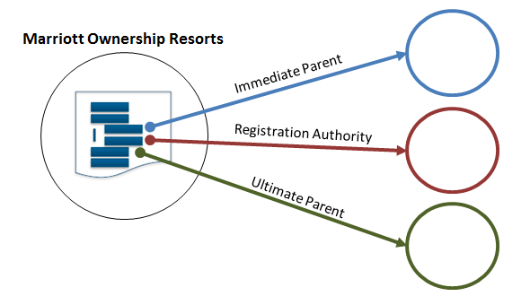

# *xg*: Traversing Outbound Links #

----

**Go to:** &nbsp;&nbsp;&nbsp;&nbsp; [**Root TOC**](CM-Well.RootTOC.TOC.md) &nbsp;&nbsp;&nbsp;&nbsp; [**Topic TOC**](API.Traversal.TOC.md) &nbsp;&nbsp;&nbsp;&nbsp; [**Previous Topic**](API.Traversal.Intro.md)&nbsp;&nbsp;&nbsp;&nbsp; [**Next Topic**](API.Traversal.yg.md)  

----

## The *xg* Operator ##

The **xg** operator allows you to traverse infotons' outbound links. When you add **xg** to a CM-Well query, for each infoton result of the query, CM-Well traverses the outbound links defined by **xg**, and adds those links to the query results.

>**Note**: The **xg** flag has several optional operands that allow you to define the outbound fields you want to traverse, and the level of indirection you want to traverse. See [Traversal Operands](API.Traversal.Operands.md) to learn more.

Let's look at an example of how to use the **xg** flag.

## Example: Using *xg* to Retrieve Parent Organizations ##

The following query searches for Organization infotons whose name contains "Marriott Ownership" and whose city contains "Orlando":

    <cm-well-host>/permid.org?op=search&qp=CommonName.mdaas:Marriott%20Ownership,organizationCity.mdaas:Orlando&with-data&format=ttl&length=1

Running the query produces the following single infoton result (truncated for readability):

    <http://permid.org/1-4294969614>
        a                               mdaas:Organization , organization:Organization ;
        mdaas:CIK                       "0001541356" ;
        mdaas:CommonName                "Marriott Ownership Resorts Inc"@en ;
        mdaas:LEI                       "BW4532OH033VURR0IT68" ;
        mdaas:MXID                      "108194567" ;
        mdaas:OrganizationProviderTypeCode        "1" ;
        mdaas:RCPID                     "600073966" ;
        mdaas:TaxID                     "521320904" ;
        mdaas:akaName                   "Marriott Ownership Resorts" ;
        mdaas:entityLastReviewedDate    "2010-02-26 05:00:00" ;
        mdaas:equityInstrumentCount     "0" ;
        mdaas:hasImmediateParent        <http://permid.org/1-5035948006> ;
        mdaas:hasRegistrationAuthority  <http://permid.org/1-5000008957> ;
        mdaas:hasUltimateParent         <http://permid.org/1-5035948006> ;
        mdaas:headquartersAddress       "ORLANDO\nFLORIDA\n32821-6066\nUnited States\n"@en , "6649 Westwood Blvd Ste 300\nORLANDO\nFLORIDA\n32821-6066\nUnited States\n" ;
        ...

In the infoton retrieved by the query, we can see 3 fields that contain links to other infotons: ```hasImmediateParent```, ```hasRegistrationAuthority``` and ```hasUltimateParent```.



If we wanted to retrieve these outbound link infotons as well, we could use the **xg** flag, as in the following modified query:

    <cm-well-host>/permid.org?op=search&qp=CommonName.mdaas:Marriott%20Ownership,organizationCity.mdaas:Orlando&with-data&format=ttl&xg

This produces the following (truncated) results:

    <http://permid.org/1-4294969614>
        a                               mdaas:Organization , organization:Organization ;
        mdaas:CIK                       "0001541356" ;
        mdaas:CommonName                "Marriott Ownership Resorts Inc"@en ;
        mdaas:LEI                       "BW4532OH033VURR0IT68" ;
        mdaas:MXID                      "108194567" ;
        mdaas:OrganizationProviderTypeCode      "1" ;
        mdaas:RCPID                     "600073966" ;
        mdaas:TaxID                     "521320904" ;
        mdaas:akaName                   "Marriott Ownership Resorts" ;
        mdaas:entityLastReviewedDate    "2010-02-26 05:00:00" ;
        mdaas:equityInstrumentCount     "0" ;
        mdaas:hasImmediateParent        <http://permid.org/1-5035948006> ;
        mdaas:hasRegistrationAuthority  <http://permid.org/1-5000008957> ;
        mdaas:hasUltimateParent         <http://permid.org/1-5035948006> ;
		...

    <http://permid.org/1-5035948006>
        a                               mdaas:Organization , organization:Organization ;
        mdaas:CIK                       "0001524358" ;
        mdaas:CommonName                "Marriott Vacations Worldwide Corp" ;
        mdaas:ExchangeTicker            "VAC" ;
        mdaas:InvestextID               "VAC" ;
        mdaas:LEI                       "549300WA6BT5H4F7IO94" ;
        mdaas:MXID                      "111800547" ;
        mdaas:RCPID                     "600304172" ;
        mdaas:RIC                       "VAC.N" ;
        mdaas:SDCID                     "1218547002          " ;
        mdaas:SDCusip                   "56655E" ;
        mdaas:TaxID                     "452598330" ;
        mdaas:entityLastReviewedDate    "2016-03-02 05:00:00" ;
        mdaas:equityInstrumentCount     "1" ;
        mdaas:hasImmediateParent        <http://permid.org/1-5035948006> ;
        mdaas:hasRegistrationAuthority  <http://permid.org/1-5000008957> ;
        mdaas:hasUltimateParent         <http://permid.org/1-5035948006> ;
		...

    <http://permid.org/1-5000008957>
        a                               mdaas:Organization , organization:Organization ;
        mdaas:officialLatinName         "Delaware Department of State"@en ;
        tr-common:hasPermId             "5000008957" ;
        organization:hasActivityStatus  organization:statusActive ;
        organization:hasHeadquartersAddress  <http://permid.org/2-c59eac8479e6106496cb322e1d4705657db9708018a2dec5b178fe193d549879> ;
        organization:hasImmediateParent      <http://permid.org/1-5000008957> ;
        organization:hasLegacyPI        "15894917" ;
        organization:hasMXID            "107548790" ;
        organization:hasNDAOrgID        "106227913" ;
        organization:hasOfficialName    "Delaware Department of State"@en ;
		...
		
    <http://data.thomsonreuters.com/1-4294969614>
        a                            oa:Organization ;
        Common:organizationFoundedDaysourceLink
                "https://icis.corp.delaware.gov/Ecorp/EntitySearch/NameSearch.aspx" ;
        Common:organizationFoundedDaysourceType
                <http://data.thomsonreuters.com/1-2010107> ;
        Common:organizationFoundedDaysourceUpdateDate
                "2015-12-28T17:22:50" ;
        Common:organizationFoundedMonthsourceLink
                "https://icis.corp.delaware.gov/Ecorp/EntitySearch/NameSearch.aspx" ;
        Common:organizationFoundedMonthsourceType
                <http://data.thomsonreuters.com/1-2010107> ;
        Common:organizationFoundedMonthsourceUpdateDate
                "2015-12-28T17:22:50" ;
        Common:organizationFoundedYearsourceLink
                "https://icis.corp.delaware.gov/Ecorp/EntitySearch/NameSearch.aspx" ;
        Common:organizationFoundedYearsourceType
                <http://data.thomsonreuters.com/1-2010107> ;
        Common:organizationFoundedYearsourceUpdateDate
                "2015-12-28T17:22:50" ;
		...
	
    <http://permid.org/2-29ea9a58f0cf50bd968c58b8b301903bec0a3d793d3c9cc562a80d130a61555c>
        a                     vcard:Address ;
        vcard:country-name    "US" ;
        vcard:locality        "WILMINGTON" ;
        vcard:postal-code     "19808" ;
        vcard:region          "DELAWARE" ;
        vcard:street-address  "Suite 400\n2711 Centerville Road\nNew Castle"@en .	
		...
		
    <http://permid.org/2-0ea63bd5da91dc26c362f09a984b27eb4ada52b0bd494e3e0b8ec54e8fb6ac3d>
        a                     vcard:Address ;
        vcard:country-name    "US" ;
        vcard:locality        "ORLANDO" ;
        vcard:postal-code     "32821-6066" ;
        vcard:region          "FLORIDA" ;
        vcard:street-address  "6649 Westwood Blvd Ste 300"@en .	
		...


Note that these results contain the original infoton result, the 3 Organization infotons that are referenced in its fields, and also 2 Address infotons that are referenced in its fields. The last 5 infotons were retrieved because we used the **xg** flag.

Suppose we're only interested in Marriott Ownership Resorts' immediate parent. We can run the following query:

    <cm-well-host>/permid.org?op=search&qp=CommonName.mdaas:Marriott%20Ownership,organizationCity.mdaas:Orlando&with-data&format=ttl&xg=hasImmediateParent.mdaas
    
By specifying the field name ```hasImmediateParent``` as the **xg** value, we now constrain the query to return only outbound links contained in the original infoton's ```hasImmediateParent``` field.

If we're interested both in Marriott Ownership Resorts' immediate parent and its ultimate parent, we can specify two field names in the **xg** flag, as follows:

    <cm-well-host>/permid.org?op=search&qp=CommonName.mdaas:Marriott%20Ownership,organizationCity.mdaas:Orlando&with-data&format=ttl&xg=hasImmediateParent.mdaas,hasUltimateParent.mdaas

>**Note**: See [Traversal Operands](API.Traversal.Operands.md) to learn more about **xg** operands.

----

**Go to:** &nbsp;&nbsp;&nbsp;&nbsp; [**Root TOC**](CM-Well.RootTOC.TOC.md) &nbsp;&nbsp;&nbsp;&nbsp; [**Topic TOC**](API.Traversal.TOC.md) &nbsp;&nbsp;&nbsp;&nbsp; [**Previous Topic**](API.Traversal.Intro.md)&nbsp;&nbsp;&nbsp;&nbsp; [**Next Topic**](API.Traversal.yg.md)  

----
