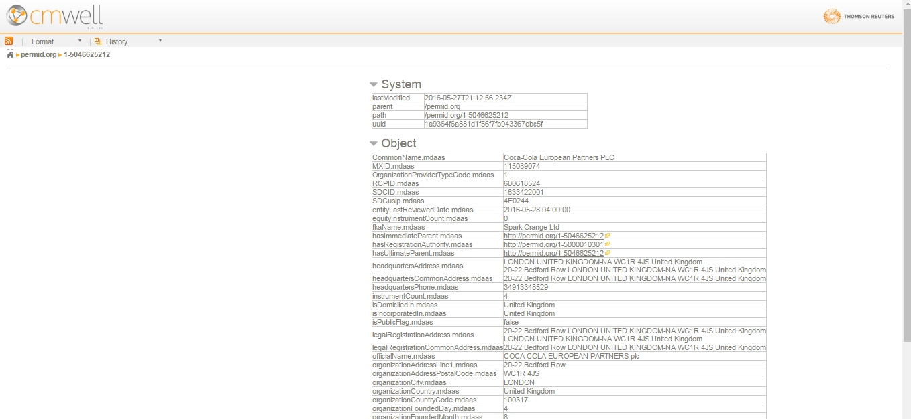
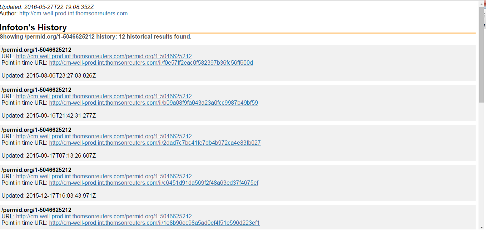

# Using the with-history Flag #

----

**Go to:** &nbsp;&nbsp;&nbsp;&nbsp; [**Root TOC**](CM-Well.RootTOC.md) &nbsp;&nbsp;&nbsp;&nbsp; [**Topic TOC**](API.TOC.md) &nbsp;&nbsp;&nbsp;&nbsp; [**Previous Topic**](API.UsingTheWith-dataFlag.md)&nbsp;&nbsp;&nbsp;&nbsp; [**Next Topic**](API.UsingTheWith-deletedFlag.md)  

----

Each time a CM-Well infoton is updated, a "historical" copy of it is saved, and its URL (which serves as a "virtual link") is updated to point to the most recent version.

Each version of the infoton has a "point in time URL", which is a unique URL pointing to that particular version.

For example, this is what we see when retrieving the default (latest) version of an infoton:

And this is what we see when retrieving the same infoton, using the with-history flag:

Note that the infoton has 12 historical versions (the image shows only one page of results).

----

**Go to:** &nbsp;&nbsp;&nbsp;&nbsp; [**Root TOC**](CM-Well.RootTOC.md) &nbsp;&nbsp;&nbsp;&nbsp; [**Topic TOC**](API.TOC.md) &nbsp;&nbsp;&nbsp;&nbsp; [**Previous Topic**](API.UsingTheWith-dataFlag.md)&nbsp;&nbsp;&nbsp;&nbsp; [**Next Topic**](API.UsingTheWith-deletedFlag.md)  

----