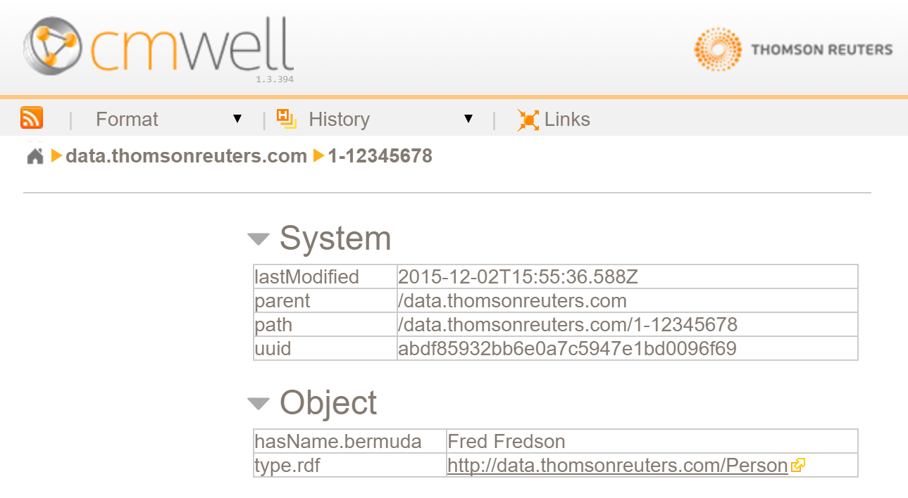
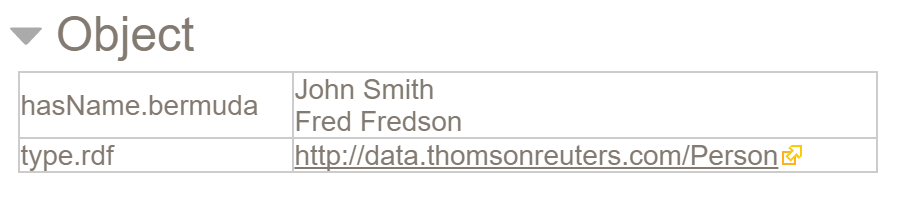
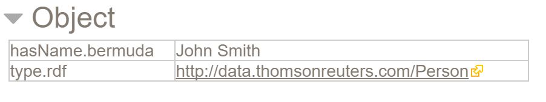

# Updating CM-Well #

----

**Go to:** &nbsp;&nbsp;&nbsp;&nbsp; [**Root TOC**](CM-Well.RootTOC.md) &nbsp;&nbsp;&nbsp;&nbsp; [**Topic TOC**](DevGuide.TOC.md) &nbsp;&nbsp;&nbsp;&nbsp; [**Previous Topic**](DevGuide.AdvancedQueries.md)&nbsp;&nbsp;&nbsp;&nbsp; [**Next Topic**](DevGuide.StreamingDataFromCM-Well.md)  

----

CM-Well supports APIs for writing to it as well as reading from it. However, in order to protect production data, only internal CM-Well subsystems and authorized users can update the production instance of CM-Well.

If you want to experiment with writing to CM-Well, you can use the lab or pre-production environments, or install the CM-Well Docker.

> **Note:** If you're creating a repository with new entities that will eventually be part of the TR Knowledge Graph, you will need to consult with the TR Information Architecture team to determine how to assign or create domain IDs and entity URIs. 

Updates to CM-Well use the standard HTTP POST or DELETE verbs. In our examples, we’ll mostly use the cURL utility to issue commands to CM-Well, but you can use any application that can issue POST and DELETE requests. (A convenient application with a Windows UI is Fiddler, which you can downloaded at: [http://www.telerik.com/fiddler](http://www.telerik.com/fiddler).)

>**Note:** Calls that update CM-Well (calls that add, change or delete data) operate asynchronously. This means that when the call returns, the update is not necessarily complete. The call adds the update request to a queue, and the request is performed eventually. The client may have to wait some time before the change is evident on CM-Well. If you want the call to be synchronous, use the [blocking flag](API.UsingTheBlockingFlag.md).
>
**Note:** You can using the [tracking API](API.Update.TrackUpdates.md) to track the status of update requests.

>**Note:** To prevent an update request from overwriting a parallel request, use [conditional updates](API.UsingConditionalUpdates.md).

[Inserting New Infotons](#hdr1)

[Deleting Infotons](#hdr2)

[Adding and Replacing Field Values](#hdr3)

[Deleting Field Values](#hdr4)

[Special Infotons](#hdr5)

## Inserting New Infotons ##

To create a new infoton in CM-Well:

* POST a request to the _in endpoint of the CM-Well instance. 
* In the request's payload, include a triple of the format **\<entity URI\> \<predicate\> \<type URI\>**, to define a new infoton whose subject has the given type.
* In the request's payload, optionally include triples defining field values for the new infoton. 
* Specify the format of the triples using the **?format** parameter.

>**Note:** If the format parameter is not used, CM-Well attempts to "guess" the format based on the Content-Type header.  

For example, here is a cURL command that creates the infoton [<data.com/1-12345678>](<data.com/1-12345678>) with two triples:

    curl -X POST "<cm-well-host>/_in?format=ttl" -H "Content-Type: text/plain" --data-binary 
    '<http://data.com/1-12345678> a <http://data.com/Person>; 
    <http://ont.thomsonreuters.com/bermuda/hasName> "Fred Fredson" .'
    
> **Note:** If you want to post a larger set of data for the infoton, it may be more convenient to use the -data @filename parameter instead of --data-binary. In this case, you enter the infoton's data in the file instead of in the command.

After running the POST command above, you'll see this infoton in the graph:

To create several new infotons at once, simply add more entity-type definitions in the request payload, for example:

    curl -X POST "<cm-well-host>/_in?format=ttl" 
    `-H "Content-Type: text/plain" --data-binary` 
    '<http://data.com/1-11111111> a <http://data.com/Person> .
     <http://data.com/1-22222222> a <http://data.com/Person> .
     <http://data.com/1-33333333> a <http://data.com/Person> .'
    

## Deleting Infotons ##

To delete the infoton you created in the previous section, you can issue this command:

    curl -X DELETE <cm-well-host>/data.com/1-12345678

If the DELETE operation succeeds, CM-Well returns a status code of 200, with a JSON payload of: {“success”: true}.  

> **Note:** CM-Well returns a "success" status code even if the infoton you requested to delete doesn't exist.

Alternatively, you can use the following syntax to delete several infotons in one POST:

    curl -X POST "<cm-well-host>/_in?format=ttl" -H "Content-Type: text/plain" --data-binary '
    <http://data.com/1-11111111> <cmwell://meta/sys#fullDelete> "false" .
    <http://data.com/1-22222222> <cmwell://meta/sys#fullDelete> "false" .
    <http://data.com/1-33333333> <cmwell://meta/sys#fullDelete> "false" .
    '

### Recursive Deletion of Infotons ###
   
The Boolean value in the previous section's example indicates whether the deletion should be recursive, as follows:

* **true** - in addition to deleting the infotons in the request, if there are infotons under the paths supplied in the request, they will be deleted too.
* **false** - no recursive deletion.

>**Note:** The number of infotons that can be deleted recursively in a single API call is limited to 500. To delete more infotons recursively, retrieve the list of infotons for deletion with a search or stream operation, divide them into groups of up to 500, and submit a deletion request as above, with a recursion flag of "false".

## Adding and Replacing Field Values ##

In order to update an existing infoton, you use the same API endpoint as for a create operation.  

Using the example above, we’ll update the same infoton, while entering in a new **hasName** value:

    curl -X POST "<cm-well-host>/_in?format=ttl" -H "Content-Type: text/plain" --data-binary '<http://data.com/1-12345678> <http://ont.thomsonreuters.com/bermuda/hasName> "John Smith" .'

Now, if we look at this infoton in CM-Well, we’ll see something interesting:

The infoton now has two entries for the name of the person.  Rather than overwrite the field, the new value was appended to the infoton. This is the default behavior, but we can override it by specifying the **replace-mode** flag as a parameter on our POST call. For example:

    curl -X POST "<cm-well-host>/_in?format=ttl&replace-mode" -H "Content-Type: text/plain" --data-binary '<http://data.com/1-12345678> <http://ont.thomsonreuters.com/bermuda/hasName> "John Smith" .'

Now when we look in CM-Well, we see the following:

 
The **hasName** field was overwritten as expected.

An alternate syntax for replacing field values (which allows multiple replacements in the same POST) is as follows:

    curl -X POST "<cm-well-host>/_in?format=ttl " -H "Content-Type: text/plain" --data-binary '<http://data.com/1-12345678> <cmwell://meta/sys#markReplace> <http://ont.thomsonreuters.com/bermuda/hasName> . 
	<http://data.com/1-12345678> <http://ont.thomsonreuters.com/bermuda/hasName> "John Doe" . '

> **Notes:** 
> * For best performance, if you're performing several updates to a certain infoton, include all the updates in a single call (rather than distribute updates to one infoton across several calls).  
> * If you attempt to perform an update on an infoton, where all of the "new" infotons triples are identical to the existing infoton's triples, no update will occur. This is in order to prevent saving a new infoton version when no actual change was made.

## Deleting Field Values ##

To delete an infoton's field, you can use the following syntax (in this example, the **hasName** field is deleted):
 
    curl -X POST "<cm-well-host>/_in?format=ttl " -H "Content-Type: text/plain" --data-binary '<http://data.com/1-12345678> <cmwell://meta/sys#markReplace> <http://ont.thomsonreuters.com/bermuda/hasName> .'

You can delete multiple fields in the same POST by adding several **#markReplace** triples to the command.

In some cases, an infoton may have several values for the same field name. For example, a Person infoton might have several Telephone or Email field values.

Using the **#markReplace** operator to delete a field deletes all of it values. If you only want to delete a subset of a field's multiple values, while retaining the other values, you can use the **#markDelete** operator, as in the example below.

    curl -X POST "<cm-well-host>/_in?format=turtle" --data-binary '
    @prefix vcard: <http://www.w3.org/2006/vcard/ns#> .
    <http://example.org/Individuals/JohnSmith>
    <cmwell://meta/sys#markDelete> [
      vcard:EMAIL <mailto:jane.smith@example.org> ;
      vcard:EMAIL <mailto:jenny.smith@example.org> ]
    '

## Special Infotons ##

Standard infotons are collections of triples, usually representing an entity and its attributes. However, CM-Well supports two other types of "special" infotons:

* **File infotons** - any file may be uploaded to CM-Well. This can be useful for storing documentation files, configuration files, images and so on. See the [Add File API](API.Update.AddFileInfoton.md) for more details. 
* **Link infotons** - a link infoton is a reference to another infoton. Performing a GET action on a link infoton retrieves the target ("pointed-to") infoton. You can define a link infoton as permanent, temporary or forward. See [Add Link Infoton API](API.Update.AddLinkInfoton.md) for more details. 
          

----

**Go to:** &nbsp;&nbsp;&nbsp;&nbsp; [**Root TOC**](CM-Well.RootTOC.md) &nbsp;&nbsp;&nbsp;&nbsp; [**Topic TOC**](DevGuide.TOC.md) &nbsp;&nbsp;&nbsp;&nbsp; [**Previous Topic**](DevGuide.AdvancedQueries.md)&nbsp;&nbsp;&nbsp;&nbsp; [**Next Topic**](DevGuide.StreamingDataFromCM-Well.md)  

----