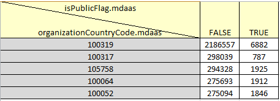

# Using Elastic Search Statistics #

----

**Go to:** &nbsp;&nbsp;&nbsp;&nbsp; [**Root TOC**](CM-Well.RootTOC.md) &nbsp;&nbsp;&nbsp;&nbsp; [**Topic TOC**](DevGuide.TOC.md) &nbsp;&nbsp;&nbsp;&nbsp; [**Previous Topic**](DevGuide.CallingJavaScalaFunctionsFromSPARQLQueries.md)&nbsp;&nbsp;&nbsp;&nbsp; [**Next Topic**](DevGuide.WorkingWithNamedSub-Graphs.md)  

----

## What Are Elastic Search Statistics? ##

Elastic Search is the underlying search engine that CM-Well uses when performing a query (which involves a full-text search on infoton field values). Elastic Search supports several types of statistical analyses of field values within a given group of infotons.  For example, using statistics, you can discover how many distinct values there are for a certain field in a certain group of infotons. (The Elastic Search statistical feature is called "aggregations", and you may see some references to this term in the search syntax and results.) 

CM-Well passes the statistical query to Elastic Search, which performs the query and returns its results, which are passed back to the caller. You can learn more about Elastic Search aggregation options [here](https://www.elastic.co/guide/en/elasticsearch/reference/current/search-aggregations.html).

CM-Well supports only a subset of Elastic Search's aggregation options. These are described in the next section.

## Statistical Metric Types ##

The following table describes the statistical metric types that CM-Well supports. The  type is passed in the **type** parameter.

Type | Type Parameter Value | Description | Applies to | Supports Sub-Queries
:-----------------|:----------------------|:-------------|:------------|:---------------------------
Cardinality | card | Returns the number of distinct values of the specified field for a given group of infotons. | All fields | No
Statistics | stats | Returns the count, sum, average, minimum and maximum of the field values. | Numeric fields | No
Terms | term | Returns the top N most frequent terms in a given field for a given group of infotons, using the N you define in the query. | All fields | Yes
Significant Terms | sig | Returns the top N most significant terms in a given field for a given group of infotons. "Significant terms" are terms that are significantly more frequent in the defined group than in the "background" group (a control group of infotons; by default the entire repository). | All fields | Yes

>**Note:** All counts returned by statistical queries are **approximate**. This is because Elastic Search is a distributed application, and data updates may take time to replicate on all machines. Usually counts are accurate to within 5%-10% of the true value. Accuracy is affected by the optional [precision_threshold](https://www.elastic.co/guide/en/elasticsearch/reference/current/search-aggregations-metrics-cardinality-aggregation.html#_precision_control) parameter.

## Statistical Query Syntax ##

Here is an example of a query that requests a cardinality metric:

    <cm-well-host>/permid.org?op=stats&ap=type:card,name:MyCurrencyStats,field:iso4217.currency&format=json&pretty

The query conforms to the following template:

    <cm-well-host>/<cm-well-path>?op=stats&ap=type:<statsType>,field:<statsField>,name:<outputName>&format=<outputFormat>

The placeholders in the template are as follows:

* **cmwellPath** - the path in CM-Well on which to apply the query.
* **statsType** - **card**, **stats**, **term** or **sig**.
* **name** - an optional parameter. If supplied, its value is returned as the **name** value in the query response.
* **field** - the name of the field on whose values you want to apply the query.
* **outputFormat** - the desired output format. 

> **Notes:**
> * The values defined in **ap** (aggregation parameters) are passed on to Elastic Search as they are.
> * The aggregation parameters must be passed in this order: 
> 
>Type | Parameter Order | Defaults
>:----|:----------------|:---------
>term | type:term[,name:MyName],field(:\|::)MyFieldName[,size:MySize][subaggregations] | size = 10
>sig | type:sig[,name:MyName],field(:\|::)MyFieldName[,backgroundTerm:FieldName*Value][,minDocCount:MyCount][,size:MySize][subaggregations] | size = 10, minDocCount = 10
>card | type:card[,name:MyName],field(:\|::)MyFieldName[,precisionThreshold:MyLong] |
>stats | type:stats[,name:MyName],field(:\|::)MyFieldName |

> * The output format must be one of: csv, json, jsonl.

## Sub-Queries ##

**Term** and **Significant Term** queries support **sub-queries**. This means that the first query defined in the **ap** parameter may be followed by one or more additional queries, defined in < > brackets. Each sub-query is applied to the output of the previous queries.

Here is an example of a query that requests a "significant terms" query, and then a "terms" query:

    <cm-well-host>/permid.org?op=stats&ap=type:sig,field::organizationCountryCode.mdaas,size:5<type:term,field::isPublicFlag.mdaas>&format=csv

This query runs on the **permid.org** path in CM-Well, obtains the infotons with the top 5 most frequent country codes, and then examines the their **isPublicFlag** field values. The resulting csv file looks like this:

>**Note:** When using sub-queries, you can only request a total of 2 queries with the csv format, as a table only has 2 dimensions. For larger numbers of queries, use the json format, which has no limit on its nesting levels.

## Statistical Query Examples ##

### Cardinality ###

**Action:** Find out how many distinct currency values are found in permid.org. The result is 266.

**Call:**

    curl "<cm-well-host>/permid.org?op=stats&ap=type:card,name:MyCurrencyStats,field:iso4217.currency&format=json&pretty"

**Response:**

    {
      "AggregationResponse" : [ {
    	"name" : "MyCurrencyStats",
    	"type" : "CardinalityAggregationResponse",
    	"filter" : {
      		"name" : "MyCurrencyStats",
      		"type" : "CardinalityAggregation",
      		"field" : "iso4217.currency"
    	},
    	"count" : 266
      } ]
    }

### Terms ###

**Action:** Find the top 10 countries where companies are incorporated.

**Call:**

    curl "<cm-well-host>/permid.org?op=stats&ap=type:term,name:MyIncorporatedStats,field::isIncorporatedIn.mdaas,size:10&pretty&format=json"

>**Note:** To perform a query on the entire field value, use the :: operator for the field parameter, as in `field::isIncorporatedIn.mdaas`. Otherwise, queries are performed on the tokenized versions of the values, i.e. each word is counted separately. In the example above, "United" would be counted as one value (appearing both in "United States" and "United Kingdom"), while "States" and "Kingdom" would be counted as separate values.

**Response:**

    {
    "AggregationResponse" : [ {
    "name" : "MyIncorporatedStats",
    "type" : "TermsAggregationResponse",
    "filter" : {
      "name" : "MyIncorporatedStats",
      "type" : "TermAggregation",
      "field" : "isIncorporatedIn.mdaas",
      "size" : 10,
      "subFilters" : [ ]
    },
    "buckets" : [ {
      "key" : "United States",
      "objects" : 737160
    }, {
      "key" : "China (Mainland)",
      "objects" : 187429
    }, {
      "key" : "United Kingdom",
      "objects" : 179029
    }, {
      "key" : "Germany",
      "objects" : 169454
    }, {
      "key" : "France",
      "objects" : 60621
    }, {
      "key" : "Canada",
      "objects" : 55675
    }, {
      "key" : "Netherlands",
      "objects" : 50387
    }, {
      "key" : "Japan",
      "objects" : 46034
    }, {
      "key" : "Sweden",
      "objects" : 43550
    }, {
      "key" : "Australia",
      "objects" : 42465
    } ]
      } ]
    }

----

**Go to:** &nbsp;&nbsp;&nbsp;&nbsp; [**Root TOC**](CM-Well.RootTOC.md) &nbsp;&nbsp;&nbsp;&nbsp; [**Topic TOC**](DevGuide.TOC.md) &nbsp;&nbsp;&nbsp;&nbsp; [**Previous Topic**](DevGuide.CallingJavaScalaFunctionsFromSPARQLQueries.md)&nbsp;&nbsp;&nbsp;&nbsp; [**Next Topic**](DevGuide.WorkingWithNamedSub-Graphs.md)  

----