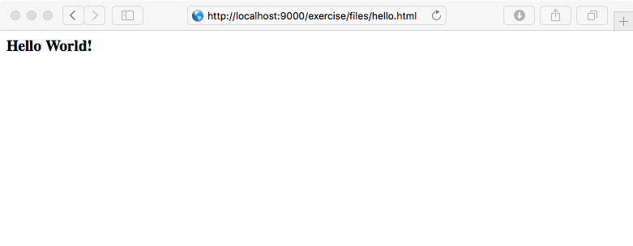

# Hands-On Exercise: Add a File Infoton #

----

**Go to:** &nbsp;&nbsp;&nbsp;&nbsp; [**Root TOC**](CM-Well.RootTOC.md) &nbsp;&nbsp;&nbsp;&nbsp; [**Topic TOC**](Tutorial.HandsOnExercisesTOC.md) &nbsp;&nbsp;&nbsp;&nbsp; [**Previous Topic**](Tutorial.HandsOnExercises.WorkWithSubGraphs.md)  

----

**Action:** Add an image file to CM-Well.

>**Note:** Before running the curl command, create the file: `c:\mypath\test.png`. After running the curl command, browse to \<cm-well-host\>/exercise/files/test.png and verify that the file was uploaded.

**Curl command:**

    curl -X POST <cm-well-host>/exercise/files/test.png -H "X-CM-WELL-TYPE: FILE" -H "Content-Type: image/png" --data-binary @"c:\mypath\test.png"

**Response:**

    {"success":true}

## Host an HTML page in CM-Well ##

Beyond hosting blob files like an image, CM-Well will also serve full HTML files (in fact, the CM-Well UI is hosted under the /meta URI structure and served using this method).

This means that you can easily create additional applications that integrate with CM-Well APIs just by loading the file to CM-Well.

The most basic HTML file is, of course, hello world. Create a new file on your file system with the following text

```
<html>
<head><title>Hello World!</title></head>
<body><h3>Hello World!</body>
</html>
```

Publish to CM-Well

    curl -X POST <cm-well-host>/exercise/files/hello.html -H "X-CM-WELL-TYPE: FILE" -H "Content-Type: text/html" --data-binary @"hello.html"

Now navigate to the page in your browser:



Two more complex examples, a [query builder](./examples/search_builder.html), and a [D3 integration](./examples/visualizer/index.html), can be found in the examples directory.

## API Reference ##
[Add File Infoton](API.Update.AddFileInfoton.md)


----

**Go to:** &nbsp;&nbsp;&nbsp;&nbsp; [**Root TOC**](CM-Well.RootTOC.md) &nbsp;&nbsp;&nbsp;&nbsp; [**Topic TOC**](Tutorial.HandsOnExercisesTOC.md) &nbsp;&nbsp;&nbsp;&nbsp; [**Previous Topic**](Tutorial.HandsOnExercises.WorkWithSubGraphs.md)  

----
