# The Previous CM-Well Web Interface #

* [Introduction](#hdr1)
* [CM-Well Paths](#hdr2)
* [CM-Well UI Controls](#hdr3)
	* [Address Bar](#hdr4)
	* [Results Page](#hdr5)
	* [Home Button](#hdr6)
	* [HELP Link](#hdr7)
	* [Paging Controls](#hdr8)
	* [Message Banner](#hdr9)
	* [Atom Feed Buttons](#hdr10)
	* [Format Dropdown](#hdr11)
	* [History Dropdown](#hdr12)
	* [History Button](#hdr13)
	* [History Diff Button](#hdr14)
	* [Type Navigation Button](#hdr15)
	* [Field Dropdown](#hdr16)
	* [Search Box](#hdr17)
	* [Exact Term Checkbox](#hdr18)
	* [Statistics Dropdown](#hdr19)
	* [SPARQL Query Button](#hdr20)
* [The Infoton View](#hdr21)
* [Running CM-Well Queries in the UI](#hdr22)
* [Special CM-Well Folders and Files](#hdr23)
* [Configuring Infoton Link Display by Type](#hdr24)

## Introduction ##

The CM-Well web interface is a graphical user interface for accessing CM-Well through your browser. When you browse to the root URI of a CM-Well instance, you see this page:

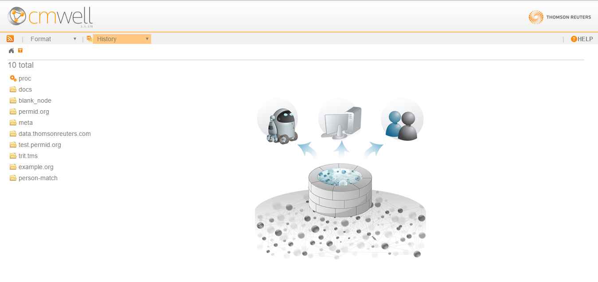

Using the CM-Well web interface, you can browse among the CM-Well folders and infotons, run queries and get results, and examine the query results. Anyone in the Thomson Reuters network has read access to CM-Well; this requires no special permissions.

This page describes the features of the CM-Well web interface and how to use them.

---------------------------------

## CM-Well Paths ##

CM-Well is a Linked Data repository with a hierarchical folder structure. Each folder can contain infotons and other folders. (See [CM-Well Data Paradigms](Intro.CM-WellDataParadigms.md) to learn more about infotons).

An infoton's URI is similar to an internet URI in that it refers to a specific internet resource. In this case the resource is an infoton rather than a web page. The infoton itself has no display information, but the CM-Well UI renders the infoton information as a visual web page.

A path to an infoton contains the CM-Well host, the sub-folders and the infoton's unique ID. For example: `<cm-well-host>/data.com/1-34415653093`

There are several lab, pre-production and production CM-Well environments, and each one has a different root URI. (See [CM-Well Environments](CM-WellEnvironments.md) to learn more.)

---------------------------------

## CM-Well UI Controls ##

### Address Bar ###

You can browse to an infoton by entering its path in a browser address bar.

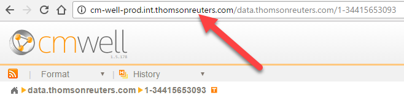

---------------------------------

### Results Page ###

The central page area of the CM-Well web interface displays your query results, or in other words, the folders and/or infoton/s that reside under the CM-Well path in the address bar.

If the URI refers to a single infoton, the results page shows that infoton's fields and values.

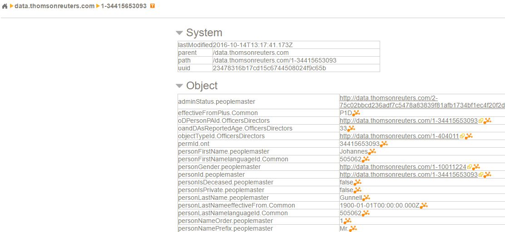

If there are sub-folders or infotons under the URI in the address bar, they are displayed as a list on the left of the results page.

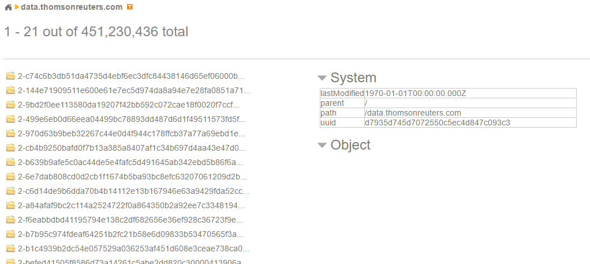

Clicking on the URI of a folder or infoton displays the page for the selected folder or infoton.

>**Note:** A CM-Well folder is also an infoton, which has system fields that are displayed when you browse to a folder's URI. (It can potentially also have object fields.)

---------------------------------

### Home Button ###

Clicking on the Home button at the top left navigates to the CM-Well root URI.

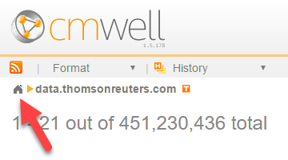

---------------------------------

### HELP Link ###

Clicking on the HELP link at the top right displays the Table of Contents page for the CM-Well help documentation.

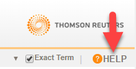

---------------------------------

### Paging Controls ###

When there is more than one sub-folder or infoton under the URI in the address bar, the results are displayed in a list on the left of the page. If there are many results, they are divided among several pages, through which you can navigate using the paging controls.

A message above the results list shows how many results are displayed on this page and from which offset. You can page among subsets of results using the page number and arrow controls at the top left.

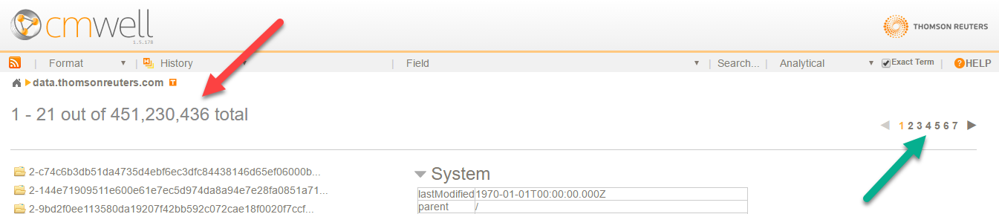

---------------------------------

### Message Banner ###

Sometimes CM-Well may display a special message to its users, in the message banner at the bottom of the page.

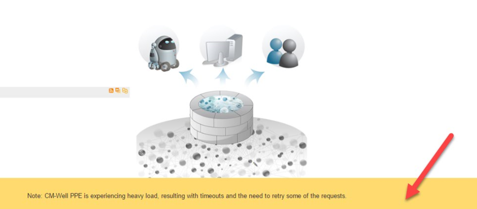

---------------------------------

### Atom Feed Buttons ###

You may want to examine an atom feed (a.k.a. RSS feed) of the latest infotons in a certain CM-Well path. There are two ways to do this:

* Click the atom feed button at the top left to retrieve an atom feed of the infotons under the URI in the address bar.	

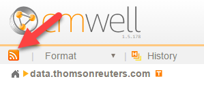	
* Hover over a folder link on the left, then click the atom feed button that appears in the same line.	

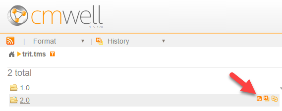

After you click on an atom feed button, the first 50 results in the feed are displayed. 

>**Note:** To conveniently retrieve and handle an ongoing stream of infotons, use the [Consumer API](API.Stream.CreateConsumer.md).

---------------------------------

### Format Dropdown ###

You can choose the format of the infotons displayed by selecting a value from the **Format** dropdown menu.

---------------------------------

### History Dropdown ###

You can view all historical versions of the infoton in the address bar, in the format of your choice, by selecting a value from the **History** dropdown menu.

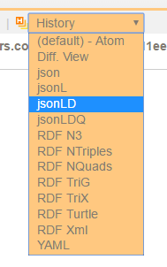

---------------------------------

### History Button ###

To view all historical versions of an infoton in the left-hand list, hover over the infoton link, then click the history button that appears in the same line.	

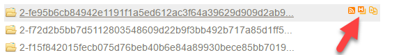

---------------------------------

### History Diff Button ###

To compare historical versions of an infoton in the left-hand list, hover over the infoton link, then click the **History (Diff View)** button that appears in the same line.	

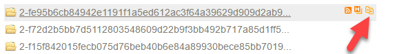

---------------------------------

### Type Navigation Button ###

Sometimes it is useful to retrieve infotons according to their RDF type. For instance, you may want to examine only the infotons whose RDF type is Person.

To navigate by RDF type, click the **Type** button on the top left.

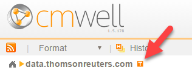

CM-Well displays a partial list of the type values that are found under the current URI, and the counts of each type in parentheses after the type name.

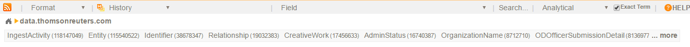

You can click the **more** link on the right to see the complete type list.

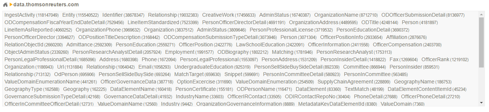

When you click on a type name, only infotons with that type are displayed.

---------------------------------

### Field Dropdown ###

The Field dropdown menu shows all field names found in the first 100 infotons under the current URI. You can choose a field name in order to apply a search to that field (see next section).

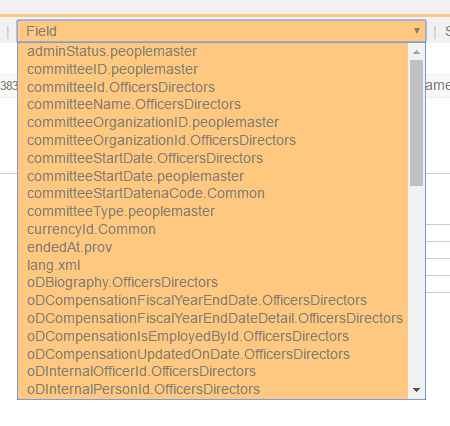

---------------------------------

### Search Box ###

To search for a value in all infoton fields, type a value in the **Search** box and click the search button.

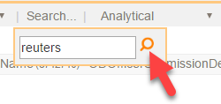

To search for a value in a specific field, first select the field name in the **Field** dropdown menu, then type a value in the **Search** box and click the search button.

After you click the search button, the first 10 search results are displayed.

---------------------------------

### Exact Term Checkbox ###

If you check the Exact Term checkbox, the search will match the search term exactly, rather than performing a tokenized string search, which is the default behavior.

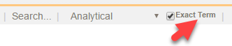

---------------------------------

### Statistics Dropdown ###

You will see a dropdown entitled **Analytics** to the right of the **Search** button. This refers to a legacy feature for activating statistical functions. This feature is deprecated and will be replaced by an enhanced version of the feature.

---------------------------------

### SPARQL Query Button ###

You can activate a special page for submitting SPARQL queries, by clicking the (S) button in CM-Well's home page graphic. See [Using SPARQL on CM-Well Infotons](DevGuide.UsingSPARQLOnCM-WellInfotons.md) to learn more.

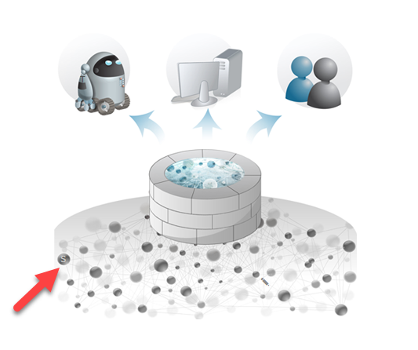

When you click on the (S) button, the SPARQL query editor page is displayed:

From this page, you can click on the **SPARQL on whole graph** link to display the page for submitting a SPARQL query that runs on the entire CM-Well graph. See [Apply SPARQL to the Entire Graph](API.Query.ApplySPARQLToEntireGraph.md) to learn more.

---------------------------------

## The Infoton View ##

When a single infoton's URI appears in the browser address bar, the CM-Well web interface shows that infoton's page.

On this page, you can see the infoton's field names and values. These include:
* **System fields** - fields added to the infoton by CM-Well itself. These include "administrative" details such as the infoton's path, UUID and the time it was last modified.
* **Object fields** - fields added to the infoton by the a user, via the CM-Well API.

You may notice that some fields have a small, orange graph icon. This indicates that these fields are part of a sub-graph, or in other words, have been given a label.  (See [Working with Named Sub-Graphs](DevGuide.WorkingWithNamedSub-Graphs.md) to learn more.) You can see the label value by hovering over this icon.

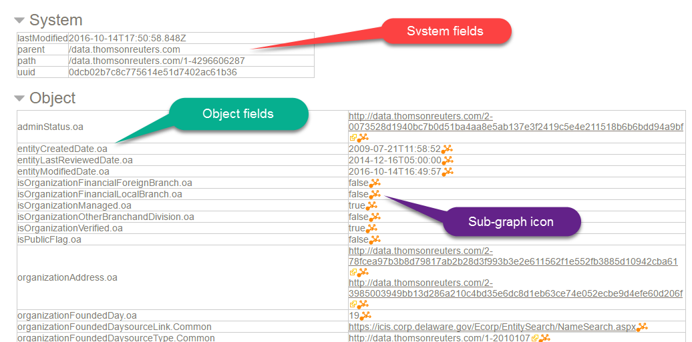

---------------------------------

## Running CM-Well Queries in the UI ##

You can run simple CM-Well queries by entering them in your browser's address bar. These queries correspond to GET operations in CM-Well's REST API.

The simplest kind of query is one that retrieves a single infoton (which could also be a folder infoton). The infoton is retrieved by its URI.

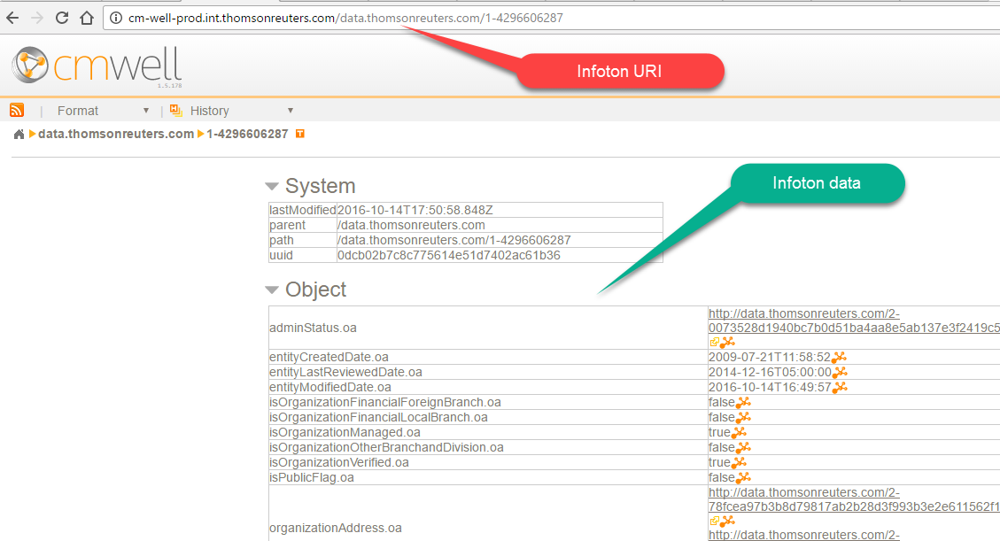

You can also add query parameters to the address line, to retrieve several results while applying filters to their field values. For example, the following query searches for infotons under the permid.org folder (these are mainly Organization entities), which are located in New York state: 

`http://cm-well-prod.int.thomsonreuters.com/permid.org?op=search&qp=organizationStateProvince.mdaas:New%20York`

When you enter this query in the address bar, CM-Well displays a list of links to infotons that match the query. You can click on these links to see those infotons' pages.

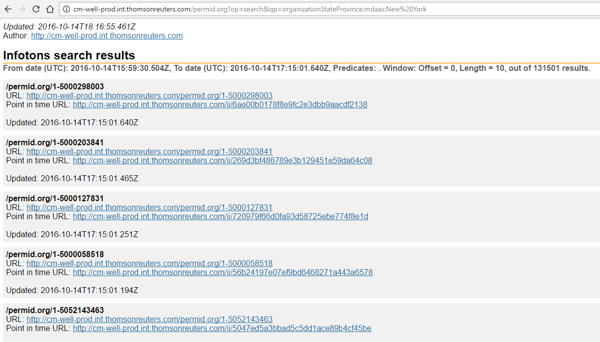

See the [Developer Guide and API Reference topics](CM-Well.RootTOC.md) to learn more about CM-Well queries.

>**Note:** You can add the **with-data** flag to retrieve query results with their field values instead of links only.

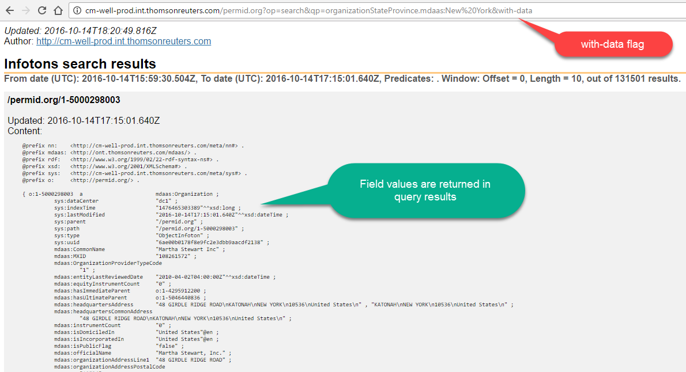

---------------------------------

## Special CM-Well Folders and Files ##

In addition to folders and infotons that users create on CM-Well, there are several folders and files kept on CM-Well for various monitoring purposes and other functional purposes. (Files may be saved to CM-Well as a special kind of infoton.)

The following special folders, files and infotons may be of interest to users and operations personnel:

* **Health pages** - under the **proc** folder, there are several pages that reflect the health of CM-Well nodes and sub-systems. See [Health Dashboards](Monitoring.HealthDashboards.md) to learn more.
* **meta/lib** - you can copy your own Java library files (jar files) under this folder, and call their functions from within SPARQL queries. See [Calling Java Functions from SPARQL Queries](DevGuide.CallingJavaScalaFunctionsFromSPARQLQueries.md) to learn more.
* **proc/node** - in this infoton you can see version numbers of CM-Well components.
* **proc/fields** - in this infoton you can see a list of all field names from all infotons on the specific CM-Well platform.

---------------------------------

## Configuring Infoton Link Display by Type ##

Authorized users can configure the display of infoton links according to RDF type, instead of displaying the infoton link only as a path with a cryptic UUID. For example, for a Person infoton, you might want to display the person's first and last names in the link. For an organization, you might want to display the organization's name, CEO and country of origin.

### The Display Configuration Infoton ###

The Display Name configuration infoton must be placed in **/meta/dn/\<HASH\>**, where HASH is the md5 encoding of a type.rdf value. The configuration infoton must have a **forType** field, containing the RDF type for which you want to configure display.
In addition, it should have at least one field with the **displayName** prefix. The field values define the string that should be added to the displayed link for infotons of the given type. The values are either the name of a field that usually appears in the infoton, or a javascript snippet that defines a manipulation of such fields.

For example:
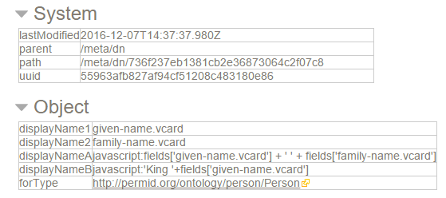

In this example, **displayName1** and **displayName2** refer to name fields that usually appear in Person infotons. **displayNameA** and **displayNameB** contain javascript snippets that define concatenations of such fields and string constants.

### Calculating Display Names ###

Multiple **displayName** values provide alternate display names. Display names are calculated until one of them produces a non-empty string, and then that string is used in the displayed link. (Note that an empty string  might be produced if the relevant field values are missing).

Display name values are calculated in the following order:
* First javascript value are calculated, in lexicographical order of all the displayNames whose value contains javascript.
* If none of the javascript displayNames produces a non-empty string (or there were none to begin with), the rest of the values are calculated in lexicographical order of  the displayNames.

In the example that appears above, **displayNameA** would be the first to be calculated, because it contains javascript, and **displayNameA** comes before **displayNameB** in lexicographical order. If the calculation produces a non-empty string, the result is added to the link's display.

This is what the configured Person links look like:

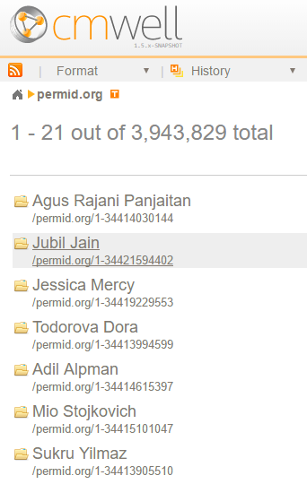

