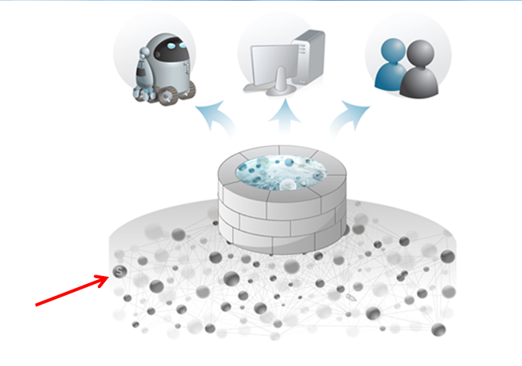
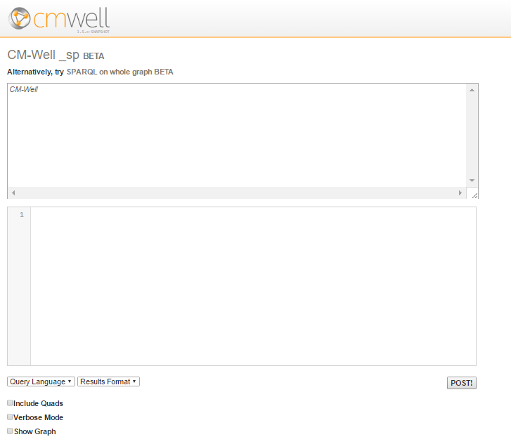
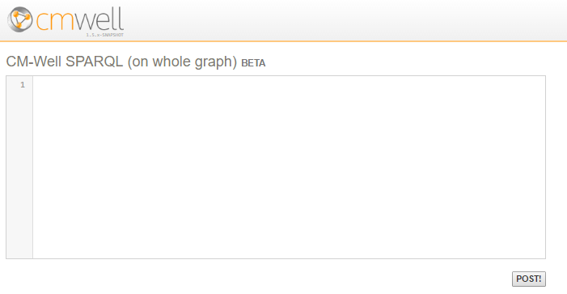

# Using SPARQL on CM-Well Infotons #

[What is SPARQL?](#hdr1)

[Using the CM-Well UI to Submit SPARQL Queries](#hdrUI)

[CM-Well Paths for SPARQL Queries](#hdr3)

[CM-Well SPARQL Query Syntax](#hdr4)

[Special Query Options for SPARQL](#hdr5)

[Using "Placeholder" Parameters in Queries](#hdr6)

[Using the CONSTRUCT Command](#hdr7)

[Using the IMPORT Directive to Apply Uploaded CONSTRUCTs](#hdr8)

[Using the SPARQL Trigger Processor Agent](#hdr9)

<a name="hdr1"></a>
## What is SPARQL? ##

SPARQL (SPARQL Protocol and RDF Query Language - pronounced "sparkle") is an industry-standard query language designed to work with graph databases. It is similar in syntax to SQL.

You can use SPARQL queries on CM-Well in order to apply database operations to infotons, which are the type of "database records" that CM-Well supports. 

> **Note:** Currently, the only SPARQL operations that CM-Well supports are SELECT and CONSTRUCT.

A comprehensive description of SPARQL is beyond the scope of this document.  

You can learn more about SPARQL at:
-	[Apache Jena tutorial](http://jena.apache.org/tutorials/sparql.html)
-	[W3C specifications](http://www.w3.org/2009/sparql/wiki/Main_Page)

<a name="hdrUI"></a>
## Using the CM-Well UI to Submit SPARQL Queries ##

CM-Well provides a simple UI for submitting SPARQL queries. To access the SPARQL UI page, click the "secret" (S) button in the CM-Well home page, shown in the image below.



Clicking the (S) button displays the following page:



To submit a SPARQL query using this UI:

1. Enter the paths part of the query (without the "PATHS" header) in the first edit box.
2. Enter the SPARQL part of the query (without the "SPARQL" header) in the second edit box.
3. Select the output format you want from the **Results Format** dropdown menu.
4. Click **POST**. The query is submitted to the _sp endpoint of the CM-Well host you're accessing.

From the SPARQL Query page, you can click on the **SPARQL on whole graph** link to display the page for submitting a SPARQL query that runs on the entire CM-Well graph. See [Apply SPARQL to the Entire Graph](API.Query.ApplySPARQLToEntireGraph.md) to learn more.



To submit a SPARQL query on the whole CM-Well graph using this UI:
1. Enter the SPARQL query in the edit box.
2. Click **POST!**. The query is submitted to the _sparql endpoint of the CM-Well host you're accessing.

<a name="hdr3"></a>
## CM-Well Paths for SPARQL Queries ##

A SPARQL query to CM-Well has two parts. The second part is the SPARQL query itself. The first part is a set of paths within CM-Well on which you want to run the SPARQL query. The "paths" are in fact regular queries to CM-Well, which produce a list of infotons. After retrieving this list, CM-Well applies the SPARQL query to the list.

Here are some examples of paths to which you could apply a SPARQL query:

    /permid.org/1-5035948006?xg=2
    permid.org?op=search&qp=organizationFoundedYear.mdaas>2014,type.rdf:Organization

In the CM-Well GUI shown in the previous section, you would enter the paths in the top text box, and the query in the lower text box.

> **Note:** The need to provide an initial path is not part of standard SPARQL syntax; it is unique to CM-Well. It is required in order to prevent the SPARQL query from running on the entire CM-Well graph, which could cause performance problems, due to the massive amount of data in CM-Well. 

<a name="hdr4"></a>
## CM-Well SPARQL Query Syntax ##

Here is an example of a cURL call that applies a SPARQL query to CM-Well paths:

    curl -X POST "<cm-well-host>/_sp?format=ascii" --data-binary '
    PATHS
    /example.org/Individuals?op=search&length=1000&with-data
    /example.org/Individuals/RonaldKhun
    /example.org/Individuals/JohnSmith?xg=3
    
    SPARQL
    SELECT DISTINCT ?name ?active WHERE { ?name <http://www.tr-lbd.com/bold#active> ?active . } ORDER BY DESC(?active)
    '
    
Let's break this command down to its components:

Query Part  |  Value in Example
:------------|:--------------------
POST command to CM-Well's _sp endpoint | curl -X POST "http://cm-well-host.com/_sp" 
format parameter | ?format=ascii
PATHS header | PATHS
List of paths, one per line | /example.org/Individuals?op=search&length=1000&with-data<br>/example.org/Individuals/RonaldKhun<br>/example.org/Individuals/JohnSmith?xg=3
Empty line | There *must* be an empty line before the SPARQL header
SPARQL header | SPARQL
SPARQL query | SELECT DISTINCT ?name ?active WHERE { ?name <http://www.tr-lbd.com/bold#active> ?active . } ORDER BY DESC(?active)

> **Notes:** 
> * The **--data-binary** flag causes cURL to encode the subsequent string (surrounded by ' ') in binary format.
> * The empty line before the SPARQL header is mandatory.

You can also add several SPARQL queries to the same command, by separating them with lines of (at least 3) dashes, as follows:

    curl -X POST "<cm-well-host>/_sp?verbose" --data-binary '
    PATHS
    /example.org/Individuals?op=search&length=1000&with-data
    /example.org/Individuals/RonaldKhun
    /example.org/Individuals/JohnSmith?xg=3
    
    SPARQL
    SELECT DISTINCT ?name ?active
    WHERE { ?name <http://www.tr-lbd.com/bold#active> ?active . } ORDER BY DESC(?active)
    --------------------------
    SELECT DISTINCT ?name
    WHERE { ?name <http://www.tr-lbd.com/bold#active> "false" . }
    '

### Example 1: Retrieving One Field ###

In our [example of how to use the yg parameter](API.TraversingOutboundAndInboundLinksWithXgAndYg.md), we were looking for the corporate address for a given RIC code. What we actually got in response to our regular CM-Well query was the infotons that were related to the RIC code. We still had to retrieve the corporate address information ourselves from the relevant field. By using SPARQL, we can cause CM-Well to handle that step. 

To retrieve the mdaas:headquartersCommonAddress value, we can use this SPARQL query:

    SELECT * WHERE {
    ?infoton <http://ont.thomsonreuters.com/mdaas/headquartersCommonAddress> ?addr. 
    }

Note that instead of using the prefix “mdaas:”, we used the full URL that defines the field. This is necessary in order for SPARQL to recognize the field we’re looking for.

The cURL command, which uses the PATH from the “yg” example but also retrieves the CommonName field by applying SPARQL, looks like this:

    $ curl -X POST "<cm-well-host>/_sp?format=ascii" -H "Content-Type:text/plain" --data-binary '
    PATHS
    /permid.org?op=search&qp=CommonName.mdaas:Marriott%20Ownership,organizationCity.mdaas:Orlando&with-data&xg=hasImmediateParent.mdaas>_

    SPARQL
    SELECT * WHERE {
    ?infoton <http://ont.thomsonreuters.com/mdaas/headquartersCommonAddress> ?Addr.
    }
    '

The output of the command above looks like this:

    ------------------------------------------------------------------------------------------------------------------
    | infoton                          | Addr                                                                        |
    ==================================================================================================================
    | <http://permid.org/1-5035948006> | "6649 Westwood Blvd\nORLANDO\nFLORIDA\n32821-8029\nUnited States\n"@en      |
    | <http://permid.org/1-4294969614> | "6649 Westwood Blvd Ste 300\nORLANDO\nFLORIDA\n32821-6066\nUnited States\n" |  
     -----------------------------------------------------------------------------------------------------------------           

### Example 2: Retrieving Two Fields and Sorting Results ###

Here are some CM-Well paths (in a custom-made repository) to which we can apply a SPARQL query:

Path                                                                                              | Retrieves
:--------------------------------------------------------------------------------------------------|:----------------------------------------
http://cm-well-host.com/example.org/Individuals?op=search&length=1000&with-data | The first 1000 people under Individuals 
http://cm-well.com/example.org/Individuals/RonaldKhun                      | A specific person's infoton             
http://cm-well.com/example.org/Individuals/JohnSmith?xg=3                  | A specific person's outbound links     

Let's run a SPARQL query that retrieves each person's **name** and **active** fields, and sorts the results by the **active** value:

    curl -X POST "<cm-well-host>/_sp?format=ascii" --data-binary '
    PATHS
    /example.org/Individuals?op=search&length=1000&with-data
    /example.org/Individuals/RonaldKhun
    /example.org/Individuals/JohnSmith?xg=3
    
    SPARQL
    SELECT DISTINCT ?name ?active WHERE { ?name <http://www.tr-lbd.com/bold#active> ?active . } ORDER BY DESC(?active)
    '

The results are:

    -------------------------------------------------------------
    | name                                            | active  |
    =============================================================
    | <http://example.org/Individuals/BruceWayne>     | "true"  |
    | <http://example.org/Individuals/DonaldDuck>     | "true"  |
    | <http://example.org/Individuals/HarryMiller>    | "true"  |
    | <http://example.org/Individuals/JohnSmith>      | "true"  |
    | <http://example.org/Individuals/MartinOdersky>  | "true"  |
    | <http://example.org/Individuals/NatalieMiller>  | "true"  |
    | <http://example.org/Individuals/PeterParker>    | "true"  |
    | <http://example.org/Individuals/RonaldKhun>     | "true"  |
    | <http://example.org/Individuals/SaraSmith>      | "true"  |
    | <http://example.org/Individuals/DaisyDuck>      | "false" |
    | <http://example.org/Individuals/RebbecaSmith>   | "false" |
    -------------------------------------------------------------
    

### Specifying the Output Format for SPARQL Results ###

As you can see in the examples above, by default the SPARQL results are a text-rendered table. They might be "scrambled" in your command window, depending on the length of its lines. This format is not convenient for machine-readability. However, you can specify different output formats with the _sp endpoint, just as for regular CM-Well queries. 

> **Note:** Only the following output formats are supported for SPARQL queries: ascii, json, rdf, tsv, xml. 
 
For example, we can specify the tsv (tab-separated values) output format as follows:

    $ curl -X POST "<cm-well-host>/_sp?format=tsv" -H "Content-Type:text/plain" --data-binary '
    PATHS
    /permid.org?op=search&qp=CommonName.mdaas:Marriott%20Ownership,organizationCity.mdaas:Orlando&with-data&xg=hasImmediateParent.mdaas>_
    SPARQL
    SELECT * WHERE {
    ?infoton <http://ont.thomsonreuters.com/mdaas/headquartersCommonAddress> ?Addr.
    }
    '

The output now looks like this:

    ?infoton?Addr
    <http://permid.org/1-5035948006>"6649 Westwood Blvd\nORLANDO\nFLORIDA\n32821-8029\nUnited States\n"@en
    <http://permid.org/1-4294969614>"6649 Westwood Blvd Ste 300\nORLANDO\nFLORIDA\n32821-6066\nUnited States\n"

<a name="hdr5"></a>
## Special Query Options for SPARQL ##

You can use the followings special options (or any combination of them) with SPARQL queries:

* **quads** - this option returns RDF "quadruples" rather than "triples", meaning that in addition to the subject, predicate and object, it also returns the graph name for each triple.
* **verbose** - this option returns the time-metrics of data retrieval and processing operations, as well as the data itself.
* **show-graph** - this option shows the list of infotons, which are the result of the initial CM-Well query, and the input to the SPARQL query.

The following sections show examples of the usage of each special option.

### The "quads" option ###

This option returns RDF "quadruples" rather than "triples", meaning that in addition to the subject, predicate and object, it also returns the graph name for each triple.

Here is an example of a query using the "quads" option:

    curl -X POST "<cm-well-host>/_sp?format=ascii&quads" --data-binary '
    PATHS
    /example.org/Individuals?op=search&length=1000&with-data
    /example.org/Individuals/RonaldKhun
    /example.org/Individuals/JohnSmith?xg=3
    
    SPARQL
    SELECT *
    FROM NAMED <http://example.org/graphs/spiderman>
    WHERE { GRAPH ?g { ?s ?p ?o . } }
    '

Its results are:

                        s                      |                     p                         |                     o                        |           g 
    ===========================================|===============================================|==============================================|=====================================
    <http://example.org/Individuals/JohnSmith> | <http://purl.org/vocab/relationship/parentOf> | <http://example.org/Individuals/SaraSmith>   | <http://example.org/graphs/spiderman>
    <http://example.org/Individuals/JohnSmith> | <http://purl.org/vocab/relationship/friendOf> | <http://example.org/Individuals/PeterParker> | <http://example.org/graphs/spiderman>
    
### The "verbose" option ###
This option returns the time-metrics of data retrieval and processing operations, as well as the data itself.

You must use the ?format=ascii option if you want to receive verbose information. 

Here is an example of a query using the "verbose" option:

    curl -X POST "<cm-well-host>/_sp?format=ascii&verbose" --data-binary '
    PATHS
    /example.org/Individuals?op=search&length=1000&with-data
    /example.org/Individuals/RonaldKhun
    /example.org/Individuals/JohnSmith?xg=3
    
    SPARQL
    SELECT DISTINCT ?name ?active WHERE { ?name <http://www.tr-lbd.com/bold#active> ?active . } ORDER BY DESC(?active)
    '

Its results are:

    Time metrics:
    Start End Type Task
    00:00:00.489 00:00:00.556 Subgraph /example.org/Individuals?op=search&length=1000&with-data=&format=nquads
    00:00:00.490 00:00:00.505 Subgraph /example.org/Individuals/RonaldKhun?=&format=nquads
    00:00:00.499 00:00:00.552 Subgraph /example.org/Individuals/JohnSmith?xg=3&format=nquads
    00:00:00.561 00:00:00.566 SPARQL   SELECT DISTINCT ?name ?active WHERE { ?name <http://www.tr-lbd.c...
    
    Results:
    ------------------------------------------------------------
    | name                                           | active  |
    ============================================================
    | <http://example.org/Individuals/BruceWayne>    | "true"  |
    | <http://example.org/Individuals/DonaldDuck>    | "true"  |
    | <http://example.org/Individuals/HarryMiller>   | "true"  |
    | <http://example.org/Individuals/JohnSmith>     | "true"  |
    | <http://example.org/Individuals/MartinOdersky> | "true"  |
    | <http://example.org/Individuals/NatalieMiller> | "true"  |
    | <http://example.org/Individuals/PeterParker>   | "true"  |
    | <http://example.org/Individuals/RonaldKhun>    | "true"  |
    | <http://example.org/Individuals/SaraSmith>     | "true"  |
    | <http://example.org/Individuals/DaisyDuck>     | "false" |
    | <http://example.org/Individuals/RebbecaSmith>  | "false" |
    ------------------------------------------------------------

### The "show-graph" option ###
This option shows the list of infotons, which are the result of the initial CM-Well query, and the input to the SPARQL query.

You must use the ?format=ascii option if you want to use the "show-graph" option. 

Here is an example of a query using the "show-graph" option:

    curl -X POST "<cm-well-host>/_sp?format=ascii&show-graph" --data-binary '
    PATHS
    /example.org/Individuals?op=search&length=1000&with-data
    /example.org/Individuals/RonaldKhun
    /example.org/Individuals/JohnSmith?xg=3
    
    SPARQL
    SELECT DISTINCT ?name ?active WHERE { ?name <http://www.tr-lbd.com/bold#active> ?active . } ORDER BY DESC(?active)
    '

Its results are:

    Graph:
    <http://example.org/Individuals/DonaldDuck> <http://purl.org/vocab/relationship/knowsByReputation> <http://example.org/Individuals/MartinOdersky> .
    <http://example.org/Individuals/DonaldDuck> <http://www.tr-lbd.com/bold#active> "true" .
    <http://example.org/Individuals/DonaldDuck> <http://purl.org/vocab/relationship/mentorOf> <http://example.org/Individuals/JohnSmith> .
    <http://example.org/Individuals/RebbecaSmith> <http://www.tr-lbd.com/bold#active> "false" .
    <http://example.org/Individuals/RebbecaSmith> <http://purl.org/vocab/relationship/siblingOf> <http://example.org/Individuals/SaraSmith> .
    <http://example.org/Individuals/MartinOdersky> <http://purl.org/vocab/relationship/collaboratesWith> <http://example.org/Individuals/RonaldKhun> .
    <http://example.org/Individuals/MartinOdersky> <http://www.tr-lbd.com/bold#active> "true" .
    <http://example.org/Individuals/BruceWayne> <http://purl.org/vocab/relationship/employedBy> <http://example.org/Individuals/DonaldDuck> .
    <http://example.org/Individuals/BruceWayne> <http://www.tr-lbd.com/bold#active> "true" .
    <http://example.org/Individuals/PeterParker> <http://www.tr-lbd.com/bold#active> "true" .
    <http://example.org/Individuals/PeterParker> <http://purl.org/vocab/relationship/worksWith> <http://example.org/Individuals/HarryMiller> .
    <http://example.org/Individuals/PeterParker> <http://purl.org/vocab/relationship/neighborOf> <http://example.org/Individuals/ClarkKent> .
    <http://example.org/Individuals/SaraSmith> <http://www.tr-lbd.com/bold#active> "true" .
    <http://example.org/Individuals/SaraSmith> <http://purl.org/vocab/relationship/siblingOf> <http://example.org/Individuals/RebbecaSmith> .
    <http://example.org/Individuals/RonaldKhun> <http://www.tr-lbd.com/bold#category> "deals" .
    <http://example.org/Individuals/RonaldKhun> <http://www.tr-lbd.com/bold#category> "news" .
    <http://example.org/Individuals/RonaldKhun> <http://www.tr-lbd.com/bold#active> "true" .
    <http://example.org/Individuals/RonaldKhun> <http://purl.org/vocab/relationship/collaboratesWith> <http://example.org/Individuals/MartinOdersky> .
    <http://example.org/Individuals/JohnSmith> <http://www.tr-lbd.com/bold#active> "true" .
    <http://example.org/Individuals/NatalieMiller> <http://www.tr-lbd.com/bold#active> "true" .
    <http://example.org/Individuals/NatalieMiller> <http://purl.org/vocab/relationship/childOf> <http://example.org/Individuals/HarryMiller> .
    <http://example.org/Individuals/HarryMiller> <http://purl.org/vocab/relationship/parentOf> <http://example.org/Individuals/NatalieMiller> .
    <http://example.org/Individuals/HarryMiller> <http://www.tr-lbd.com/bold#active> "true" .
    <http://example.org/Individuals/DaisyDuck> <http://purl.org/vocab/relationship/colleagueOf> <http://example.org/Individuals/BruceWayne> .
    <http://example.org/Individuals/DaisyDuck> <http://www.tr-lbd.com/bold#active> "false" .
    <http://example.org/Individuals/JohnSmith> <http://purl.org/vocab/relationship/parentOf> <http://example.org/Individuals/SaraSmith> .
    <http://example.org/Individuals/JohnSmith> <http://purl.org/vocab/relationship/friendOf> <http://example.org/Individuals/PeterParker> .
    
    Results:
    ------------------------------------------------------------
    | name                                           | active  |
    ============================================================
    | <http://example.org/Individuals/BruceWayne>    | "true"  |
    | <http://example.org/Individuals/DonaldDuck>    | "true"  |
    | <http://example.org/Individuals/HarryMiller>   | "true"  |
    | <http://example.org/Individuals/JohnSmith>     | "true"  |
    | <http://example.org/Individuals/MartinOdersky> | "true"  |
    | <http://example.org/Individuals/NatalieMiller> | "true"  |
    | <http://example.org/Individuals/PeterParker>   | "true"  |
    | <http://example.org/Individuals/RonaldKhun>    | "true"  |
    | <http://example.org/Individuals/SaraSmith>     | "true"  |
    | <http://example.org/Individuals/DaisyDuck>     | "false" |
    | <http://example.org/Individuals/RebbecaSmith>  | "false" |
    ------------------------------------------------------------
    
<a name="hdr6"></a>
## Using "Placeholder" Parameters in Queries ##

Sometimes it can be useful to be able to insert "macro-like" placeholders in your SPARQL query, i.e. named parameters whose instances within the query are replaced with a string value that you define. CM-Well supports this option. 

You can define a placeholder parameter as one of the URI parameters, prefixed by "sp." and followed by the value you want to use in the specific call. You can then reference this parameter by placing it anywhere in the SPARQL query (including the PATHS section and the SPARQL section), surrounded by the '%' character on either side, as many times as you want. The parameter is replaced with the value you defined before the SPARQL query is applied.

>**Note:** Parameter names may contain only letter characters.

Here is an example of a query with a placeholder parameter called **boldpred**:

    curl -X POST "<cm-well-host>/_sp?sp.boldpred=active" --data-binary '
    PATHS
    /example.org/Individuals?op=search&length=1000&with-data
    
    SPARQL
    SELECT DISTINCT ?name
    WHERE { ?name <http://www.tr-lbd.com/bold#%BOLDPRED%> "true" . }
    '

The WHERE clause, after placeholder replacement, becomes:

    WHERE { ?name <http://www.tr-lbd.com/bold#active> "true" . }

> **Note:** The matching between placeholder name and its instances within the query is case insensitive.

<a name="hdr7"></a>
## Using the CONSTRUCT Command ##
In addition to the SELECT command, you can use SPARQL's CONSTRUCT command. The CONSTRUCT command allows you to formulate your own RDF triples by manipulating query results. You can perform changes such as creating new entities and relationships, or performing transformations on values. You can then use the new triples you created as input to CM-Well, or for any other purpose.

Here is an example of a query using CONSTRUCT, that derives an "UncleOf" relationship from information about people's parents and siblings:

    curl -X POST "<cm-well-host>/_sp" --data-binary '
    PATHS
    /example.org/Individuals?op=search&length=1000&with-data
    
    SPARQL
    PREFIX rel: <http://purl.org/vocab/relationship/>
    
    CONSTRUCT { ?uncle rel:demoUncleOf ?nephew . }
    WHERE {
      ?uncle rel:siblingOf ?x .
      ?x rel:ParentOf ?nephew .
    }'

Its results are:

    <http://example.org/Individuals/JohnSmith> <http://purl.org/vocab/relationship/demoUncleOf> <http://example.org/Individuals/TimSmith> .

<a name="hdr8"></a>
## Using the IMPORT Directive to Apply Uploaded CONSTRUCTs ##

CM-Well allows you to upload SPARQL CONSTRUCT commands, save them as "file infotons" and use them in subsequent CM-Well queries. This is conceptually similar to creating "stored procedures" for an SQL database. This feature allows you to reuse long/complex CONSTRUCT commands rather than having to recreate them every time you use them.

> **Note:** In addition to infotons related to an RDF subject, CM-Well supports file infotons, which are simply files that are stored on CM-Well for various purposes.  

### Uploading a CONSTRUCT File ###

To upload a file containing a CONSTRUCT command:

1. Create a text file containing a valid CONSTRUCT command.
2. Upload it to CM-Well using the following syntax:

    `curl <cm-well-host>/myQueryPath/myConstruct.sparql -H "X-CM-Well-Type:File" -H "Content-Type:text/plain" --data-binary @myConstruct.sparql`

### Syntax of a SPARQL Query with IMPORT ###

You can use the following syntax to submit a SPARQL query, while importing an uploaded construct file:

```
PATHS
<data path 1>
<data path 2>
...

IMPORT
<query path 1>
<query path 2>
...

SPARQL
<sparql query>
```

> **Notes:**
> * Each query path can be absolute or relative. A query path that starts with a `/` is absolute. A query path that does not start with a `/` is relative, and will be retrieved from under `/meta/sp/`.
> * Each query path can refer to a specific endpoint, or end with a wildcard. The wildcard characters are `*` and `_`. They both have the same meaning: retrieve all construct files under the given path (non-recursive; does not extend to sub-paths).
> * The order of the imports does not matter, because each imported construct is only applied to the given PATHS, and not to other constructs' output.
> * The "placeholder parameters" feature works for imported queries as well as regular queries.

#### Example: Using Absolute and Relative Paths ####

Let's assume the following construct files were pre-uploaded as file infotons:

* /meta/sp/quote/foo.sparql
* /meta/sp/quote/bar.sparql
* /meta/sp/foobar.sparql
* /myQueries/xyz/baz.sparql
* /myQueries/abc/1.sp
* /myQueries/abc/2.sp

This would be a valid SPARQL query POST:

```
PATHS
/data?op=search&with-data

IMPORT
foobar.sparql
quote/*
/myQueries/xyz/baz.sparql
/myQueries/abc/_

SPARQL
SELECT * WHERE { ?s ?p ?o }
```

Note the different types of import path (in order of appearance): 

1. foobar.sparql - relative (implicitly to /meta/sp).
2. quote/* - relative; uses a wildcard to refer to all files under the path.
3. /myQueries/xyz/baz.sparql - absolute; refers to a specific file.
4. /myQueries/abc/_ - absolute; uses a wildcard to refer to all files under the path.

### Example: Complete Usage Scenario for IMPORT ###

The following sequence of commands does the following:

* Creates a small repository of people. 
* Uploads a file containing a CONSTRUCT command to CM-Well.
* Applies a construct to add a sibling called "his sister" to each person with an **active** value of "true".
* Queries for all people with siblings, thereby retrieving all the people in the repository.

> **Note:** The "siblings" are only added in the construct; they are not written to CM-Well.

First, let's upload some data:
```
$ curl -X POST "<cm-well-host>/_in?format=ntriples" -H "Content-Type: text/plain" --data-binary '
  <http://example.org/Individuals/DaisyDuck> <http://purl.org/vocab/relationship/colleagueOf> <http://example.org/Individuals/BruceWayne> .
  <http://example.org/Individuals/BruceWayne> <http://purl.org/vocab/relationship/employedBy> <http://example.org/Individuals/DonaldDuck> .
  <http://example.org/Individuals/DaisyDuck> <http://www.tr-lbd.com/bold#active> "false" .
  <http://example.org/Individuals/DonaldDuck> <http://www.tr-lbd.com/bold#active> "true" .
  <http://example.org/Individuals/BruceWayne> <http://www.tr-lbd.com/bold#active> "true" .
'
```
Now, let's upload a SPARQL construct file:
```
$ curl <cm-well-host>/myQueries/xyz/baz.sparql -H "X-CM-Well-Type:File" \
-H "Content-Type:text/plain" --data-binary @baz.sparql
```

Where the contents of baz.sparql are:
```
CONSTRUCT { ?s <http://purl.org/vocab/relationship/siblingOf> "his sister" . }
WHERE { ?s <http://www.tr-lbd.com/bold#active> "true" }
```

Now, let's POST a SPARQL query, while importing the construct file we uploaded:
```
$ curl -X POST "<cm-well-host>/_sp?format=ascii" --data-binary '
PATHS
/example.org/Individuals?op=search&length=1000&with-data

IMPORT
/myQueries/xyz/baz.sparql

SPARQL
PREFIX rel: <http://purl.org/vocab/relationship/>
SELECT ?name WHERE { ?name rel:siblingOf "his sister" . }
'
```

The results are:
```
--------------------------------------------------
| name                                           |
==================================================
| <http://example.org/Individuals/BruceWayne>    |
| <http://example.org/Individuals/DonaldDuck>    |
--------------------------------------------------
```

Note that Daisy Duck does not appear in the output, as her **active** value is "false", and therefore no sibling was added for her by the construct.

### Using the cmwell-import Directive for Nested Imports ###

Sometimes you may want to use "nested" constructs, that is, constructs that import other constructs. You can do this by creating constructs that use the `#cmwell-import` directive.

To use this directive, add a line starting with `#cmwell-import` to the beginning of the SPARQL construct, followed by one space character and a list of comma-separated absolute CM-Well paths of other CONSTRUCT queries, as follows:

    #cmwell-import /queries2/a1,/queries2/a2

Here is an example of how to use the `#cmwell-import` directive.

Upload construct **b**:

    curl -X POST <cm-well-host>/queries/b -H "X-CM-WELL-Type:File" -H "Content-Type:text/plain" --data-binary @input.txt

\- with this input data:

    CONSTRUCT { ?s ?p "b". } WHERE { ?s ?p ?o }

Upload construct **a**:

    curl -X POST <cm-well-host>/queries/a -H "X-CM-WELL-Type:File" -H "Content-Type:text/plain" --data-binary @input.txt

\- with this input data:

    #cmwell-import /queries/b
    CONSTRUCT { ?s ?p "a". } WHERE { ?s ?p ?o }

Note that construct **a** imports construct **b**.

Run a SPARQL query:

    curl -X POST <cm-well-host>/_sp?x-no-cache --data-binary @input.txt

\- with this input data:

    PATHS
    /example.org/Individuals/MartinOdersky
    
    IMPORT
    /queries/a
    
    SPARQL
    SELECT * WHERE { ?s <http://www.tr-lbd.com/bold#active> ?o } ORDER BY ?o

The results are:

    -----------------------------------------------------------
    | s                                              | o      |
    ===========================================================
    | <http://example.org/Individuals/MartinOdersky> | "a"    |
    | <http://example.org/Individuals/MartinOdersky> | "b"    |
    | <http://example.org/Individuals/MartinOdersky> | "true" |
    -----------------------------------------------------------

Note that both construct **a** and construct **b** are applied.

**Notes:**
* CM-Well imports each recursively imported CONSTRUCT exactly once (you don't have to worry about circular references).
* In SPARQL, a line that starts with a # is considered a comment, so adding the #cmwell-import directive keeps the SPARQL valid.
* You cannot use relative paths or wildcards in recursive imports; use absolute paths.

<a name="hdr9"></a>
## Using the SPARQL Trigger Processor Agent ##

You may want to create a materialized view of certain infotons in an ongoing fashion, by running SPARQL queries and uploading their results. To do this, you can create a custom configuration file that is read and processed by the CM-Well SPARQL Trigger Processor Agent. See [Using the SPARQL Trigger Processor](Tools.UsingTheSPARQLTriggerProcessor.md) to learn more.
