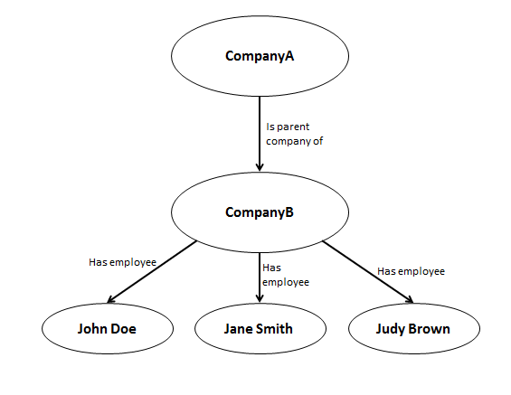
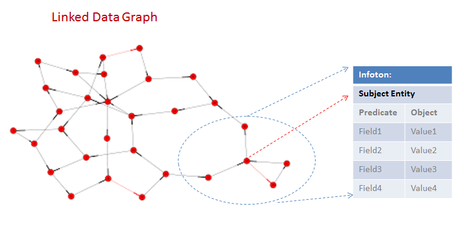
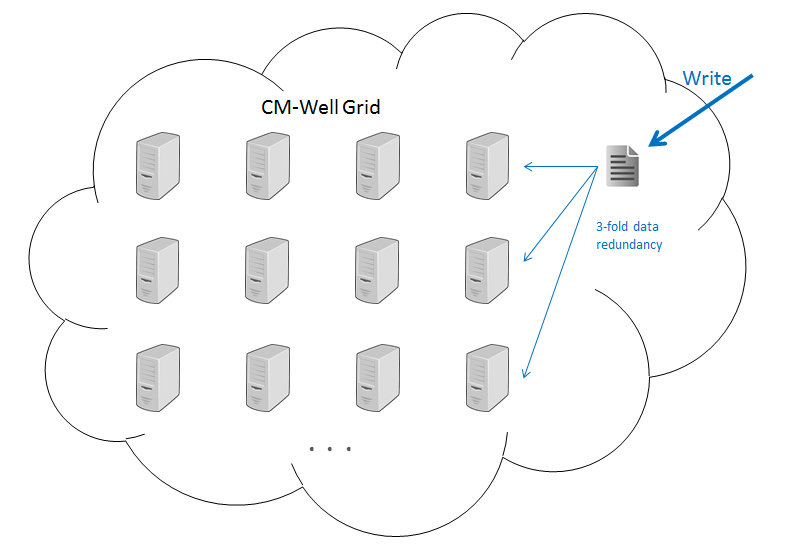
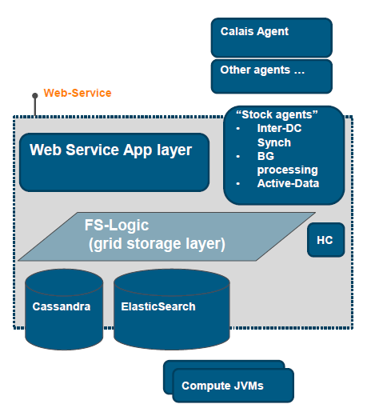

# CM-Well High-Level Architecture #

This page provides a high-level description of the CM-Well hardware, software and information architecture.

[Information Architecture](#hdr1)

[The CM-Well Grid](#hdr2)

[Machine-Level Architecture](#hdr3)

[The CM-Well API](#hdr4)

## Information Architecture ##

The CM-Well information is modeled as triples in an RDF repository. (See [CM-Well Data Paradigms](Intro.CM-WellDataParadigms.md) to learn more.) Each triple is composed of a subject, a predicate and an object. For example, *companyA -> hasParentCompany -> companyB*.

The repository is conceptually a graph, with nodes representing subjects and objects, and edges representing predicates. Some of the graph nodes represent entities, such as organizations or people, while some are simple types such as a name string or date value.

To best serve CM-Well's use cases, information is not retrieved at the triple level, but rather at the **infoton** level. An infoton is an information object representing an entity (such as an organization, instrument, quote or person) and its attributes (the subject entity's predicates and objects). 

(Infotons are similar to UML objects, or RDBMS Entity-Relationship models.)

## The CM-Well Grid ##

Each CM-Well system is contained within a single data center, and has a grid architecture. This means that the system is composed of several identical machines (a.k.a. nodes), enabling parallel processing of multiple requests, distributed database management and redundancy in case of failure.  

Every data item has a replication factor of 3, that is, it is saved in 3 copies over different machines. If one machine fails, other machines take over seamlessly. Once the machine is back online, data is copied to it so that full replication is restored.

> **Note:** There is no failover among data centers in case one center becomes inaccessible. The production environment at Eagan, MN performs an automatic copy of its data to the production environment at Plano, TX, providing a backup in case of critical failure.

## Machine-Level Architecture ##

The following diagram and table describe the modules running on each CM-Well node.

Module | Description
:-------|:------------
Web Service | The web service layer that handles read/write requests for users and external agents.
FS-Logic | An abstraction layer above the storage modules, allowing lower layers to be switched if necessary.
HC | Health Control - monitors health of CM-Well nodes.
Cassandra | A 3rd-party storage package, used for table-based search and direct access to infotons.
ElasticSearch | A 3rd-party search package, used for full-text search capabilities.
Compute JVMs | Separate processes for long computations e.g. SPARQL queries.
Inter-DC Synch | Synchronizes data of master production environment with backup environment.
Background Processing | Processes lengthy requests in the background, according to a work queue.
Active Data | Agent that updates time-triggered info for certain data items.
Calais Agent | Ingests new triples derived from Calais tagging of news metadata.
Other Agents | Agents for ingesting data from additional sources, such as Organization Authority.

>**Note:** The Calais Agent and other agents are not an integral part of CM-Well. They are given as examples of applications that write data to CM-Well.

## The CM-Well API ##

CM-Well provides a RESTful API that supports the following functionality: 

* Direct read access to infotons via URI
* Querying for infotons by conditions on their field values
* Applying SPARQL queries to infotons
* Adding, deleting and modifying infotons and triples
* Subscribing to real-time updates
* Defining private groupings of objects ("named sub-graphs") and providing them as a virtual queue.

