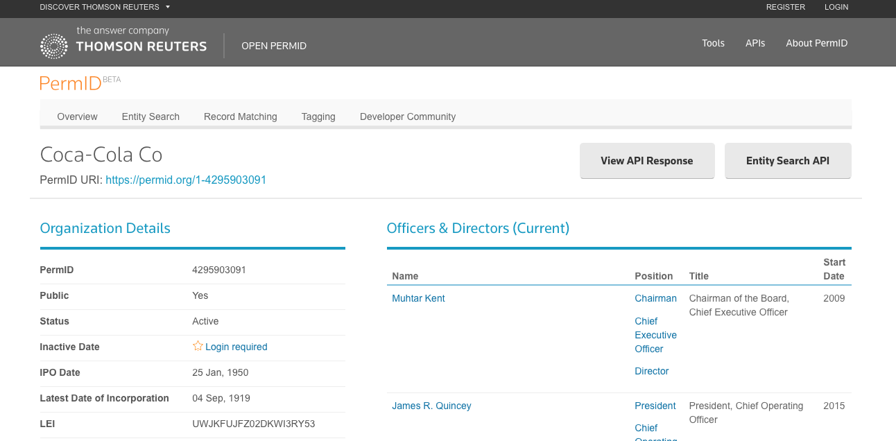

# Introduction to CM-Well #

[What is CM-Well?](#hdr1)

[CM-Well as a Platform for Data Modeling](#hdr3)

[How Do I Access CM-Well?](#hdr4)

[Why Should I Use CM-Well?](#hdr5)

[A CM-Well Use Case: Open PermID](#hdr6)

[Getting Started with CM-Well](#hdr7)

## What is CM-Well? ##
CM-Well is a writable [Linked Data](https://en.wikipedia.org/wiki/Linked_data) repository, which can be used to model data from various datasets.

CM-Well (Content Matrix Well) adheres to Open Data principles, meaning that its data is in a standard, machine-readable format, and is open to access by anyone in Thomson Reuters. (Currently access from outside TR is allowed only for TR products.)

CM-Well's data is represented as a graph database, which means that it contains both entities and relationships between pairs of entities. For instance, it  contains facts such as "CompanyA is a subsidiary of CompanyB", or "PersonX works at CompanyA". Conceptually, a graph database is a structure composed of nodes representing entities, and directed arrows representing relationships among them. See the image below for an example.

## CM-Well as a Platform for Data Modeling ##
CM-Well can be used to build your own linked data repository. In addition to API calls for reading CM-Well information, there are calls for creating new entries and connections.

For example, you could create a data repository describing countries, their capitals, continents and currencies. For each of these entities, you would create a corresponding entity in CM-Well, with appropriate relationships between them (e.g. "Paris" - "is capital of" - "France").

## How Do I Access CM-Well? ##

Entities and their related information can be accessed by a URI (Uniform Resource Identifier). A URI looks like an internet link, but it points to a data structure rather than a typical web page. 

Here is an example of a CM-Well URI: 
[http://cm-well-host.com/permid.org/1-5035948006](http://cm-well-host.com/permid.org/1-5035948006)

The "5035948006" identifier at the end is a company's TR PermID. If you access this URI in a browser within Thomson Reuters you will see this page:

You can also access CM-Well programatically, by making REST API calls.
Go to <a href="Intro.IntroductionToCM-Well.md#hdr7">Getting Started with CM-Well</a> to learn more.

## Why Should I Use CM-Well? ##
CM-Well has many advantages and convenient features, including:

* Easy-to-use Linked Data sharing as a service.
* Direct access to entity info via URI.
* Does not require installation.
* Does not require downloading large files and subsequent processing and database insertion.
* Contains up-to-the-minute current info, as well as all historical versions of entities. 
* Supports retrieval, querying and filtering of content at different levels of granularity - from a single entity, to a stream of updates, to the entire repository.
* Enables navigation among related entities via the links returned within an entity's info.
* Allows you to create your own data repository.
* As opposed to standard triple-stores that focus only on reading relatively static data, CM-Well is specifically designed to handle data that is constantly updated. This includes features such as convenient upload, handling historical versions, subscribing to real-time updates, and more.

## A CM-Well Use Case: Open PermID ##
The [Thomson Reuters Open PermID](https://permid.org/) platform is a beta-release service that allows anyone to look up companies, organizations, instruments and quotes. The matched entity is returned with a TR "PermID", which is a unique, permanent identifier for the entity. This is important for applications that must work with verified financial entity IDs, rather than name strings that can be ambiguous or even incorrect.

Open PermId users can view entity information in a browser, as shown below.

Programs can access the same information via the Open PermID API.

CM-Well is the underlying information provider for the Open PermID platform.

## Getting Started with CM-Well ##

Here are some more topics to help you get started with CM-Well:

[Technical Aspects of CM-Well](Intro.TechnicalAspectsOfCM-Well.md)
[CM-Well Data Paradigms](Intro.CM-WellDataParadigms.md)
[CM-Well Input and Output Formats](API.InputAndOutputFormats.md)
[Overview of the CM-Well API](Intro.OverviewOfTheCM-WellAPI.md)
[Basic Queries](DevGuide.BasicQueries.md)

