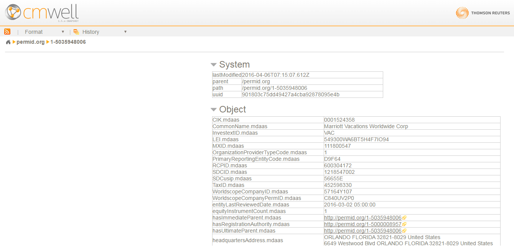

# Overview: Technical Aspects of CM-Well #

The following sections provide a high-level overview of CM-Well's technical properties. This overview should be a good starting point, if you want to understand what is involved in developing an application that works with CM-Well. 

[REST API and Other Tools](#hdr1)

[Development Languages](#hdr2)

[Accessing CM-Well](#hdr4)

[CM-Well Data Paradigms and Formats](#hdr5)

[The CM-Well Platform](#hdr6)

## REST API and Other Tools ##
CM-Well's basic API is a REST interface. This is an HTTP interface that allows the caller to read and write information in CM-Well. You can call the CM-Well API from standard tools that support REST, such as the cURL utility.

You can also perform some operations in a browser, such as reading a single Organization's details. 

>**Note:** CM-Well browser operations are tested in Chrome. Most operations will also work in Firefox, Safari and Edge. 

To see an example of accessing a CM-Well infoton through a browser, click on this link: [http://cm-well-ppe.int.thomsonreuters.com/permid.org/1-5035948006](http://cm-well-ppe.int.thomsonreuters.com/permid.org/1-5035948006)

You will see the following page in your browser, containing the details for the Marriott Vacations Worldwide Corp organization:

In addition to the central API, CM-Well offers several utilities to assist developers, such as:

* **CM-Well Docker** - a small instance of the CM-Well server, which you can install on your own local server for experimentation, independent of the public CM-Well environments.
* **CM-Well Downloader** - a utility for performing bulk downloads of CM-Well data. This tool is also packaged as Java and Scala libraries, which you can call from your application to perform bulk downloads.
* **CM-Well Ingester** - a utility for uploading infotons to CM-Well in bulk. You can run it as a stand-alone executable, or call it as a library from your application. 

## Development Languages ##
You can develop your application in any language and development environment that allow you to make REST calls.

If you are coding in Java or Scala, you can use the CM-Well utility libraries for these languages. See [CM-Well Git Repository](https://github.com/thomsonreuters/CM-Well) to download and collaborate on CM-Well-related code and libraries.

## Accessing CM-Well ##

You can perform CM-Well read operations over HTTP on any of the CM-Well environments, with no special credentials.

Only internal CM-Well modules can perform write operations to the CM-Well production environment. 

Write operations to the lab and pre-production environments are currently permitted with no credentials, but this is subject to change. 

If you want to perform updates to production or pre-production environments, please contact the CM-Well support team to obtain CM-Well user credentials.

> **Note:** CM-Well is only accessible to internal TR applications, not to the general public.

## CM-Well Data Paradigms and Formats ##
The underlying structure of CM-Well is a graph database, which means that the data is represented as nodes and connecting relationships rather than in tabular format. CM-Well conforms to the RDF (Resource Description Framework) Linked Data standard. RDF information can be formatted in several ways, and you can choose the format you prefer.

For more information, see:
* [CM-Well Data Paradigms](Intro.CM-WellDataParadigms.md)
* [CM-Well Input and Output Formats](API.InputAndOutputFormats.md)

## The CM-Well Platform ##
As mentioned previously, CM-Well has lab, pre-production and production environments running in TR data centers. These are highly available, robust and fault-tolerant environments. As you access them via HTTP, all you need to know about them is their URL. You don't have to be aware of their physical location or failover mechanisms.

In addition, CM-Well is designed to be highly scalable, so you don't have to worry about access latency increasing over time, although new data is continually being written to CM-Well.

