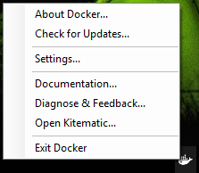
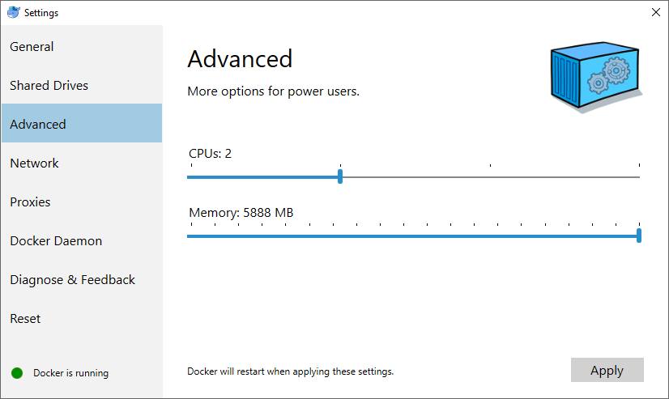

# Using CM-Well Docker #

## What is CM-Well Docker? ##

Docker is a 3rd-party utility that provides an isolated "container" for a software application, containing the application itself, any other software required for its installation, and any files it uses or creates. When running on Linux, Docker runs in the native environment; when running on Windows or Mac OS X, Docker runs over a Linux virtual machine. 

An application running under Docker is guaranteed to be isolated from the effects of any other applications running on the same machine (and vice versa).

CM-Well Docker is a small instance of CM-Well that runs under Docker.

## Why Should I Use CM-Well Docker? ##
If you work with the CM-Well Docker, you have your own private instance of CM-Well which is not affected by changes made to a public instance of CM-Well. For example, the lab environments are subject to periodic data wipes. In Lab or PPE environments, other users can make changes to data you have created, and vice versa.

In addition, you can easily stop, start and reset the CM-Well Docker, which is especially useful if you want to test a scenario while starting from an empty repository. 

## System Requirements for Running CM-Well Docker ##
Docker is intended to run on Linux, and this is the recommended OS for Docker installation. However, you can run it on Windows or Mac OS X. In Windows environments, Docker runs over the HyperV virtualization component.

To run CM-Well Docker, you must have:

* A Linux (recommended), Windows or Mac OS X machine
* About 2.5GB of free disk space
* 6GB of free RAM

> **Note:** See Docker's additional OS-specific requirements under [Docker's installation page](https://docs.docker.com/engine/installation).

## Installing Docker ##
To run CM-Well Docker, you must install the Docker utility itself and the related CM-Well files. CM-Well requires over 5GB of RAM to run, and therefore after installing Docker, you must change its settings such that 6GB of RAM are allocated to the Docker virtual machine.

**To install Docker:**

1. Download and run the Docker installation appropriate for your OS, from the [Docker installation page](https://docs.docker.com/engine/installation). 
2. In the toolbar, right-click the Docker icon and click Settings.
  The Docker Settings dialog opens.
1.  In the left-hand menu, click **Advanced**. 
2.  Drag the Memory slider to the right to enlarge the memory size to be as close as possible to 6GB.
3.  Docker restarts to implement the new memory setting.

>**Note:** Optimally, CM-Well Docker should have 6GB of RAM configured. If there is not enough available memory on your machine, CM-Well Docker will still run with 4.8GB of RAM, though not at production-level performance.

## Installing the CM-Well Image ##
*Coming soon.*

## Operating CM-Well Docker ##

**To run CM-Well Docker:**
Run the following command: `docker run --name cm-well -d -p 8080:9000 cmwell-dev`
[http://localhost:8080](http://localhost:8080) is now the root URL of your local CM-Well instance. The syntax for calling the CM-Well API on a Docker instance is identical to the syntax for calling any other CM-Well host.

**To add data to CM-Well Docker:**
Use the CM-Well API for adding data, while referring to the [http://localhost:8080/_in](http://localhost:8080/_in) endpoint. For example:

    curl -X POST "http://localhost:8080/_in?format=ttl" -H "Content-Type: text/plain" --data-binary "<http://example.org/Individuals/JohnSmith> a <http://data.com/Person>;  <http://ont.thomsonreuters.com/bermuda/hasName> \"John Smith\" ."

**To pause CM-Well Docker:**
Run the following command: `docker stop cm-well`

**To restart CM-Well Docker after a pause:**
Run the following command: `docker start cm-well`

> **Notes:** 
> * After a restart, it may take a few seconds for CM-Well Docker to initialize and respond to requests.
> * CM-Well's state and any data added to it are retained through stop and start operations.

**To kill the CM-Well Docker process:**
Run the following command: `docker kill cm-well`

**To remove the CM-Well Docker container:**
Run the following command: `docker rm cm-well`

**To delete the CM-Well Docker repository and start from scratch:**
1. Kill the CM-Well Docker process.
2. Remove the CM-Well Docker Container.
3. Run the CM-Well Docker (using the "run" command).
 
> **Note:** You can also run multiple CM-Well Docker containers on different ports. 
