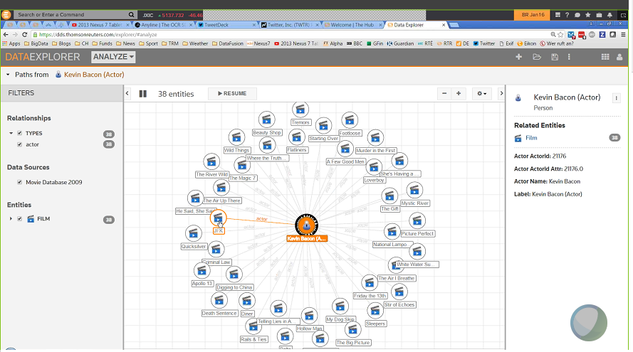

# CM-Well Use Case: Data Fusion #

## Business Details ##

### Contacts ###
**Business case:** Brian Rohan, Common Platform, brian.rohan@thomsonreuters.com.

### Product ###
Data Fusion. 

### Use Case ###

Data Fusion was an independent company, acquired by Thomson Reuters in 2013. The Data Fusion product includes a server that manages a Linked Data repository, and a client application ("Data Explorer") which allows the user to examine entities and relationships in the Linked Data repository, including graph visualization views. Data Fusion also supports user permission management.

Similarly to CM-Well, Data Fusion is a generic platform for managing a Linked Data repository, to which any type of Linked Data may be uploaded. Data Fusion solutions have been sold by the IP & Science division, together with pharmaceutical content from the Cortellis product. Future solutions are planned to include risk and business development content (and specifically legal business development). They will also include core TR content such as Organization Authority, People Authority and Supply Chain, obtained from CM-Well, and entities and relationships derived from TRIT metadata tagging of news sources.

Data Fusion provides a REST API that allows users to upload their own data to the Data Fusion repository. Users can then link their data to native TR data.

Data Fusion does not upload data to CM-Well; it only downloads data from the various TR authority files.

Data Fusion reads the following data from CM-Well:

* Organization Authority
* People Authority
* Supply Chain

There is also a variant of the Data Fusion product called **Graph Feed**, which allows the user to receive a direct data feed from CM-Well.

