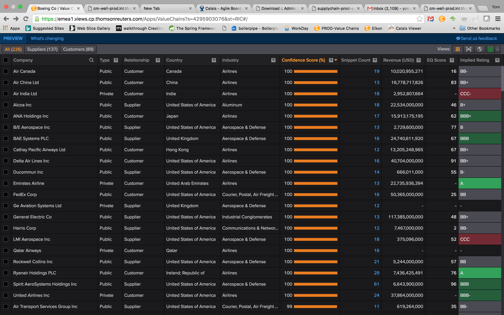

# CM-Well Use Case: Value Chain #

## Business Details ##

### Developed by: ###
Yoni Matasaro, Technology & Ops ,yoni.matasaro@thomsonreuters.com.

### Product ###
Eikon.

### Use Case ###

It is often interesting for business analysts to explore supplier-customer relationships between companies, as a supply problem or other business event may affect an entire "chain" of dependent companies.

The **Value Chain** sub-system identifies supplier-customer relationships between companies in News and Company Filings content, and writes these relationships to CM-Well. Eikon has a dedicated view that displays these supplier-customer relationships. Eikon queries CM-Well directly to retrieve the relationship information.

## Developer Details ##

### Main Software Functionality ###

The **Value Chain** sub-system consists of several server modules. (The user interface module that displays the **Value Chain** data is Eikon itself.) 

These are the main operations that the **Value Chain** sub-system performs:

* Pull latest Company Filings content from ECP.
* Pull latest News content from UCDP. Manage a queue of News documents to process.
* Identify supplier-customer relationships in the Filings and News texts, using Company entities tagged by the TRIT platform.
* Write supplier-customer relationship infotons to CM-Well.

### Data Written to CM-Well ###
**Value Chain** writes the following data to CM-Well:

* Supplier-customer relationship infotons (named **supplychain_agreement**), that point to the two participating companies.
* "Evidence" infotons (named **snippet**), that contain the text snippet in which the relationship was found. (If allowed; some news sources prohibit copying snippets from their content.)
* Configuration infotons, which contain settings such as news source permissions for distributing content snippets.
* News stories written as file infotons, as a method for managing a processing queue.

>**Note:** Data modeling was coordinated with Giuseppe Saltini in the Information Architecture team.

### Linked Data Connections ###
Supplier-customer relationship infotons refer to the participating companies as **permid.org** pointers.

### CM-Well Usage Scenarios ###

* **Value Chain** modules write supplier-customer relationship data and news stories to CM-Well.
* Eikon reads supplier-customer relationships from CM-Well.

### Data URL ###

You can see the **Value Chain** data under: [http://cm-well-prod.int.thomsonreuters.com/data.thomsonreuters.com/sc](http://cm-well-prod.int.thomsonreuters.com/data.thomsonreuters.com/sc)

### Tips and Lessons Learned ###

It's highly recommended to work with the [CM-Well Docker](Tools.UsingCM-WellDocker.md) platform during development. This is a small, private platform that you can install on a local server, making you completely independent from the "public" CM-Well platforms and from other users. You can start using CM-Well quickly and easily, and you don't even need to obtain user credentials to write to CM-Well (as for other platforms). Using CM-Well Docker also allows you to easily purge all your data and start from scratch. However, you should move to a pre-production environment for post-development testing.
